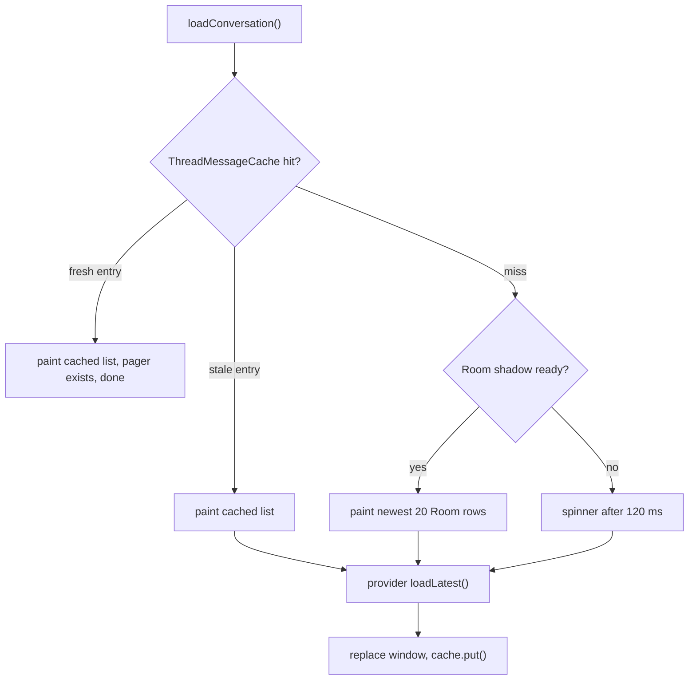
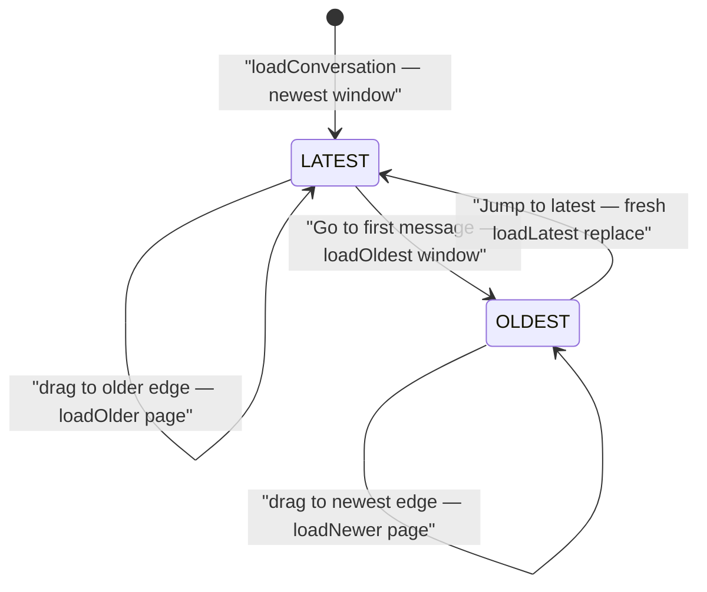

# Conversation Window and Keyset Pagination

Opening a conversation never loads the thread. The screen keeps a bounded
**window** of rows (the newest pages, or — after "Go to first message" — the
oldest pages) and walks the full thread lazily, one keyset page at a time, in
either time direction. Three layers cooperate:

- `ThreadPager` (app/src/main/java/com/autonomousone/messages/repository/ThreadPager.kt)
  performs bidirectional **keyset pagination** against the Telephony provider's
  `Telephony.Sms` / `Telephony.Mms` tables, one independent cursor per source
  (12 rows per source for the boundary page, 40 per source for interior pages).
- `ConversationViewModel`
  (app/src/main/java/com/autonomousone/messages/viewmodel/ConversationViewModel.kt)
  owns the visible window and the `ConversationWindowMode` — `LATEST` (anchor
  at the newest edge, crawl older by scrolling up) or `OLDEST` (anchor at the
  oldest edge, crawl newer by scrolling down) — and guards every async job
  with a conversation-generation stamp.
- `ThreadMerge` / `ThreadMessageCache`
  (app/src/main/java/com/autonomousone/messages/repository/) are pure helpers:
  merge-based window updates that dedupe by id (or by body + 5 s time
  proximity) so optimistic sends collapse into provider-confirmed rows, and a
  per-process LRU cache that makes re-opening a chat paint instantly.

The UI layer, `ConversationListMapper`
(app/src/main/java/com/autonomousone/messages/ui/conversation/ConversationListMapper.kt),
flips the canonical oldest→newest list into newest-first data order for a
`reverseLayout = true` LazyColumn — so *opening* a conversation lands on the
latest row with no scroll command at all.

Caption: instant-open flow of `loadConversation` — in-memory cache first,
Room shadow (≤20 rows) on a fresh process, then the provider windowed query
that replaces the paint and refills the cache.

## ThreadPager: bidirectional keyset paging

`ThreadPager` exposes four public window operations — `loadLatest()`,
`loadOlder()`, `loadOldest()`, `loadNewer()` — plus two live-path operations,
`loadNewerSince(newestDate)` (rows strictly newer than the newest on screen,
bounded at 100 rows per source, does not touch the crawl cursors) and
`loadSmsRowsById(ids)` (re-reads visible outgoing SMS rows by provider id).
The tail query alone cannot observe `PENDING → SENT/DELIVERED/FAILED`
transitions because a status callback rewrites the row in place with its date
unchanged, which is why status refreshes go through the by-id query. A
deprecated `loadFirstPage()` still forwards to `loadLatest()` for
v2.6.5-era callers, and `hasMore` aliases `hasOlder`.

The crawl cursor is a `(date, id)` pair, advanced to the *oldest* (or
*newest*) row each source returned; the provider query carries a composite
keyset predicate so ties on the same timestamp page cleanly:

- older crawl: `date < ? OR (date = ? AND _id < ?)`, ordered
  `date DESC, _id DESC`;
- newer crawl: `date > ? OR (date = ? AND _id > ?)`, ordered
  `date ASC, _id ASC`.

MMS keyset arguments are converted to provider seconds (the mapper models
MMS dates in ms), and MMS model ids are negative (provider id negated), so
cursors restore the real `_id` with `abs()`.

Phone-only selection: while a conversation has no thread id yet
(`threadId == 0`, e.g. a brand-new chat addressed by phone only), the SMS
selection becomes a normalized-address suffix match — the last up to 7 digits
of `ContactRepository.normalizePhone(phone)` matched against
`Telephony.Sms.ADDRESS` — instead of a bogus `THREAD_ID = 0` selection that
would always return an empty page. MMS is skipped entirely for such threads
(it needs a real thread id), and the direction-exhaustion logic accordingly
treats the SMS source alone as authoritative. Once the first loaded row
reveals the real thread id, `ConversationViewModel` rebuilds the pager on it
so later pages query the resolved thread.

The pager is isolated from Android by an internal `ThreadMessageSource`
interface (`querySms` / `queryMms` taking selection, args, sort order, and a
limit). Production binds `ProviderThreadMessageSource`, which delegates to
`SmsRepository.querySmsRaw` / `queryMmsRaw`
(app/src/main/java/com/autonomousone/messages/repository/SmsRepository.kt,
L238-L342) — raw ContentResolver queries that apply the provider `limit`
query parameter. The companion factory `ThreadPager.forTesting(source,
threadId, phone)` (the "PART AZ" test seam) is what lets unit tests drive the
pager from an in-memory fake instead of a real ContentResolver; it keeps
exactly one public constructor so `ThreadPager(getApplication(), ...)`
resolves without overload ambiguity.

## Instant open: cache, Room shadow, provider

`loadConversation` is stale-while-revalidate. It first asks
`ThreadMessageCache` — a per-process `LruCache` (24 threads, each entry capped
at the newest 400 messages) keyed by `(threadId << 32) | phoneHash` so the
by-thread and by-phone lookups share an entry. `getStale()` returns the cached
rows plus a flag saying whether revalidation is still needed; a fresh entry
short-circuits the provider, **but** the ViewModel still constructs the pager
in that branch, because scroll-up history and the tail refresh silently
degrade if no pager exists on a cache hit.

On a cache miss (fresh process) the screen paints from the Room shadow — the
local Room database maintained by `TelephonySyncCoordinator` — reading
`newestWindowForThread(threadId, limit)` or `newestForAddress(address, limit)`
(app/src/main/java/com/autonomousone/messages/data/Daos.kt, L24-L60).
`ROOM_WINDOW = 20` rows — chosen to approximate the union of the provider
pager's two 12-row per-source windows on a single merged table. Room may
serve this paint only once `TelephonySyncCoordinator.isShadowReady()`
confirms both SMS and MMS initial windows are complete
(app/src/main/java/com/autonomousone/messages/data/TelephonySyncCoordinator.kt,
L103-L113); the DAO rows come back date-DESC and are flipped to canonical ASC
before painting, or the bottom anchor would land on the oldest row of the
window. When neither cache nor Room can paint, a spinner appears only after a
120 ms grace — a ≤24-row read usually finishes before a human would notice.

The provider read (`loadLatest()`) then atomically replaces both screen and
cache; `ThreadMessageCache.put` stores exactly the loaded latest window.
Freshness is tracked by a `@Volatile generation` counter: `HomeViewModel`'s
`SmsContentObserver` bumps it on every provider change, so a stale entry is
never trusted twice — `getStale` hands out any entry but flags it
`mustRevalidate`. `ThreadMessageCache.append` (used for optimistic sends and
live incoming rows) writes into the entry **without** bumping the generation:
the entry stays "fresh" so the next open still paints instantly, and the next
provider refresh normalizes ids and dates.

## Window modes and boundary jumps

`ConversationWindowMode` (LATEST / OLDEST) declares which end of the thread
the visible window is anchored to. Every open is deterministic:
`loadConversation` resets `windowMode = LATEST` and clears
`pendingNewMessagesCount`. In LATEST mode, scrolling toward the older edge
drives `loadOlderMessages()` (a `ThreadMerge.prependOlder` merge that drops
overlapping rows); in OLDEST mode, dragging toward the newest edge drives
`loadNewerMessages()` (`ThreadMerge.appendNewer`).

Caption: `ConversationWindowMode` transitions — crawls stay inside a mode;
only the two boundary jumps cross between modes, and both are window
*replaces*, not appends.

Incoming-while-historical: a message that arrives while the user reads OLDEST
history must not be dropped into the historical window — the gap between the
oldest pages and "now" would be years wide. `appendLiveMessage` therefore
keeps such rows out of `messages`, appends them to `ThreadMessageCache`
instead, and increments `pendingNewMessagesCount`. The count renders on the
jump-to-latest floating button (badged "99+" past 99) and is cleared when the
user reaches the newest edge (`setUserAtLatest`) or when a jump completes.
The button itself appears only after a sustained drift away from the newest
edge (the screen debounces it ~180 ms) and stays pinned hidden during the
glide that follows the user's own send.

**Jump to latest.** In LATEST mode the newest window is already on screen, so
`jumpToLatest()` just emits a scroll command to index 0. In OLDEST mode it
must *not* animate through hundreds of pages: it builds a **fresh** `ThreadPager`,
queries the latest window directly (O(page size)), replaces the entire window,
cancels in-flight crawls, and emits `ConversationScrollCommand.Latest` with
the newest message id.

**Go to first message.** The top-bar action calls `jumpToOldest()`: one
bounded `date ASC` page from the provider (`loadOldest()` — no full scan, no
OFFSET, no wait on the historical backfill), a window replace, a flip to OLDEST
mode, and an `Oldest` scroll command that hard-anchors on the window's oldest
row. It deliberately does *not* write to `ThreadMessageCache`: that cache is
for the LATEST window only, and caching an oldest page here would re-open this
thread years in the past tomorrow.

**Scroll commands.** `ConversationScrollCommand` (`Latest` / `Oldest`, each
carrying a message id) is a one-shot intent emitted **only after a window
replace** — ordinary pagination never emits one, because in reverse layout a
merged page grows at index 0 (visual bottom) and the row being read never
slides. The commands flow through a capacity-1 `SharedFlow` with
`DROP_OLDEST` (a burst keeps only the newest follow request).
`ConversationScreen` (app/src/main/java/com/autonomousone/messages/ui/screens/ConversationScreen.kt,
L397-L444) consumes them: `Latest` waits for the target row to be composed
and laid out (1 s timeout), teleports to just short of index 0 if far away,
then glides the last stretch (`animateScrollToItem(0)`); `Oldest` hard-anchors
on the last message item (date separators trail their day, so the last message
row, not the last item, is the target).

The reverse-layout geometry: data index 0 (newest) paints at the visual
bottom, the oldest edge at the visual top. Scrolling toward OLDER increases
`firstVisibleItemIndex`; the OLDEST-mode crawl fires on a drag that reaches
index 0, the LATEST-mode older crawl on a drag that reaches within two items
of the data tail. "At latest" is tolerant — the newest row merely has to stay
visible or be within one row of the viewport — so layout jitter during
re-anchoring never flashes the jump button.

## Merge-based refresh

Refreshes never replace the visible window. `refresh()` is re-entrant-safe: a
provider burst (multipart SMS, MMS parts) that arrives mid-refresh marks
`refreshRequestedAgain`, and exactly one more pass runs when the current one
finishes — no dropped final update. One pass (`refreshOnce`) does three things:

1. `pager.loadNewerSince(newestShown)` — the cheap tail query for rows
   strictly newer than the newest on screen (phone-only conversations fall
   back to `SmsRepository.getMessagesByPhone`);
2. `pager.loadSmsRowsById(...)` for every visible outgoing row — this is the
   only way to observe in-place delivery-status transitions;
3. `ThreadMerge.mergeTail(existing, tail + statusRows)` — fold, dedupe, and
   resort, then `ThreadMessageCache.put` the result, **but only in LATEST
   mode**: storing an OLDEST-boundary window would re-open this chat years in
   the past on the next visit.

`ThreadMerge` (app/src/main/java/com/autonomousone/messages/repository/ThreadMerge.kt)
is the pure, Android-free core of this. `sameMessage` treats two rows as the
same message when ids match **or** when type and body match within 5 seconds
— which is what collapses an optimistic send (synthetic id = send timestamp)
into its provider-confirmed copy. `mergeTail` never drops a row already on
screen; when a match exists it adopts the provider copy (preserving the
display-side unread flag), which is also how PENDING bubbles pick up SENT
status. `prependOlder` drops overlapping rows when extending upward;
`appendNewer` merges forward-crawl rows, replacing on-screen duplicates with
the fresher copy; `tailWindow` caps a list to its newest n entries. Every
window mutation ends in the single `canonicalChronological` comparator —
date, then `abs(id)`, so SMS and MMS are comparable on one axis despite MMS
model ids being negative.

## Reverse-layout UI mapping and list-row reconciliation

`buildReverseChatItems` (app/src/main/java/com/autonomousone/messages/ui/conversation/ConversationListMapper.kt)
maps the canonical ASC window into the LazyColumn's data order: it first
dedupes by provider/model id (a provider refresh and a live incoming event can
race on a self-SMS and briefly hand Compose the same row twice, and
LazyColumn throws on duplicate keys), then emits newest message first with
each day's `DateSeparator` *trailing* its group — in reverse layout that means
the separator paints above the day's messages, exactly like a section header.
Row keys are identity-based: `msg_<id>_<date>_<type>` (the negative MMS model
id keeps `msg_-7_...` unique against `msg_7_...`) and `date_<yyyy-day>`,
never localized text.

`ThreadSnippet` (app/src/main/java/com/autonomousone/messages/repository/ThreadSnippet.kt)
operates at the other end of the data path: the Home list is built from
`Telephony.Threads`, whose SNIPPET/DATE columns the platform provider updates
only when a message row is correctly thread-associated. If an outgoing row
lands without a THREAD_ID — or is associated late — the list row goes stale
while the conversation screen (which can query by address) shows the newer
message. `ThreadSnippet.reconcileAll` (used by `HomeViewModel` on both its
full and silent refresh paths) fixes each row against the newest message
actually known for that thread, last-write-wins by timestamp; the unread flag
is never copied from an outgoing message, since a thread whose newest message
is your own send is by definition read.

## Canonical invariants

- **ASC out, always.** Every public `ThreadPager` method returns rows
  oldest→newest. Descending order exists only inside a provider query
  (`ORDER BY date DESC` for the older crawl) and is flipped before
  returning; the ViewModel and UI never see a DESC list.
- **Independent cursors.** SMS and MMS keep separate `(date, id)` cursor
  pairs and separate exhaustion flags. Exhaustion per crawl is
  `smsExhausted && (mmsExhausted || threadId <= 0)`. A merged cursor let the
  source with the newer tail skip the other's rows forever; an exhausted MMS
  source must never block SMS pagination.
- **No OFFSET.** "Skip the first N rows" is forbidden. Every keyset step is
  O(page size), so a ten-year-old thread costs the same to open, to jump
  inside, and to walk as a two-message one.
- **Oldest from the provider, never Room.** `loadOldest()` always reads the
  Telephony provider, because the Room shadow may still be backfilling
  historical messages and can be arbitrarily incomplete; "Go to first
  message" must be correct even mid-backfill. (The Room shadow is used only
  for the *newest* instant-open window, and only once fully ready.)

## Tests

`ThreadPagerTest` (app/src/test/java/com/autonomousone/messages/ThreadPagerTest.kt)
drives the whole pager through a `FakeSource` implementing
`ThreadMessageSource` — an in-memory fake that interprets the real selection
strings the pager emits and records every selection it issues. The recorded
selections let tests assert that keyset `date < ?` / `date > ?` + `_id`
predicates are used and that no selection ever contains `OFFSET`. The suite
guards five properties the conversation-open regression depended on:

- every public method returns canonical ASC (newest last);
- `loadLatest` is a bounded newest window, never a full scan, and does not
  arm the newer crawl;
- older/newer crawls use strictly-ordered keyset predicates with no
  duplicates across pages and no gaps when both crawls meet in the middle;
- `hasOlder` / `hasNewer` exhaust correctly per source (an exhausted MMS
  source does not block SMS paging; a phone-only thread never queries MMS);
- `loadOldest` returns the ASC head window, disables the older crawl, and
  arms the newer direction.

The merge helpers have their own regression suite, `ThreadMergeTest`
(merge idempotency, optimistic-row collapse, status refresh on unchanged
id/date, `prependOlder`/`appendNewer` overlap handling, `tailWindow`), and
`ConversationListMapperTest` pins the reverse-layout contract: index 0 is the
newest message (open lands on latest), separators trail their day group, and
keys are identity-based with negative MMS ids colliding with nothing.
`ThreadSnippetTest` covers reconcile/reconcileAll semantics including the
outgoing-clears-unread rule.

## Related pages

- /openwiki/architecture/data-model.md — the `Sms` model (MMS id negation,
  type/status fields) and the Room `MessageEntity` table behind the shadow.
- /openwiki/architecture/sync-coordinator.md — `TelephonySyncCoordinator`
  backfill and the `isShadowReady` gate that authorizes Room-first reads.
- /openwiki/architecture/ui-architecture.md — `ConversationScreen`'s
  reverse-layout LazyColumn, scroll collectors, and the jump FAB.
- /openwiki/testing/unit-tests.md — how provider-backed logic is unit-tested
  through in-memory fakes of the Telephony contract.
