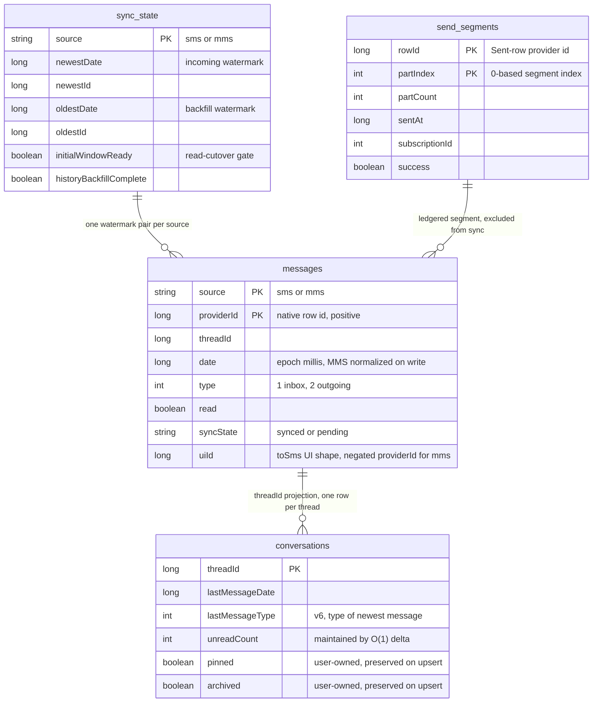

# Room Data Model (Read Shadow)

`MessagesDatabase` (app/src/main/java/com/autonomousone/messages/data/MessagesDatabase.kt) is the
app's local **read-SSOT**: the UI reads from here, and `TelephonySyncCoordinator` keeps it in step
with the system Telephony provider. The database is built lazily as a singleton under the filename
`messages.db`, declares **version 6** with `exportSchema = true`, and registers five entities —
`MessageEntity`, `ConversationEntity`, `SyncStateEntity`, `MessageFts`, `SendSegmentEntity` — with
one DAO accessor each: `messageDao()`, `conversationDao()`, `syncStateDao()`, `messageFtsDao()`,
`sendSegmentDao()`.

## Data model

Caption: `messages` / `conversations` / `sync_state` / `send_segments` and their relationships —
key invariants: `messages` is keyed by the composite **(source, providerId)** (provider `_id`
sequences overlap between SMS and MMS), all dates are **millis-normalized** (MMS provider seconds
×1000 on write), MMS ids are **negated only in the UI row shape** produced by `toSms()`
(`id > 0` ⇒ SMS, `id < 0` ⇒ MMS), and `send_segments` is **app-owned telemetry** that no sync or
reconcile path ever writes. `messages_fts` is a virtual FTS4 table over `messages.body` (not an
entity in this diagram; see [Full-text search](#full-text-search)).

## messages: the mirrored table

`MessageEntity` (app/src/main/java/com/autonomousone/messages/data/Entities.kt, L17-L85) mirrors
one SMS or MMS row. Its primary key is the **composite `(source, providerId)`**: the SMS and MMS
`_id` sequences overlap, so the provider id alone is not unique across the two tables. `source` is
`"sms"` or `"mms"` (`SOURCE_SMS` / `SOURCE_MMS`), and `MessageKey(source, providerId)`
(app/src/main/java/com/autonomousone/messages/data/MessageMutation.kt, L7) mirrors the composite for
in-memory identity.

**Dates are always milliseconds** in this table. MMS rows arrive in seconds from the provider —
`SmsRepository` multiplies `Mms.DATE` by 1000 at read time (app/src/main/java/com/autonomousone/
messages/repository/SmsRepository.kt, L318) — and the sync layer's keyset predicates divide the
millis watermark back to whole seconds before querying MMS (`readMmsKeyset` / `readNewerThan`),
which is exact because MMS dates are whole seconds.

Other fields: `threadId`, `normalizedAddress` (ContactRepository.normalizePhone) plus `rawAddress`
(display fallback), `body`, `type` (1 = inbox, 2 = sent, mirroring `Sms.MESSAGE_TYPE_*`), `status`
(Telephony.Sms.STATUS), `dateSent`, `read`, and `syncState` bookkeeping (`SYNC_STATE_SYNCED` /
`SYNC_STATE_PENDING`, default `synced`).

The UI-facing mapping `toSms()` negates MMS ids: SMS rows map to `id = providerId` (positive), MMS
rows to `id = -providerId`. The convention `id > 0` == SMS, `id < 0` == MMS keeps
`distinctBy { it.id }` and Compose keys from colliding when both providers contain the same `_id`
(guarded by `MessageKeyTest`, including a 100k mixed-identity scale smoke test).

The index set serves the hot read paths:

| Index | Purpose |
|---|---|
| `(threadId, date, providerId)` | conversation window + newest-first paging |
| `(normalizedAddress, date)` | per-contact lookups before a thread is resolved |
| `(date)` | fast dedupe during incremental syncs |
| `(threadId, read, type)` | O(unread_count) SQL COUNT for thread badges |

The last index is declared in Room so **fresh installs (Room-managed) and upgrades (MIGRATION_3_4)
converge to the same schema** — the old hand-rolled `PARTIAL` index (`idx_messages_thread_unread`)
could not be declared in Room and was silently missing on fresh installs.

## conversations: the per-thread projection

`ConversationEntity` is a per-thread projection keyed by `threadId`, indexed on `lastMessageDate`.
Fields: `normalizedAddress` / `rawAddress`, `snippet` (newest message body), `lastMessageDate`,
`unreadCount`, `lastMessageType` (v6), and the user-owned `pinned` / `archived` flags.
`lastMessageType` (type of the newest message, default 1/incoming) was added in v6 so Home can
render the "You:" marker without an O(N) probe into `messages`.

There are three distinct write paths, chosen by who is writing:

- **`upsertPreservingFlags`** — the exact-mutation path. It is a true upsert written as
  `INSERT … ON CONFLICT(threadId) DO UPDATE SET` that updates **only projected fields** —
  `pinned`/`archived` are never clobbered. The snippet, date, and type columns use a
  *newest-wins* guard (`CASE WHEN excluded.lastMessageDate >= conversations.lastMessageDate`), so a
  late-arriving older row cannot overwrite a newer snippet, and `lastMessageDate` advances via
  `MAX(excluded, current)`. A brand-new thread is INSERTED here, so realtime visibility never
  depends on a later full rebuild.
- **`upsertFull`** — the sync-engine rebuild path; overwrites every projection field including
  `pinned`/`archived` (the coordinator passes current repository state).
- **`upsert`** — plain Room upsert used by `fullRebuildConversations()`.

The badge count is maintained by **delta, not recount**: `UnreadDelta`
(app/src/main/java/com/autonomousone/messages/data/UnreadDelta.kt) is a pure, database-free signed
delta rule — brand-new unread +1, brand-new read 0, flag unchanged 0, unread→read −1 (the badge must
come down when a message is read), read→unread +1. This keeps the realtime path O(1) regardless of
thread size.

The rebuild helper `newestPerThread()` (Daos.kt, L69-L82) picks the newest message per thread with a
deterministic tie-break via a correlated rowid subquery ordered `date DESC, source DESC,
providerId DESC`: the old `MAX(date)` + `GROUP BY` form picked an *arbitrary* row among equal-date
ties (a send and its delivery receipt share a timestamp constantly). The v6 backfill SQL uses the
same ordering.

## sync_state: dual watermarks

`SyncStateEntity` holds one row per synced source (PK `source`) with **dual watermarks that move
independently and must not interfere**:

- `newestDate` / `newestId` — incoming direction (new messages from above);
- `oldestDate` / `oldestId` — backfill direction (history from below). Defaults to
  `Long.MAX_VALUE` on both, the sentinel meaning "oldest watermark untouched".

Plus state flags `initialWindowReady` (initial 200–500-message window loaded),
`historyBackfillComplete`, and repair bookkeeping `lastReconcileAt` / `schemaVersion`.

The DAO enforces **monotonic watermark advancement in SQL**: `advanceNewest` updates only when
`(newestDate, newestId)` is strictly ahead of the stored pair, and `advanceOldest` symmetrically
only when strictly behind. The rule is "NEVER read-modify-write the whole entity inside the
backfill loop: a stale copy written back at the end stomps every cursor advanced during the run (the
v2.6.2 bug). Each update touches exactly one field group." `markInitialWindowReady` is set **only
after** the conversations projection has been rebuilt (see [Read cutover](#read-cutover-and-the-read-path)).

## Full-text search

`MessageFts` (app/src/main/java/com/autonomousone/messages/data/MessageFts.kt) is an `@Fts4`
virtual table over message **bodies** with `contentEntity = MessageEntity::class`: every FTS
`docid` equals the `rowid` of its `messages` row, so joins back to the content table are exact and
index-free, and Room-generated triggers
(`room_fts_content_sync_messages_fts_BEFORE/AFTER_UPDATE/DELETE/INSERT`) keep the index in sync.
`WHERE body MATCH ?` becomes a B-tree lookup — O(matching rows), not O(total messages) — which is
what makes search viable at 360K-row scale instead of loading every row into Kotlin.

The query is built by `FtsQuery.build` (app/src/main/java/com/autonomousone/messages/data/FtsQuery.kt):
every whitespace-split token is double-quoted (so FTS4 operators like `OR`, `*`, `:` stay literal)
with embedded quotes escaped by doubling; empty/whitespace input yields `""`, which callers must
skip. `MessageFtsDao.threadHits` aggregates hits per thread (`threadId`, `matchCount`, `latestDate`)
ordered by newest conversation first; `HomeViewModel.searchAllMessages` maps each hit to the
thread's newest message row for display.

## send_segments: the send-segment ledger

`SendSegmentEntity` (app/src/main/java/com/autonomousone/messages/data/SendSegment.kt, L29-L74)
records one **confirmed outgoing SMS segment** — a modem callback, not a `send()` attempt — written
by `SmsStatusReceiver` when the per-part SENT PendingIntent fires
(app/src/main/java/com/autonomousone/messages/sms/SmsStatusReceiver.kt, L100-L133). Primary key
`(rowId, partIndex)` with `OnConflictStrategy.REPLACE`: a redelivered callback inserts over the
existing row, so the COUNT never moves twice. `rowId` is the Sent-row provider `_id`;
`partIndex`/`partCount` describe the multipart split; `sentAt` is the callback timestamp;
`subscriptionId` is the SIM that carried the segment (−1 = unknown); `success` marks
carrier-confirmed segments.

The success verdict (v2.6.18) counts **RESULT_OK and the AMBIGUOUS_ACCEPTED verdict**
(`RESULT_ERROR_GENERIC_FAILURE` — SMSC-accepted on affected RILs) as success; explicit radio errors
(`NO_SERVICE` / `RADIO_OFF` / `NULL_PDU`) are not billable and stay `success = false`. The Home
"N SMS today" chip counts **rows, not logical messages** (a 3-part send contributes 3 — what the
carrier bills), via `observeSuccessSince` over a local-midnight window; `successBySubscription`
breaks the same window down per SIM, and failed rows are retained for post-mortems, simply never
counted.

This table is kept **out of the sync mirror on purpose**: it is app-owned telemetry that no Telephony
provider table stores, so no reconcile path may ever touch it. Boundedness is maintained by
`pruneBefore(90 days)`, which the coordinator piggybacks on the periodic full-sync reconcile
(app/src/main/java/com/autonomousone/messages/data/TelephonySyncCoordinator.kt, L227).

## Read cutover and the read path

`TelephonySyncCoordinator.isShadowReady()` is the read-cutover gate: it is true only when **both**
the SMS and MMS sources report `initialWindowReady`
(app/src/main/java/com/autonomousone/messages/data/TelephonySyncCoordinator.kt, L108-L113).
`syncSource` deliberately leaves the flag FALSE when the initial window lands; `applyReconcile`
flips it only *after* `fullRebuildConversations()` has rebuilt the projection — so the UI can never
observe "ready" against an empty or missing conversation list. If the process dies in between, the
next reconcile redoes the (idempotent) window + rebuild before marking again.

The gate is consulted on the read side with a provider fallback: `HomeViewModel.performLoad` /
`silentRefresh` call `syncNow()` then read the Room conversation list only when `roomReadEnabled`
(app/src/main/java/com/autonomousone/messages/viewmodel/HomeViewModel.kt, L220-L324), and
`ConversationViewModel` paints the Room shadow (`newestWindowForThread` / `newestForAddress`,
20-row window) on an in-memory cache miss
(app/src/main/java/com/autonomousone/messages/viewmodel/ConversationViewModel.kt, L541-L571).

The write side is single-writer by construction: `TelephonySyncCoordinator` is the **single writer
into Room**, with two channels — exact **mutations** through an unlimited sequential channel
(never dropped, never conflated) and **reconciles** through a conflated channel (N nudges collapse
into one bounded repair pass). An `Upsert` mutation runs in one Room transaction: re-read the old
row by composite key, `upsertAll`, compute the `UnreadDelta`, then `upsertPreservingFlags` — O(1)
per message, no full scan, no projection rebuild on the realtime path. See
[Sync Coordinator](sync-coordinator.md) for the full channel model and backfill crawl.

## Migration strategy: v2 → v6

| Migration | Change |
|---|---|
| **MIGRATION_2_4** | direct v2 → v4 jump (old users never touch the broken historical 2→3 path); drops the hand-rolled indexes, creates the Room-managed unread index + FTS4 table and triggers, and rebuilds `sync_state` data-preservingly |
| **MIGRATION_3_4** | same as 2_4, but fresh v3 DBs already have the exact v4 `sync_state` and keep every watermark with no rebuild |
| **MIGRATION_4_5** | adds `send_segments` + `index_send_segments_sentAt` (additive only) |
| **MIGRATION_5_6** | adds `conversations.lastMessageType INTEGER NOT NULL DEFAULT 1` and backfills it in the same transaction (additive only) |

### The v4 data-preserving sync_state rebuild

The v4 migration's core hazard was `sync_state`: a blanket `DROP` is what erased watermarks on
every app update historically, making every upgrade a 360K-message full rescan. Instead,
`migrateSyncStateDataPreserving` inspects the table's **actual** columns via `PRAGMA table_info`
and `syncStateRebuildSql` decides by shape (MessagesDatabase.kt, L82-L126):

| Observed shape | Action |
|---|---|
| Table missing | plain v4 CREATE |
| Exact v4 column set | **nothing** — the watermarks are the entire point of the table |
| Legacy v2 shape (`newestSyncedDate`, `backfillComplete`, `lastSyncAt`), including DBs the broken shipped 2→3 migration only ALTER-added columns onto | Room table-rebuild: CREATE `sync_state_v4_new` with the exact v4 columns → `INSERT … SELECT` with column mapping → DROP old → RENAME |
| Any other unknown shape | last-resort drop + create (the coordinator re-syncs, as before) |

The v2 → v4 column mapping: `newestDate ← newestSyncedDate` (preferring it when `> 0`, falling back
to an ALTER-added `newestDate`), `initialWindowReady ← 1` (a legacy row means the old sync ran),
`historyBackfillComplete ← backfillComplete`, `lastReconcileAt ← lastSyncAt`, and — when the legacy
backfill finished, the whole history is already mirrored, so `oldestDate/oldestId ← 0` to ensure no
backfill ever re-runs; otherwise the `Long.MAX_VALUE` sentinel keeps backfill pending.

The companion `UPGRADE_TO_V4_SQL` list is idempotent for every starting shape and never drops
`sync_state`: it drops the non-managed hand-rolled indexes, creates the Room-managed
`(threadId, read, type)` unread index, heals the Room-declared `messages` indexes, and creates the
FTS4 virtual table plus all four content-sync triggers — **exact text from 4.json**, which Room
validates verbatim at upgrade time.

### v6 backfill

`UPGRADE_TO_V6_SQL` is additive only: `ALTER TABLE conversations ADD COLUMN lastMessageType
INTEGER NOT NULL DEFAULT 1`, then a single UPDATE backfill that sets the column to the newest
message's `type` using the deterministic tie-break `ORDER BY date DESC, source DESC, providerId
DESC LIMIT 1`, guarded by `WHERE EXISTS` so threads with no messages keep the incoming default.

### Schema rules

1. **Every schema change bumps the version and adds a real `Migration`** wired into
   `.addMigrations(...)` — the current chain is `MIGRATION_2_4, MIGRATION_3_4, MIGRATION_4_5,
   MIGRATION_5_6` (MessagesDatabase.kt, L233).
2. **Never hand-edit an exported schema JSON.** The files under
   `app/schemas/com.autonomousone.messages.data.MessagesDatabase/2.json … 6.json` are KSP build
   artifacts of schema history, committed to git as the canonical per-version record.
3. **The destructive fallback is DEBUG-only** (v2.6.10): `fallbackToDestructiveMigration(dropAllTables = true)`
   is applied only when `BuildConfig.DEBUG`. In release, a missing migration must fail loudly in QA
   — never silently wipe the local read model (send_segments ledger, sync state, projections) and
   force a full Telephony re-crawl on hundreds of thousands of rows.
4. Migrations that must match Room exactly (FTS triggers, v4/v5/v6 CREATE/ALTER text) are kept as
   bare-SQL constants in lockstep with the generated JSON and pinned by unit tests, so drift is
   caught on every `testDebugUnitTest` run instead of exploding on a device at upgrade time.

> **Stale document warning:** `docs/room-migration-strategy.md` is **stale** — it describes the
> database as being at version 2, with no real v1 → v2 migration and an intentional destructive
> fallback for now. The database is at **v6** with real migrations for every step and a debug-only
> fallback. Treat `MessagesDatabase.kt` and the committed `app/schemas/*.json` files as
> authoritative for the current state.

## Tests

The data-model invariants that would break a device at upgrade time or corrupt badges are pinned by
JVM unit tests:

- **`MigrationToV4SqlTest`** (app/src/test/java/com/autonomousone/messages/MigrationToV4SqlTest.kt) —
  asserts every non-drop `UPGRADE_TO_V4_SQL` statement matches the compacted text of the generated
  `4.json`; asserts `UPGRADE_TO_V4_SQL` never drops `sync_state`; and drives
  `syncStateRebuildSql` across shapes: exact v4 → no-op, legacy v2 → rebuild via
  create-insert-select-drop-rename with the legacy column mapping and `initialWindowReady` pinned
  to 1, broken 2→3 hybrid → `CASE WHEN newestSyncedDate > 0 … ELSE IFNULL(newestDate, 0)`, unknown
  shape → drop+create, missing table → plain v4 create.
- **`MigrationToV6SqlTest`** (app/src/test/java/com/autonomousone/messages/MigrationToV6SqlTest.kt) —
  asserts the 5→6 boundary, that the migration is additive-only (no DROP/CREATE TABLE), that the
  column matches `6.json` (order, `INTEGER NOT NULL`, `DEFAULT 1`), and that the backfill keeps the
  deterministic tie-break ordering and the `WHERE EXISTS` guard.
- **`UnreadDeltaTest`** — covers every delta transition and proves repeated upserts never
  accumulate (1000 re-upserts of an unread row add exactly 1).
- **`MessageKeyTest`** — composite-key non-collision for overlapping provider ids, the
  `toSms()` negation contract, and a 100k mixed-identity scale smoke test.
- **`FtsQueryTest`** — token quoting, operator literalness, quote escaping, and empty-input
  handling for the MATCH builder.

## Related

- [Conversation Window and Keyset Pagination](conversation-paging.md) — the provider-side pager and
  the Room shadow paint on conversation open.
- [Outgoing Messaging](outgoing-messaging.md) — the send path whose modem callbacks feed
  `send_segments`.
- [Sync Coordinator](sync-coordinator.md) — the single writer that maintains this database.
- [Unit Tests](../testing/unit-tests.md) — the JVM test suite pinning these invariants.
