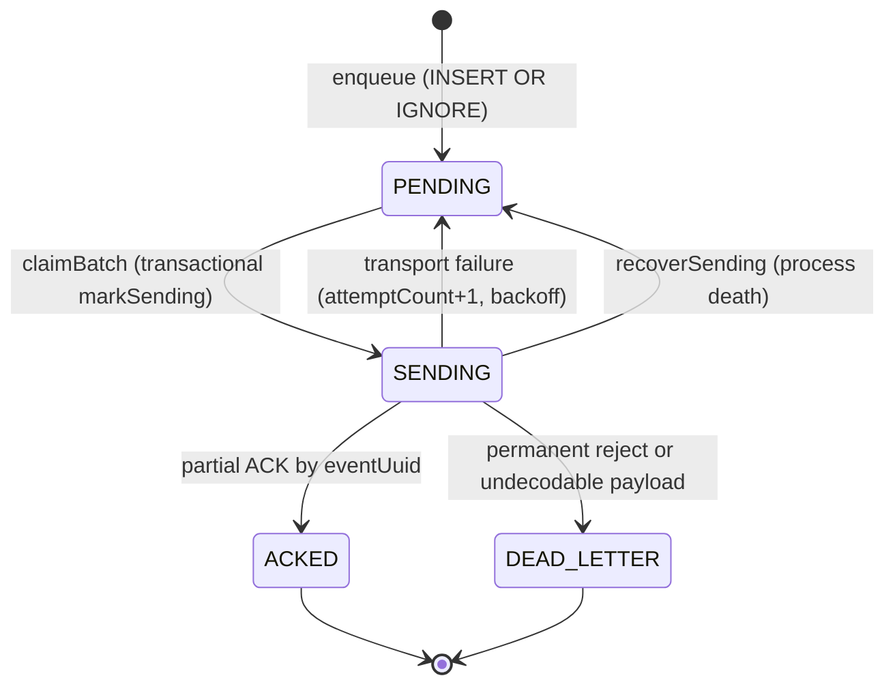
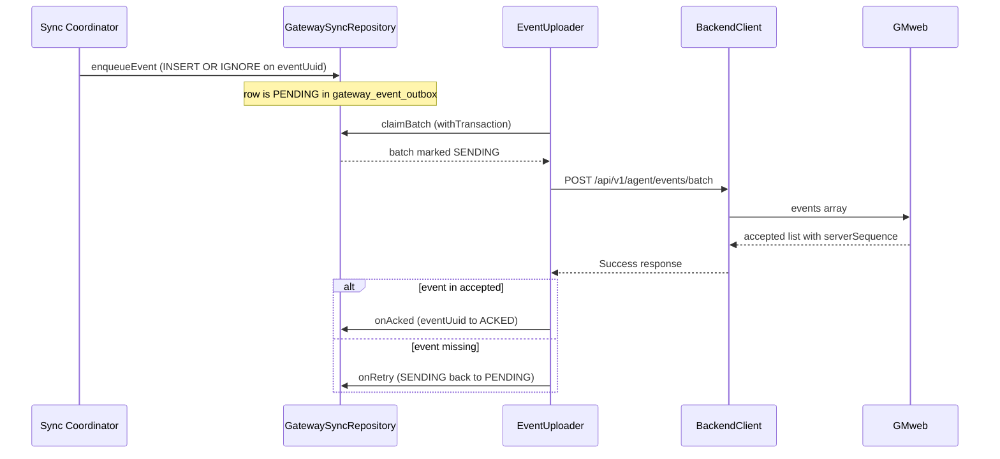

# Durable Gateway Sync (PR-01..PR-03)

PR-01..PR-03 build the durability foundation that lets the Messaging Platform satisfy
**ADR-001** (Android is the trust root), **ADR-002** (point-to-point command encryption,
conversation key epochs), and **ADR-003** (the correctness contract *durable command +
eventual pickup + no duplicate execution*, with the `<3s` pickup SLO measured **only** when
the agent is `AGENT_AVAILABLE`). The unifying principle, taken from the ADRs, is that
**correctness lives in the queue, not on the wire**: every critical event or command is
committed to durable storage before it is transmitted or executed, so a dead radio, a crash,
or a dropped ACK can never lose it. This page documents the five v7 tables, the repository
boundary, both state machines, the event factory, the uploader, and the outgoing SMS
pipeline — and states, verified against source, where the wiring is live today and where the
ADR targets are still ahead.

## The five v7 tables

`MessagesDatabase` (v7, `messages.db`) gained exactly five additive tables in
`MIGRATION_6_7` (`app/.../data/MessagesDatabase.kt`). The migration is **purely additive** —
only `CREATE TABLE` / `CREATE [UNIQUE] INDEX`, 12 statements total — and
`GatewaySyncSchemaTest` pins this shape against the KSP-generated `schemas/.../7.json`. Three
of the seven indexes are `UNIQUE`, and they *are* the exactly-once/dedupe contract:
`index_gateway_event_outbox_eventUuid`, `index_remote_commands_idempotencyKey`, and
`index_remote_conversation_map_threadId`.

| Table | Role | Key invariant |
|---|---|---|
| `remote_conversation_map` | Provider `threadId` ↔ opaque conversation UUID | **Unique `threadId`** — the ONLY home of this mapping (TechSpec §12) |
| `gateway_event_outbox` | Durable cloud event outbox | **Unique `eventUuid`** — a re-commit is a no-op, never a duplicate |
| `remote_commands` | Durable remote command inbox | **Unique `idempotencyKey`** — redelivery is a no-op INSERT |
| `remote_command_executions` | One row per execution attempt | Proves exactly-once: no command executes twice without two rows |
| `sync_cursors` | Per-direction cursors (upload ACK watermark, command inbox cursor, trust log) | Advances with *server* sequences, not provider dates |

Every payload column is **crypto-friendly from day one**: `ciphertext` (BLOB) + `encoding` +
`schemaVersion` + `cryptoVersion`. With `cryptoVersion = 0` the bytes are UTF-8 JSON
(plaintext, PR-01/PR-02); from **Phase 7 (ADR-002)** the same columns carry an opaque AEAD
envelope and the `cryptoVersion` value is bumped with **zero schema change**. Nothing in the
gateway code may assume the payload is readable text.

## `GatewaySyncRepository` boundary

`GatewaySyncRepository` (PR-01) is the **deliberately dumb** boundary over the five tables:
**no crypto, no networking**. Upload and poll workers (PR-02/PR-09/PR-10) call its suspend
functions; the repository owns the transactional semantics that make the outbox safe.

- `claimBatch(now)` is the **transactional claim**. It runs inside
  `db.withTransaction { … }`: select the claimable rows, then `markSending(ids)` flips
  *exactly that batch* `PENDING → SENDING` **atomically** before returning. The `markSending`
  SQL carries a `WHERE … AND state = 'PENDING'` guard, so only rows still `PENDING` move —
  this is what keeps the claim a safe single-flight transition even if a row's state shifted
  between selection and update.
- The claim query (`claimable`) selects rows where `state IN ('PENDING','SENDING')` and
  `nextAttemptAt <= now`, ordered by `id` (FIFO within a state). This means the claim is
  *re-entrant across restarts* and never starves an in-flight batch.
- `onAcked` / `onRetry` / `onDeadLetter` each carry a `WHERE … AND state = 'SENDING'` guard
  (except dead-letter, which is unconditional) so only a row actually in flight advances.
- `recoverSending()` is the **process-death recovery**: it flips any leftover `SENDING` rows
  back to `PENDING`. A worker that dies between claim and upload/ACK leaves `SENDING` rows;
  this restores them (ADR-003 / TechSpec §16).

Because the claim and its state flip are one transaction, and because recovery resets
`SENDING`, the invariant holds end to end: **an event is always recoverable after a crash,
and can never be double-claimed into a corrupt state.**

## Event outbox state machine

The `GatewayEventOutboxEntity` rows walk a four-state machine. Correctness is enforced by
the guarded DAO transitions and the recovery path, not by the uploader's memory.

*Caption: the `gateway_event_outbox` lifecycle — PENDING → SENDING → ACKED, with
retry/dead-letter and crash-recovery edges.*

The invariants that keep correctness in the queue:

- **Unique `eventUuid` dedupe** — `insertOrIgnore` with `OnConflictStrategy.IGNORE` on a
  unique `eventUuid` index. Re-committing an event (reconcile re-offers, redelivery) is a
  no-op, never a duplicate.
- **Transactional claim** — `markSending` runs inside `withTransaction`, so the batch's state
  flip is atomic with its selection.
- **Per-eventUuid partial ACK** — `markAcked` updates *only* the reported `eventUuid`
  (`WHERE eventUuid = … AND state = 'SENDING'`). The rest of a partially-accepted batch stays
  `SENDING`→`PENDING` and retries on its own backoff (LOCK 13).
- **SENDING→PENDING recovery on startup** — `recoverSending()` closes the crash window
  between claim and ACK.
- **DEAD_LETTER is a visible state, never a silent drop** — dead-lettered rows remain
  queryable (the health-alert surface reads this state); the row is never deleted.

### LOCK-13 upload policy

The batching/backoff math lives in `GatewaySyncRepository.Policy`, pure so the JVM tests can
pin it (`GatewaySyncPolicyTest`):

- **Batch cap** — at most `MAX_BATCH_EVENTS = 100` events **and** at most
  `MAX_BATCH_BYTES = 512 KiB` of payload bytes. `selectBatch` walks candidates in FIFO order
  and stops before either bound is exceeded.
- **Lone oversized event still ships** — the byte check is skipped for the *first* row of a
  batch, so a single >512 KiB event is still sent (the queue must never wedge on one giant
  row). `GatewaySyncPolicyTest` pins this: a 600 KiB event ships alone.
- **Full-jitter exponential backoff** — `backoffDelayMs(attempt)` returns a uniform random
  value in `[0, min(cap, base · 2^attempt))`, with `BACKOFF_BASE_MS = 2_000` and
  `BACKOFF_CAP_MS = 5 min`, attempt clamped to `0..20`. Full jitter (random in the whole
  range, not a fixed delay) prevents thundering-herd re-submission after an outage.

## Command inbox — exactly-once

The `RemoteCommandEntity` inbox stores remote commands (e.g. `SEND_SMS`) **before** any ACK
to GMweb and **before** execution. Exactly-once is a two-part construction:

1. **Unique `idempotencyKey`** — `remote_commands.idempotencyKey` is unique, and ingestion
   uses `INSERT OR IGNORE`. A redelivered command is a no-op INSERT; `ingestCommand` returns
   `false` and the caller surfaces the **existing** row's `commandId`
   (`getByIdempotencyKey`), so the same logical command always resolves to the same durable
   row.
2. **One `remote_command_executions` row per attempt** — `RemoteCommandExecutionEntity`
   (`commandId`, `attempt`, `startedAt`, `finishedAt`, `result`) is the audit trail that makes
   exactly-once *provable*: a command has never executed twice without two rows existing.

The command state machine is guarded so illegal transitions cannot occur:

- `markAcceptedIfReceived` is the **single-owner claim** —
  `UPDATE … SET state = 'ACCEPTED' WHERE commandId = … AND state = 'RECEIVED'`, returning 1
  only for the winner. Only one executor can move a command `RECEIVED → ACCEPTED`.
- `markState(commandId, state, fromStates)` is the general **guarded transition** —
  `UPDATE … SET state = … WHERE commandId = … AND state IN (fromStates)`, where the `WHERE`
  clause enforces the legal-from set. The send executor (PR-03) uses it to move
  `ACCEPTED/EXECUTING → COMPLETED/FAILED`.

Command states: `RECEIVED`, `ACCEPTED`, `EXECUTING`, `COMPLETED`, `FAILED`, `EXPIRED`.

**24 h expiry floor** (TechSpec §93): a queued command must never be deleted by a short
timeout. `GatewayOutgoingPipeline` sets `expiresAt = now + 24h`, and `RemoteCommandDao`
provides `expireStale(now)` to flip `RECEIVED` rows past their `expiresAt` to `EXPIRED` (a
visible terminal state, matched by the GMweb command expiry when it lands).

### `remote_conversation_map` — the only threadId ↔ UUID home

Per **TechSpec §12**, the provider `threadId` ↔ opaque conversation UUID mapping lives
**only** on Android, in `remote_conversation_map`. `GatewaySyncRepository` exposes two
idempotent entry points:

- `mapOrGet(threadId, conversationId)` — insert-then-read, returning the existing mapping
  when present.
- `ensureConversationIdForThread(threadId)` — reads the existing UUID, or mints a
  `java.util.UUID.randomUUID()`, inserts it, and **reads the row back** (so a lost insert
  race returns the winner's UUID, not a stale local one). GMweb ever sees only the UUID; the
  phone number is never derived into it.

## `GatewayEventFactory` — envelope-only identity

`GatewayEventFactory` (PR-02, in the `data` package because it *builds Room rows*) converts
message lifecycle facts into outbox rows. Its identity rules (TechSpec §13) make dedupe free:

- **Stable message UUID** — `messageIdFor(source, providerId, createdAtMs)` derives
  `payload.messageId` from the durable provider row identity
  `"$source:$providerId:$createdAtMs"` (a name-based UUID) — **never** from body or
  timestamp alone. `GatewayEventFactoryTest` pins that the MMS and SMS id spaces are distinct
  and that a different row/date cannot collide.
- **Deterministic per-event UUID** — `eventUuidFor(eventType, source, providerId, dateMs)`
  makes `eventUuid` deterministic from kind + row identity + date, so the outbox unique index
  turns *rebuilt* events into free dedupe rather than "row already shipped, revision silently
  dropped". Different kinds (created vs status vs deleted) for the same row produce different
  UUIDs and coexist.
- **Envelope-only / PII policy** — `outboxRow` stores the payload as
  `{"ciphertextB64","encoding","schemaVersion","cryptoVersion"}` bytes with
  `encoding = "envelope.v1"`, `cryptoVersion = 0`. Sender/body live **inside** the payload
  bytes (encrypted in Phase 7), never as envelope columns. `decodePayloadEnvelope` is the
  inverse and **rejects any `cryptoVersion ≠ 0`** with `IllegalArgumentException` — the Phase 7
  extension point is explicit and pinned by `GatewayEventFactoryTest`.

Builders: `messageCreated`, `messageStatusChanged`, `messageDeleted`, `threadRead`.

## `EventUploader` — the sole durable cloud transmitter

`EventUploader` (PR-02) is the **only** durable cloud transmitter. It is a supervisor-managed
coroutine that owns no RAM-only state: the queue is the source of truth. Its loop:

1. **Recover first** — on `start()`, the very first act is `repo.recoverSending()`, requeueing
   any `SENDING` rows left by a crash between claim and ACK.
2. **Gate** — each iteration checks `prefs.isEnabled` and a non-blank backend URL; while
   gated it sleeps (5 s) and makes **zero HTTP**.
3. **Claim** — `repo.claimBatch(now)` (transactional → `SENDING`).
4. **Upload** — `uploadBatch` decodes each payload via
   `GatewayEventFactory.decodePayloadEnvelope`, builds the `{"events":[…]}` body, and POSTs to
   **`POST /api/v1/agent/events/batch`** through `BackendClient`. An undecodable payload
   dead-letters *that one row only* and keeps the rest of the batch.
5. **Partial ACK** — on `Success`, it parses `accepted[]` (`{eventId, serverSequence}`); each
   reported `eventId` → `onAcked` (`ACKED`), each missing one → `onRetry` (`PENDING` +
   attempt-counted backoff). `acked == batch.size` → `ALL_ACKED`, else `PARTIAL`.
6. **Transport failure** — a non-4xx failure (or 429) → requeue the whole batch with
   `Policy.backoffDelayMs`. A **permanent 4xx** (400–499 excluding 429) → dead-letter the whole
   batch (`FATAL`, visible, never a silent drop).

`BackendClient` is the shared HTTPS client: it reads `backendUrl` (build-time default
`https://gaitway.autonomousone.in`, overridable via the `GATEWAY_BACKEND_URL` Gradle
property) and `gatewayToken`, sends `Authorization: Bearer <token>`, enforces
**HTTPS-only** (rejects non-`https://` so the bearer token can never ride plaintext HTTP), and
returns a sealed `Result` — no exceptions leak to callers.

*Caption: enqueue → claim → upload → per-eventUuid partial ACK for the durable cloud outbox.*

## `GatewayOutgoingPipeline` — durable SEND_SMS enqueue

`GatewayOutgoingPipeline` (PR-03) is intended to be the **single durable queue** for outgoing
SMS. `enqueueSendSms(phone, body, threadId, …)` resolves the conversation UUID via
`ensureConversationIdForThread`, mints a `commandId` + `messageUuid`, builds a `SEND_SMS`
JSON payload (`cryptoVersion = 0`), sets the 24 h `expiresAt` floor, and ingests the row
through `ingestCommand`. Redelivery with the same `idempotencyKey` returns the **existing**
command id (exactly-once). It returns a `Plan` record (a pure decision record, JVM-testable).

## Current wiring status (verified from source)

The ADRs describe the target; the code is mid-rollout. Status, checked against the tree:

- **Event outbox is LIVE end to end.**
  - *Inbound* — `TelephonySyncCoordinator` (the single Room writer) commits the matching cloud
    event **inside the same Room transaction** as the message it describes, via
    `enqueueCloudEvent` → `gatewayEventOutboxDao().insertOrIgnore`, for upsert (only when the
    message row is new, i.e. `old == null`), delete, status-change, and thread-read mutations.
    The event row and the message row live or die together (Rule 4); a process death loses both
    and the provider reconcile re-mirrors and re-enqueues.
  - *Outbound* — `EventUploader` is instantiated in `GatewayService.onCreate` and driven by
    `ConnectionSupervisor` (`startEventUploader`/`stopEventUploader` in the connect/disconnect
    reconcile). Its loop gates on `prefs.isEnabled && prefs.gmwebUrl.isNotBlank()` (while gated
    it makes zero HTTP), then POSTs the batch to `prefs.backendUrl` (build-time default
    `https://gaitway.autonomousone.in`) at `/api/v1/agent/events/batch`.
- **The old fire-and-forget cloud leg is gone.** `WebhookEngine`'s KDoc still carries PR-02
  language, but its *cloud* path has been deleted — what remains is the user-configured
  **local** webhook only (best-effort, consent-gated via
  `GatewayAccessPolicy.canTransmit`, HTTPS-only, optional HMAC `X-Signature`). The durable
  outbox, not the webhook, is now the event path.
- **Outgoing pipeline is present but not the live default.** `enqueueSendSms` exists and is
  called by `SmsSender.sendWithOutcome`, but only when the `ENQUEUE_ALL_SENDS` rollout flag is
  `true` — it **defaults to `false`**, so production sends still take the direct
  `SmsManager` path. The durable branch, when on, claims the command with
  `markCommandAcceptedIfReceived` and transitions it to `COMPLETED`/`FAILED`.
- **Not yet implemented (gap vs ADR targets):**
  - The `SmsSender.sendOrEnqueue` compatibility shim referenced by the pipeline KDoc does
    **not** exist in source (the funnel is `sendWithOutcome`, not `sendOrEnqueue`).
  - There is **no drain executor**: when the flag is on, the command executes inline in the
    send thread; nothing asynchronously polls `remote_commands` for `RECEIVED` rows.
  - **Execution rows are not yet written** — no production caller inserts into
    `remote_command_executions`, so the "one row per attempt" audit trail is the PR-01 schema
    target, not yet recorded.
  - `expireStale` (command expiry) and the `sync_cursors` accessors have no production
    callers yet; the cursor watermarking is the PR-01 schema for reconnect resume.

In short: the **outbound event** path (coordinator → outbox → uploader → GMweb) is the
durable path in production today; the **inbound command** path (GMweb → `remote_commands` →
exactly-once execution with execution rows and drain) is the PR-01/PR-03 target that is
landed at the schema level but not yet fully wired.

## Focused tests

- `GatewaySyncSchemaTest` — pins `MIGRATION_6_7` (6→7), the additive-only constraint (5 tables
  + 7 indexes), and the three exactly-once `UNIQUE` indexes by name, against `schemas/.../7.json`.
- `GatewaySyncPolicyTest` — pins LOCK-13: 100-event cap, the 512 KiB byte cap, the lone
  oversized event still shipping, and full-jitter backoff bounds (2 s base, 5 min cap).
- `GatewayEventFactoryTest` — pins the §13 deterministic identity (stable message UUID,
  distinct event UUID per kind), the `envelope.v1` round-trip, and that `cryptoVersion=1` is
  rejected until Phase 7 lands.

## Related pages

- [Room Data Model](/openwiki/architecture/data-model.md) — the full v7 schema and migration strategy.
- [Gateway service](/openwiki/architecture/gateway-service.md) — the `ConnectionSupervisor` reconcile loop that starts/stops `EventUploader` and derives the runtime `isEnabled` gate.
- [Cloud relay](/openwiki/integrations/cloud-relay.md) — the `BackendClient` HTTPS chain and relay components.
- [GMweb pull](/openwiki/integrations/gmweb-pull.md) — the outbound-only `OutboxPoller` bridge.
- [Send pipeline](/openwiki/workflows/send-pipeline.md) — the outgoing send flow the durable pipeline funnels.
