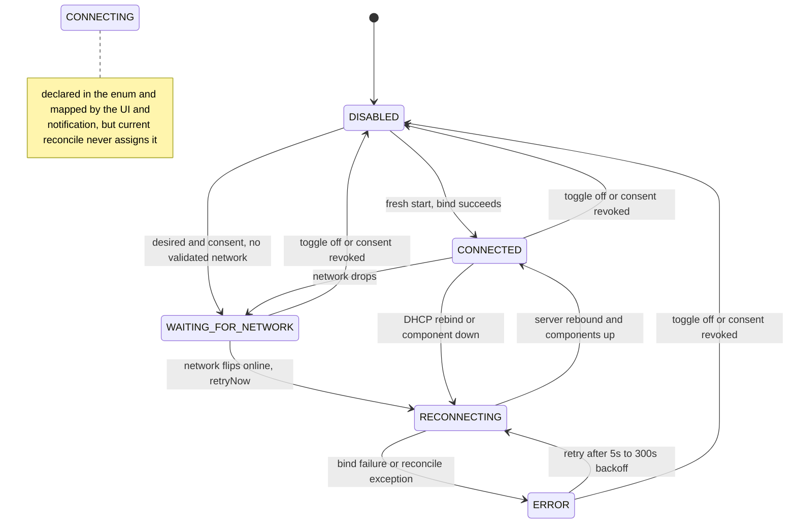

The self-hosted gateway is an Android foreground service that exposes a local REST API on the LAN, heartbeats a cloud backend, and runs the outbound-only GMweb pull bridge. Its runtime core is a single self-healing supervisor — `ConnectionSupervisor` — that reconciles all gateway components against a declarative desired state, so that network blips, DHCP rebinds, and process death all heal through one code path instead of per-component retry logic.

Key components:

- `GatewayService` — the exported=false foreground service; owns the notification, the component wiring, and intent actions (`ACTION_START`, `ACTION_STOP`, `ACTION_RETRY_NOW`).
- `ConnectionSupervisor` — process-wide singleton; the one reconcile loop that starts/stops the LAN server, heartbeat, and outbox poller, and publishes `State`.
- `GatewayServer` — hand-rolled `ServerSocket` HTTP server (no `com.sun.net.httpserver`, which is absent from the Android runtime) with DoS and brute-force hardening.
- `GatewayPreferences` — the `sms_gateway_prefs` SharedPreferences owner: user intent, runtime mirror, consent, and Keystore-encrypted secrets.
- `NetworkMonitor` — the single source of truth for "validated internet" (transition-only `Flow`, no polling).
- `GatewayAccessPolicy` — the two-line consent gate used at every start and transmission boundary.
- `BootGatewayReceiver` — replays `ACTION_START` after `BOOT_COMPLETED`/`LOCKED_BOOT_COMPLETED` when the user's intent was persisted.
- `SecureStore` — AES-256-GCM encryption backed by a hardware-backed Android Keystore key.

## GatewayService: foreground lifecycle

`GatewayService` is declared in the manifest as `android:exported="false"` with `android:foregroundServiceType="dataSync|specialUse"` (API 34+ also ORs in `SPECIAL_USE` at `startForeground` time; `dataSync` keeps Doze from freezing the sockets mid-long-poll). `onCreate` wires `BackendClient`, `RegistrationManager`, `HeartbeatManager`, `OutboxPoller`, the `NetworkMonitor` singleton, and finally `ConnectionSupervisor.get(...)` with a `newServer` factory that constructs `GatewayServer(context, prefs.port, prefs.apiKey, bindAllInterfaces = prefs.bindAllInterfaces)` and a `ManagedComponents` adapter over `heartbeatManager`, `outboxPoller`, and `TelephonySyncCoordinator.ensureLoopRunning()`.

`onStartCommand` handles four shapes:

| Intent action | Behavior | Result |
|---|---|---|
| `ACTION_STOP` | `supervisor.stop()` (flips desired OFF persistently), full component teardown, `stopForeground`, `stopSelf` | `START_NOT_STICKY` |
| `ACTION_RETRY_NOW` | post foreground notification, `supervisor.retryNow()` (manual "Reconnect now") | `START_STICKY` |
| `ACTION_START` or `null` | consent check via `GatewayAccessPolicy.canStart` (blocked → `stopSelf`, `START_NOT_STICKY`); post foreground notification; `supervisor.start()` — non-blocking, the loop does the work | `START_STICKY` |

The `null` intent is the `START_STICKY` revival path after process death: `supervisor.start()` re-reads `gatewayDesiredEnabled` from prefs and reconciles from scratch, so recovery needs no intent payload. The class-level API mirrors this: `startGateway(context)` re-checks consent before `startForegroundService`; `stopGateway(context)` sends `ACTION_STOP`; `reconnectNow(context)` prefers the live supervisor (`ConnectionSupervisor.peek()?.retryNow()`) and only falls back to an `ACTION_RETRY_NOW` service start when the service is gone.

Runtime truth is derived, never hand-set: the static `GatewayService.isServiceRunning` is computed from `supervisorState` (`CONNECTED`, `CONNECTING`, or `RECONNECTING`), and `supervisorStateFlow`/`supervisorState` mirror the supervisor's `StateFlow` — screens and the notification read this instead of any boolean that components poke on their way out. The persistent low-importance notification mirrors every supervisor state ("📴 Waiting for a network connection…", "🔁 Reconnecting…", "⚠️ Retrying…") and appends live GMweb bridge telemetry; it carries a "Stop Gateway" action that fires `ACTION_STOP`.

**Watchdog (v2.6.11).** `onDestroy` first calls `scheduleRestartWatchdog()`: if consent is present and the *runtime* `prefs.isEnabled` flag is still true (meaning the death was not user-initiated), an `AlarmManager` alarm — `setExactAndAllowWhileIdle` when exact alarms are permitted, inexact `setAndAllowWhileIdle` fallback otherwise — revives the service with `ACTION_START` after `WATCHDOG_DELAY_MS` (15 s), even from Doze. This covers the case where `START_STICKY` revival is delayed, during which the GMweb pull bridge is dark and sends fail with `503 android_gateway_unreachable`. The watchdog is never explicitly cancelled; the redundant `ACTION_START` is harmless because `supervisor.start()` is idempotent. The user-stopped case self-excludes because `supervisor.stop()` already cleared `isEnabled` before `onDestroy` runs.

## ConnectionSupervisor: the reconcile loop

`ConnectionSupervisor` replaces the old per-component "just retry" logic (heartbeat stuck in a 5-minute backoff after a WiFi blip, LAN server bound to a stale DHCP address, outbox poller burning attempts against a dead radio) with one loop over:

```
state = f(desiredEnabled, hasConsent, online, serverIsUp, boundIp == nowIp)
```

Every input change — user toggle, consent change, network callback, LAN IP change — merely nudges a **conflated** `Channel<Unit>` (`reconcileNow()`), and the loop re-derives the whole truth. Conflation means no event is missed during an in-flight action: the next pass always sees the newest facts. All reconcile actions are idempotent.

The loop (`ensureLoop()`, idempotent) spawns three coroutines in the service scope:

1. a collector on `networkMonitor.onlineFlow()` — online + desired → `retryNow()` (immediate), otherwise `reconcileNow()`;
2. a 10-second poll that nudges `reconcileNow()` — a LAN IPv4 change is what a network switch looks like locally, and the `boundIp != currentIp` comparison inside `reconcile()` *is* the DHCP-rebind detection;
3. the main `for (nudge in reconciles)` loop calling `reconcile()`. On exception it records `lastError`, sets `ERROR`, and doubles its own backoff (5 s → 300 s cap) — "the loop is the backoff," which is why `GatewayServer.start()` can stay non-blocking and non-throwing.

### State machine

`reconcile()` transitions:

- **no desired or no consent** → stop poller/heartbeat/server, set the runtime flag `prefs.isEnabled = false` *first* (components stop transmitting before teardown), then `DISABLED`.
- **offline** → stop poller and heartbeat (zero HTTP requests while offline) and set `WAITING_FOR_NETWORK` — offline is an expected condition and is deliberately *not* `ERROR`. The LAN server is intentionally left running: local clients do not need the internet.
- **online + desired**, coming from a degraded state (`RECONNECTING`/`ERROR`/`WAITING_FOR_NETWORK`) → `RECONNECTING`, then: rebind the LAN server if needed, idempotently start heartbeat, start the outbox poller (only when `gmwebUrl` is non-blank), start shadow sync, reset backoff, set `prefs.isEnabled = true` (only after a fully successful reconcile), then `CONNECTED`.



*Caption: ConnectionSupervisor.State transitions with their reconcile triggers (user toggle, consent, network callback, IP/DHCP rebind, bind failure).*

Note the asymmetry: a fresh start transitions `DISABLED → CONNECTED` directly — `CONNECTING` is declared in the enum and consumed by `isServiceRunning`/notification/UI mappings, but the current reconcile never emits it.

**Server replacement, not restart.** `GatewayServer.stop()` closes the socket and `shutdownNow()`s both the accept executor and the handler pool, so a stopped instance is *not restartable by design*. `reconcile()` therefore always constructs a **fresh** `GatewayServer` via the `newServer` factory whenever the server is down or stale. The rebind condition is: server not running, **or** (bound address is not `0.0.0.0`, current IP is not loopback, and `boundIp != currentIp`) — the DHCP-rebind case, logged as "LAN address changed (old → new) — rebinding server". If the fresh instance's `start()` did not result in `isRunning()` (e.g. port taken), reconcile throws, the loop lands in `ERROR`, and exponential backoff retries until the port frees up.

**retryNow().** Called when the network flips online (validated) or from the UI's manual reconnect. It guards on desired + consent + online, resets the loop backoff to 5 s, calls `ensureLoop()` (revives a dead loop, e.g. after a service rebuilt without `ACTION_START`), and calls `components.retryHeartbeat()` — `HeartbeatManager.retryNow()` resets the 1 s base backoff ladder *and* wakes the pending backoff sleep via its conflated wake channel (a plain `start()` would no-op while the job is alive, silently keeping the old backoff in force) — then nudges a reconcile. Net effect: a 5-second WiFi re-association retries immediately instead of waiting out the 5-minute ladder.

**Public API.** `start()` sets `desiredEnabled = true` and persists `gatewayDesiredEnabled = true` (called from every `ACTION_START` entry: user toggle, boot receiver, `START_STICKY` revival). `stop()` flips both off and reconciles but deliberately does *not* stop the service — `ACTION_STOP`'s own path handles that. `shutdown()` (service `onDestroy`/`ACTION_STOP`) cancels the loop, stops the server and components, sets `DISABLED`, and clears the process singleton.

## Boot and crash recovery

Three complementary paths make recovery automatic:

1. **Reboot** — `BootGatewayReceiver` (manifest-registered for both `BOOT_COMPLETED` and `LOCKED_BOOT_COMPLETED`, though its guard currently acts only on `BOOT_COMPLETED`) proceeds only when `gatewayDesiredEnabled && hasGatewayConsent`, then calls `GatewayService.startGateway(context)`, which re-checks consent inside `startGateway` — a revoked consent means the start is silently dropped.
2. **Process death** — the `START_STICKY` revival delivers a null intent into the `ACTION_START` branch; `supervisor.start()` replays `desiredEnabled` from prefs and reconciles from scratch.
3. **Delayed revival under Doze** — the 15 s `AlarmManager` watchdog (above) fires `ACTION_START` even when the system has not yet revived the service.

The preference split below is what makes all three possible: the user's intent survives every one of these events, while runtime state is always re-derived.

## The three flags: desired, runtime, consent

This is the most important invariant in the subsystem:

- **`gatewayDesiredEnabled`** (`gateway_desired_enabled`) — the **user's intent** that the gateway runs. Persisted, survives reboot, and is *never* touched by runtime teardown (network loss, `stopServer`, service death). Written only by supervisor `start()`/`stop()`. This is what boot recovery replays.
- **`isEnabled`** (`gateway_enabled`) — the **runtime mirror**: true while the components are actually up. Derived by `ConnectionSupervisor` — written `false` *before* stopping components on the disabled/offline paths, and `true` only at the very end of a fully successful reconcile — plus reset to `false` when consent is revoked. Components do not write it. Transmission gates (`HeartbeatManager`, `OutboxPoller`, `WebhookEngine`) all check `GatewayAccessPolicy.canTransmit(hasConsent, isEnabled)`, so a supervisor-stopped gateway stops sending even if the service process still lives.
- **`hasGatewayConsent`** — versioned consent: `storedVersion >= CURRENT_CONSENT_VERSION` (currently 1), so material data-use changes can force a fresh opt-in. `acceptGatewayConsent()` records the version and a timestamp; `revokeGatewayConsent()` clears consent, resets desired/enabled/auto-start, and clears cloud credentials. `GatewayAccessPolicy.canStart(consent)` gates every service start path, and the supervisor's reconcile treats missing consent identically to "not desired".

Consequently the runtime truth consumers (UI, notification, `isServiceRunning`) read is always *derived from supervisor state*, never a hand-set flag.

## GatewayServer: hardening of a hand-rolled HTTP server

**Threading.** A single-thread daemon acceptor (`gateway-acceptor`) so slow handlers can never starve `accept()`, plus a fixed 8-thread handler pool (`gateway-handler`); slowloris-style connections are bounded by the 10 s per-connection `soTimeout` and the fixed pool size. `start()` is `@Synchronized` and non-throwing — bind failures are logged, and `isRunning()` is the source of truth the supervisor checks. `stop()` also starts/stops `EveSmsQueue` (the EVE send queue lifecycle is tied to the server).

**Byte-based HTTP parsing (v2.6.10 UTF-8 fix).** The old `BufferedReader` approach treated `Content-Length` as a *character* count, but HTTP defines it in *bytes*, so any multi-byte UTF-8 body (Persian text, emoji) mis-parsed or stalled until socket timeout. Now:

- headers are read as raw bytes until `CRLFCRLF` (bare-LF blank line also terminates), capped at `MAX_HEADERS_BYTES = 32 KB` (`readUntilHeaderEnd` returns `null` → 400 when the cap is exceeded without a terminator), decoded as ISO-8859-1;
- header count capped at `MAX_HEADERS = 100` (header-flood protection);
- the body is read as the exact `Content-Length` bytes and decoded as UTF-8 **only after the full read** — chunked `Transfer-Encoding` → 411, body over `MAX_BODY_BYTES = 1_000_000` (1 MB) → 413, truncated body → 400.

**Authentication.** The key is taken from `X-API-Key` or `Authorization: Bearer ...` and compared with `MessageDigest.isEqual` — constant-time, defeating timing side channels. Auth is enforced only when the configured `apiKey` is non-blank; `GET /health` is deliberately reachable without authentication (EVE spec), while `GET /ready` and everything else require a valid key. The API key itself is auto-generated on first use (`"gw_"` + 128 bits from a CSPRNG).

**Per-IP brute-force lockout.** Failures are tracked per client IP as `[consecutiveFailures, windowStartMs, lockedUntilMs]` in a `ConcurrentHashMap`: **8 failures within a 10-minute window → 5-minute lockout** (`MAX_AUTH_FAILURES = 8`, `AUTH_WINDOW_MS = 600_000`, `LOCKOUT_MS = 300_000`). A locked IP gets 429 without even comparing the key; a successful auth clears the record; the map purges stale entries above 64 records so it cannot grow unbounded.

**Binding and port.** Default port is 8080 (`GatewayPreferences.DEFAULT_PORT`). Unless `bindAllInterfaces` is set, the server binds only to the first detected non-loopback LAN IPv4 address (`getLocalIpAddress()`), limiting exposure to the local network; `bindAllInterfaces = true` binds `0.0.0.0`. `reuseAddress` is enabled so a rebinding supervisor instance is not blocked by TIME_WAIT.

**SSRF guard on MMS images (v2.6.10).** `POST /api/v1/mms/send` resolves a caller-supplied `imageUrl`: `https://` only (cleartext rejected), and the host must resolve to a **public** address — loopback, 10/8, 172.16/12, 192.168/16, 169.254/16, 0.0.0.0/8, and IPv6 link/site/ULA ranges are refused so the phone cannot be pivoted into its own LAN. `content://` URIs are no longer accepted from remote callers. Downloads cap at 10 MB, disable redirects, and stream to the cache dir with a 10 s/15 s connect/read timeout.

**Endpoint groups.** Besides `/health` and `/ready`: the EVE provider contract (`POST /send`, `GET /send/status/{id}`, `POST /send/cancel/{id}`, `GET /send/capacity` backed by `EveSmsQueue`), scheduled sends (`/api/v1/sms/schedule` CRUD via `GatewayScheduler`), and the app API (`/api/v1/sms/send` with explicit 202-accepted/503-rejected outcomes, `/api/v1/sms`, `/api/v1/sms/inbox`, `/api/v1/mms/send`, `/api/v1/status`). Full endpoint semantics live in [rest-api](/openwiki/integrations/rest-api.md). All error responses deliberately avoid leaking internal exception details to API clients.

## Preferences and secret storage

All state lives in the `sms_gateway_prefs` SharedPreferences. The secrets — `gateway_api_key`, `gateway_webhook_secret`, `cloud_gateway_token`, `cloud_registration_secret` — are stored with an `enc:v1:` prefix under SecureStore encryption: AES/GCM/NoPadding with a 256-bit hardware-backed Android Keystore key, payload `Base64(iv || ciphertext)`. Legacy plaintext values are transparently re-encrypted on first read. **Fail-closed (v2.6.10):** `storeEncrypted` refuses (throws) to persist a secret when the Keystore is unavailable rather than degrading to plaintext — a crypto incident must not become a data-at-rest incident; callers see an empty value until the Keystore recovers or the secret is re-issued.

URL configuration is HTTPS-only by construction: the `backendUrl` setter `require`s `https://` (default comes from the build-time `GATEWAY_BACKEND_URL`), the `gmwebUrl` setter likewise (empty = bridge disabled), and `WebhookEngine` rejects non-https webhook URLs at dispatch time. `backendUrl` keeps the bearer token from ever crossing plaintext HTTP. An idempotency store tracks up to 500 sent event IDs (insertion-ordered FIFO trim) for cloud event deduplication.

## Invariants worth preserving

- One reconcile loop, conflated nudges, idempotent actions — never add per-component retry logic that bypasses it.
- `GatewayServer` instances are single-use: stop() makes them unrestartable; always replace via the `newServer` factory.
- Only the supervisor writes the runtime `isEnabled` (plus the consent-revocation reset); only `start()`/`stop()` write `gatewayDesiredEnabled`; consent gates both starts and transmissions.
- Offline is `WAITING_FOR_NETWORK`, never `ERROR`; the LAN server stays up while the poller/heartbeat are gated to zero traffic.
- Byte-based parsing with the 1 MB body / 100 header / 32 KB header-block caps and constant-time auth are the DoS/brute-force contract of the LAN surface.
- Secrets never persist in plaintext; if encryption is impossible, the secret is dropped, not demoted.

## Tests

The gateway runtime has exactly two JVM unit tests in this repository. `GatewayAccessPolicyTest` covers the full truth tables of `canStart` (consent required) and `canTransmit` (consent **and** runtime enabled required). `EveSmsQueueTest` is a pure-JVM suite (no `@RunWith`/Robolectric) over `EveSmsQueue.MemoryStore` that covers the queue the LAN surface depends on: priority ordering, idempotency keys, the queued→active→sent/failed status flow, cancellation rules, per-priority capacity, and GMweb-compatible verification fields. `ConnectionSupervisor` and `GatewayServer` themselves are Android-dependent (ServerSocket binding, Keystore, ConnectivityManager) and have no JVM unit tests; their behavior is exercised on-device through the gateway screen and the log flow. The `androidTest` source set contains only the stock `ExampleInstrumentedTest`.

## Related pages

- [Gateway lifecycle](/openwiki/workflows/gateway-lifecycle.md) — user-facing toggle, consent, and reconnect flows.
- [Cloud relay](/openwiki/integrations/cloud-relay.md) — `HeartbeatManager`/`BackendClient`/`RegistrationManager`, supervised by this page's loop.
- [GMweb pull bridge](/openwiki/integrations/gmweb-pull.md) — `OutboxPoller`, the outbound-only bridge.
- [REST API](/openwiki/integrations/rest-api.md) — endpoint contracts served by `GatewayServer`.
- [Device operations](/openwiki/operations/device-operations.md) — on-device operation of the gateway.
