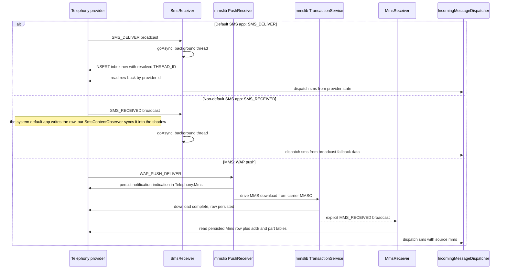

Every inbound SMS and MMS converges through one small broadcast layer before it may touch the rest of the app. The platform delivers SMS as PDUs in `SMS_DELIVER`/`SMS_RECEIVED` broadcasts and MMS as a WAP push that a receiver stack has to fetch; `SmsReceiver` and the vendored mmslib MMS stack each land the message in the system Telephony providers (`Telephony.Sms` / `Telephony.Mms`) and then hand a model built from **provider state** — never from raw broadcast extras alone — to one shared fan-out point, `IncomingMessageDispatcher.dispatch`. The receivers never talk to the UI, the gateway, or the notification manager directly; the dispatcher imposes a fixed order: mirror into the Room shadow first, apply the blocklist as a *notification* policy (the row stays persisted either way), then event bus, gateway webhook, and finally the notification — which is suppressed while the user is actively viewing that conversation.

## Receiver layer

`SmsReceiver` is declared in the manifest (`app/src/main/AndroidManifest.xml`) exported with `android.permission.BROADCAST_SMS`, with two intent filters of priority 999 — one for `SMS_RECEIVED`, one for `SMS_DELIVER`. The same manifest wires the MMS side: mmslib's `com.android.mms.transaction.PushReceiver` (exported, `BROADCAST_WAP_PUSH`, filter on `WAP_PUSH_DELIVER` with MIME `application/vnd.wap.mms-message`) and the app's `MmsReceiver`, which is **not** exported and carries no intent filter — mmslib finds it by `taskAffinity` and sends it an explicit, package-scoped `MMS_RECEIVED` broadcast. `com.android.mms.transaction.TransactionService` is declared alongside as the download engine.

### Sequence

Caption: the three inbound paths — default-app SMS, non-default-app SMS, and MMS via mmslib — all terminate at `IncomingMessageDispatcher.dispatch`.

## SmsReceiver: broadcast to persisted row

`SmsReceiver` accepts both actions and dedupes on default-app state: when the action is `SMS_RECEIVED` and `isDefaultSmsApp(context)` is true (i.e. `Telephony.Sms.getDefaultSmsPackage(context) == context.packageName`, exceptions collapse to `false`), the broadcast is skipped — when this app *is* the default SMS app, `SMS_DELIVER` owns the row, and a follow-up `SMS_RECEIVED` for the same PDU would double-process it. All other processing runs on a thread spawned after `goAsync()`, with `pending.finish()` in a `finally`; this keeps the broadcast process alive for the provider insert and read-back, which would otherwise risk the system killing the process mid-INSERT.

`processIntent` parses PDUs via `Telephony.Sms.Intents.getMessagesFromIntent`, concatenates multipart bodies, and resolves the canonical thread id up front with `IncomingMessageDispatcher.resolveThreadId` (which wraps `Telephony.Threads.getOrCreateThreadId`, returning `0L` on failure so callers keep a well-formed model without inventing ids). For `SMS_DELIVER` only, the receiver inserts into `Telephony.Sms.Inbox` with `ADDRESS`, `BODY`, `DATE`, `DATE_SENT`, `READ=0`, `SEEN=0`, `TYPE=1` and the resolved `THREAD_ID` (so the platform's Threads table stays consistent, mirroring what the stock SMS app does). It then **reads the freshly persisted row back from `Telephony.Sms`** and dispatches from that confirmed state — the single-source-of-truth rule: persist first into the provider, read the row back, then fan out. A read-back failure (or a non-insert path) falls back to the broadcast data; the failure is logged and the fan-out still runs.

When the app is **not** the default SMS app, `SMS_DELIVER` never arrives: the system default app writes the row, and the app's `SmsContentObserver` (wired through `ChangeRouter` → `TelephonySyncCoordinator` in the ViewModels) picks up the change and syncs the authoritative row into the Room shadow. The broadcast handler still runs the fan-out, but since the row is not visible to it, `readBackFromProvider` returns null and dispatch goes out from a fallback model built from the broadcast — `id` set to the PDU timestamp as a surrogate, `threadId` from `resolveThreadId`. Fan-out stays immediate and identical in shape on both roles; the observer path is what keeps the shadow authoritative for non-default deployments.

## MMS: vendored mmslib download path

The MMS receive stack is **vendored** as `app/libs/mmslib-1.0.0.aar` — the Fossify fork (`org.fossify:mmslib:1.0.0`) of klinker's android-smsmms. `app/build.gradle.kts` consumes it with `implementation(files("libs/mmslib-1.0.0.aar"))` and explains why it is committed: JitPack is the library's only remote publication, and repeated JitPack outages (timeouts fetching the POM) failed CI resolution, so the AAR ships in-repo; the three transitive runtime dependencies the published POM declared (`com.klinkerapps:logger`, `com.squareup.okhttp:okhttp:2.5.0`, `com.squareup.okhttp:okhttp-urlconnection:2.5.0`) are declared as plain Central coords because a file dependency carries no metadata. The release notes (`docs/release-v2.6.6.md`) record the vendor step — byte-for-byte from the Gradle cache, SHA-256 `21070df1…` — and the upgrade path (manual copy of a newer AAR plus re-checking its POM transitive deps; the longer-term home is a self-hosted publication). The MMS path requires the app to be the **default SMS app**: `WAP_PUSH_DELIVER` is only delivered to the default app, and before mmslib was wired in (v2.2.0) the app could send MMS but silently dropped every inbound one.

At runtime the library does the heavy lifting: its manifest-declared `PushReceiver` takes `WAP_PUSH_DELIVER`, persists the notification-indication row into `Telephony.Mms`, and drives `TransactionService` to download the actual MMS payload from the carrier MMSC over the MMS APN. When the download finishes it broadcasts `MMS_RECEIVED` to the app's `MmsReceiver`, which extends mmslib's `MmsReceivedReceiver` and overrides `isAddressBlocked` to feed the app's `BlocklistRepository` into the library's own screening.

`MmsReceiver.readMmsFromProvider` is the boundary that normalizes the MMS row into the app's `Sms` model:

- The `Telephony.Mms` row is read back from the provider (SSOT — the row was written by mmslib's download path, not by the receiver).
- **Ids**: the model id is the provider `_id` **negated** (`id = -base.id`), the repo-wide convention that MMS ids are negative so mixed UI lists can never collide with same-numbered SMS rows; the `TelephonySyncCoordinator` maps it back with `abs()` when keying the Room shadow (`providerId`).
- **Dates**: `Telephony.Mms.DATE` is epoch **seconds**; the receiver multiplies by 1000 at this boundary so the rest of the app works in milliseconds like SMS (the same seconds→ms conversion is applied in `SmsRepository` for the reconcile-path reads, and the sync watermarks convert back when querying MMS).
- **Sender**: `content://mms/addr` is scanned, preferring the FROM address (type 137) and skipping `insert-address-token` placeholders, normalized via `ContactRepository.normalizePhone`.
- **Body**: the `text/plain` part body from `Mms.Part`, falling back to the subject, then the literal `[MMS]` placeholder; `MESSAGE_BOX` maps to inbox/sent type.

`MmsReceiver` then calls `IncomingMessageDispatcher.dispatch(context, sms, source = MessageEntity.SOURCE_MMS)`. The `source` parameter matters: it selects the shadow's keyset space and dedupe id — MMS rows persisted under the SMS source would poison the shadow (wrong keyset space, wrong dedupe id), so each receiver states its own source.

## IncomingMessageDispatcher: the single fan-out

`dispatch` is the one funnel for all inbound traffic (SMS and MMS alike), and its contract is that `sms.id`/`sms.threadId` **must** come from the provider row that was just written or read back, so the UI, webhooks and notifications react to provider state rather than optimistic local state. It runs on a caller-supplied background context and does network/DB work freely. The steps, in order:

1. **Room shadow mirror, always first.** `TelephonySyncCoordinator.get(context).mutate(MessageMutation.Upsert(source, sms))`. Blocking is a notification policy, not a sync policy — the row stays persisted in the provider and the shadow even for blocked senders. The coordinator is the single Room writer; its mutation channel is `UNLIMITED` and never conflates, so a burst (100 SMS in a second) cannot silently drop an event. `applyMutation` runs one Room transaction that upserts the message **and** the conversation projection (`upsertPreservingFlags` — a brand-new thread is INSERTed there, so Home never depends on a later rebuild), computing the unread delta in O(1). The committed transaction invalidates the Room Flows, which is what repaints Home with the authoritative row.
2. **Blocklist gate.** If `BlocklistRepository.isBlocked(context, sms.sender)` is true, dispatch **returns immediately** — no bus event, no webhook, no notification. Silent handling; the message remains persisted.
3. **Address-cache invalidation.** `SmsRepository(context).invalidateAddressCaches()` drops the process-wide thread→address caches so a brand-new sender re-resolves its contact name instead of rendering "Unknown" on the next list refresh.
4. **Event bus.** `SmsEventBus.emitSms(sms)` — a fire-and-forget nudge (no replay; `extraBufferCapacity = 64` absorbs bursts). `HomeViewModel` uses it to optimistically prepend the new conversation; `ConversationViewModel` appends the message to the open thread when the sender matches (`sameConversation`) and marks that thread read in the provider.
5. **Gateway webhook.** `WebhookEngine.sendIncomingSmsWebhook(context, sms)` — fire-and-forget and consent-gated inside: `GatewayAccessPolicy.canTransmit` requires gateway consent **and** an enabled gateway, otherwise nothing is dispatched. When open it runs two legs on an IO scope: a local webhook POST to the user-configured HTTPS URL (non-HTTPS URLs are rejected and logged) with optional HMAC-SHA256 `X-Signature`/`X-Timestamp` headers, and a cloud event to the backend (`/api/gateways/events/sms`) whose `eventId` is a **deterministic** UUID derived from sender + date + body prefix, checked against a local "already sent" cache for idempotency. Failures are logged, never thrown into the receiver.
6. **Notification, suppressed while viewing.** `NotificationHelper.showSmsNotification(context, sms)` is skipped only when `ContactRepository.sameConversation(sms.sender, SmsEventBus.activeConversationPhone) && SmsEventBus.isAppInForeground` — i.e. the user is actively watching this very conversation.

### The blocklist

`BlocklistRepository` is a two-layer store. Layer 1 is the system `BlockedNumberContract` — enforced by the platform (no ring, no notification) where the app holds the blocking role, written best-effort since the contract is not always available. Layer 2 is a local mirror in the `messages_blocklist` SharedPreferences — always readable by the app, so the conversation list can hide blocked threads and the receivers can drop notifications even where the system contract is not writable. `block()`/`unblock()` write both layers; reads always use the mirror. Matching normalizes to digits (folding Iranian "98" prefixes onto the local "0…" form) and then applies `ContactRepository.sameConversation`, so block decisions survive formatting differences and country-code variants. The static `BlocklistRepository.isBlocked(context, address)` shortcut exists specifically so broadcast receivers can check without instance state. In the MMS path the same repository also backs mmslib's `isAddressBlocked` screening hook, so blocked MMS senders are screened inside the library too.

### Notification and its actions

`showSmsNotification` posts on the `messages_notification_channel` (IMPORTANCE_HIGH) with the notification id = `sender.hashCode()` (per-sender dedupe). It extracts a 4–8 digit OTP when the body contains trigger keywords ("otp", "code", "verification", …) and highlights it in the title with a dedicated "Copy <code>" action; it always carries an inline Reply action (`RemoteInput`) and a "Mark as read" action, all targeting `NotificationActionReceiver`. The tap intent targets `MainActivity` with `AppLaunchIntent.ACTION_OPEN_CONVERSATION`, a per-thread `threadId`/`phone` extras, and a per-thread data URI (`messages://conversation/<threadId>`) so PendingIntents of different threads stay distinct. `VISIBILITY_PRIVATE` hides body and OTP from the lock screen; quiet hours suppress sound/vibration (the notification still appears, silently); Android 13+ requires `POST_NOTIFICATIONS`.

`NotificationActionReceiver` is the companion endpoint for those actions. Since v2.6.10 its `MARK_READ` and `REPLY` work runs on `Dispatchers.IO` under `goAsync()` — provider writes and rate-limited sends must never run on the main thread of a `BroadcastReceiver` (a guaranteed ANR path before the fix). Quick reply goes through `SmsSender`, which persists the message and emits its own `OutgoingSent` event; the receiver deliberately does **not** emit a second SMS event (a duplicate once forced downstream dedupe heuristics). It is still not a durable queue: a process death mid-send loses the reply (the Room-backed outbox queue is the planned Pass-2 refactor).

## Lifecycle, invariants, and failure semantics

- **SSOT ordering is an invariant**: every consumer of an inbound message (UI, webhook, notification, shadow) must see provider-confirmed state. Receivers persist first, read the row back, and dispatch from that; a read-back failure degrades to broadcast data with a logged warning rather than aborting delivery.
- **The Room mirror is unconditional** — it precedes the blocklist check, so a blocked message still exists in the shadow (and the provider); blocking silences, it does not delete.
- **Identity spaces never collide**: SMS ids are positive provider ids, MMS ids are negated at the receiver boundary and restored with `abs()` when the shadow keys them; the composite shadow key is `(source, providerId)` with stable wire values `"sms"`/`"mms"` (changing them would be a migration).
- **Broadcast lifetime**: `goAsync()` bounds how long the system keeps the receiver process alive for heavy work; everything outside that window (Room commit, webhooks, notification) is either already handed to background scopes or happens after `pending.finish()`.
- **Release-build survival**: `proguard-rules.pro` keeps the entire `com.klinker.android.**` and `com.android.mms.**` machinery whole (with `-dontwarn` for bundled legacy deps) because mmslib's transaction/PDU code is reached only through the library's own broadcast wiring.

## Tests

The boundary logic has focused JVM tests: `SameConversationRoutingTest` pins the `sameConversation` routing predicate used by the dispatcher's viewing-suppression check (normalization, suffix matching for country-code variants, and the ≥7-digit guard so short fragments never join two conversations); `SmsObserverTimingTest` asserts the observer's leading-edge/burst-coalescing contract that backs the non-default path; `ChangeRouterExtractIdTest` pins URI parsing (row-id vs table-level vs thread URIs) for the observer→mutation routing; and `MessageEntityMappingTest` pins the source constants and key namespacing the MMS/SMS boundary depends on.
