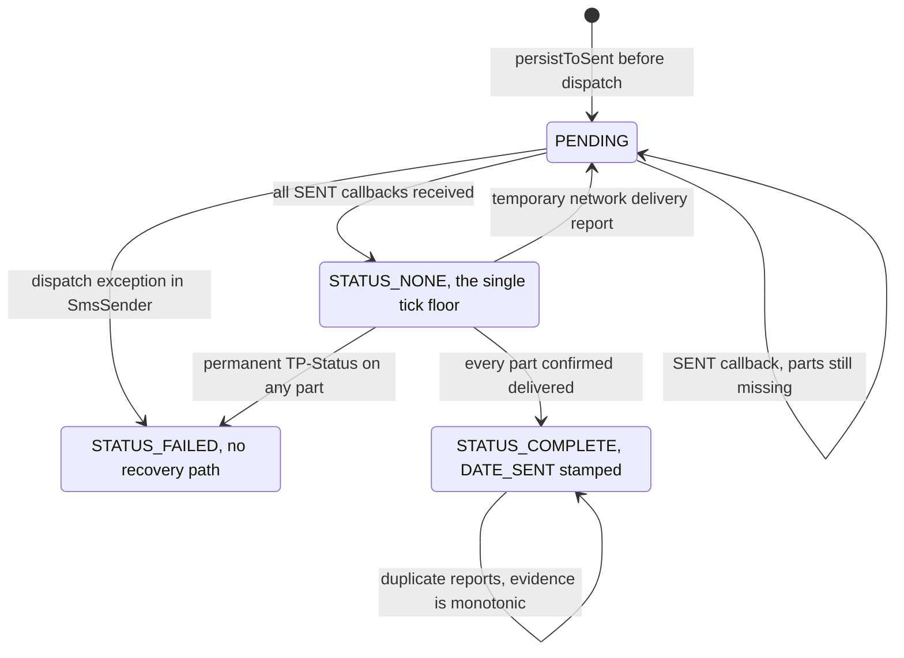
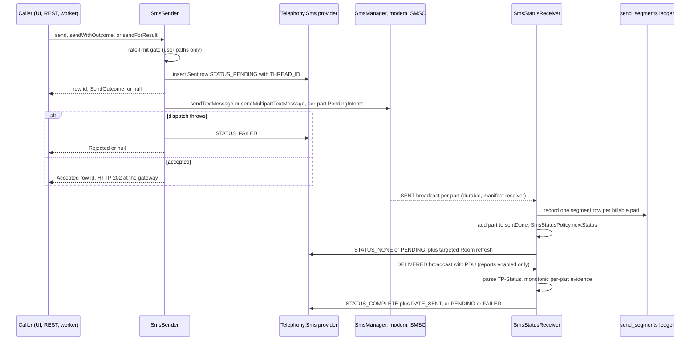

Every outgoing message on the device — typed in the UI, quick-replied from a notification, POSTed to the LAN REST gateway, pulled from the GMweb bridge, or scheduled for later — converges on one small layer before it touches the modem. `SmsSender` owns the SMS funnel: it persists a row into the shared `Telephony.Sms` provider **before** dispatch, resolves the user's SIM/SMSC/delivery-report preferences, splits multipart bodies, and hands each part to `SmsManager` with its own status `PendingIntent`. Modem results come back through a manifest-declared `SmsStatusReceiver` whose only job is to fold those callbacks into provider status via the pure `SmsStatusPolicy` and to write the per-segment send ledger. `MmsSender` is a parallel, provider-insert-based path for images, audio, and group text. Two independent scheduling mechanisms exist — a WorkManager-only user path (`ScheduledSms`) and a REST-facing path with a persistent registry (`GatewayScheduler`) — and a stub `HeadlessSmsSendService` satisfies the default-SMS-app `RESPOND_VIA_MESSAGE` contract.

## Entry points

| Caller | API used | Rate limit | Toasts |
|---|---|---|---|
| Chat screen (`ConversationViewModel.sendMessage`) | `send(phone, text, subIdOverride, null)` | yes | yes |
| Notification quick reply (`NotificationActionReceiver`) | `send(phone, text)` | yes | yes |
| User scheduled send (`ScheduledSms.SendWorker`) | `send(phone, body)` | yes | yes |
| REST `POST /api/v1/sms/send` (`GatewayServer`) | `sendWithOutcome(...)` | **no** | no |
| EVE `POST /send` and GMweb pull (`EveSmsQueue`) | `sendForResult(...)` | **no** | no |
| REST scheduled send (`GatewayScheduler.SendWorker`) | `sendForResult(...)` | **no** | no |
| Group text / image / audio MMS (`MmsSender`) | provider insert + `sendMultimediaMessage` | n/a | n/a |

## SmsSender: persist before dispatch

`SmsSender` (`app/src/main/java/com/autonomousone/messages/sms/SmsSender.kt`) exposes four methods:

- `send(phone, text)` / `send(phone, text, subscriptionIdOverride, smscOverride)` — persists, dispatches, returns the **row id** of the `Telephony.Sms.Sent` row. The overrides exist for per-call selection: an explicit SIM for this message only, and an explicit SMSC for this message only.
- `sendWithOutcome(phone, text, subId, smsc)` (v2.6.10) — same pipeline, but returns a sealed `SendOutcome`: `Accepted(rowId)` or `Rejected(rowId, reason)`. The contract says explicitly that `Accepted` means "handed to telephony", **not** "delivered" — SENT/DELIVERED arrive later via the status receiver.
- `sendForResult(phone, text)` — the silent variant for machine callers (EVE send queue, gateway scheduler): returns the row id on successful hand-off or `null` when dispatch failed. No toasts.

The send order is fixed in `send`:

1. **Rate-limit gate** (see below) — only this path honors the user's limiter.
2. **`persistToSent`** — inserts the row into `Telephony.Sms.Sent` *before* dispatch with `STATUS_PENDING`, `READ/SEEN=1`, and a resolved `THREAD_ID` from `Telephony.Threads.getOrCreateThreadId`. The comment in the code calls out the bug this prevents: without `THREAD_ID` the row is an orphan, `Telephony.Threads` keeps its stale SNIPPET/DATE, and the Home list (built from Threads) and the chat screen (which queries by ADDRESS) disagree. If the provider insert fails, the code falls back to a timestamp as the row id so the send still proceeds; the status callbacks then target a row that may not exist, which `updateStatus`/`updateProvider` absorb harmlessly.
3. **`SmsEventBus.emitOutgoingSent`** — fires the `OutgoingSent` event with `threadId = 0` (resolved by Home via phone match) so the Home list reorders the thread and an open chat appends the message instantly, even though the chat screen is still on top in the single-activity back stack.
4. **`dispatch`** — returns `true`/`false` for the hand-off result.

`dispatch` resolves the effective `SmsManager` via `resolveSmsManager`: an override or the saved preference, and only on API 31+ does `createForSubscriptionId(subId)` apply — pre-Android-12 the per-subscription API is no longer exposed by current SDK stubs, so sends fall back to the platform-default subscription. It splits the body with `divideMessage`, builds one `PendingIntent` per part for `ACTION_SMS_SENT` (always) and, when delivery reports are enabled, one per part for `ACTION_SMS_DELIVERED`, then calls `sendMultipartTextMessage` or `sendTextMessage`. On exception it writes `STATUS_FAILED` to the row, shows a toast (only for the interactive path), and returns `false`.

`buildStatusPendingIntent` has two load-bearing properties:

- **Mutability.** On API 31+ the `PendingIntent` is created with `FLAG_MUTABLE`. `SmsManager` fills callback-only extras (the delivery `pdu` and optional SENT `errorCode`) when firing the intent; `FLAG_IMMUTABLE` discards those fill-in extras, which made delivery reports unparseable. Mutability is tightly scoped because the intent is explicit to the app's own non-exported receiver. It is deliberately **not one-shot**: a temporary TP-Status may later advance to delivered, so the same intent must fire again.
- **Stable request code.** `requestCode = 31 * (31 * action.hashCode() + rowId.hashCode()) + partIndex`, so each (action, row, part) triple maps to a distinct broadcast.

### The v2.6.10 API split and the 503 contract

Before v2.6.10, `send()` returned a row id even when `SmsManager.sendTextMessage` threw — dispatch failure was silently discarded and the gateway answered HTTP 200 `"success"` for a message that never reached the modem. The fix was to give machine callers an API that can lie about neither: `sendWithOutcome` surfaces the `dispatch` boolean, and `GatewayServer` maps `Accepted` → **202** `{"status":"accepted","id":…}` and `Rejected` → **503** `{"status":"failed","error":…}`. The REST endpoint validates first (400 for blank phone/message, SMSC not matching `^\+?[0-9]{5,20}$`, or `subscription_id < -1`), normalizes the phone via `DigitNormalizer`, and accepts optional `subscription_id` and `smsc` per-call overrides. `sendForResult` exists for the same reason in the null-returning shape the queue workers prefer (it returns `null` instead of a rejected outcome, keeping `EveSmsQueue`'s sender lambda a plain `Boolean`).

## SIM, SMSC, and delivery-report preferences

`MessagingPreferences` (`app/src/main/java/com/autonomousone/messages/messaging/MessagingPreferences.kt`, prefs file `messaging_prefs`) holds the user's Google Messages-style send options. Defaults are deliberately conservative:

- `deliveryReportsEnabled` — **default ON** (so delivery can be proven where the carrier supports reports); users can opt out, in which case `dispatch` passes a `null` delivered-intent array and the row can never leave the "sent" floor.
- `sendSubscriptionId` — default `SUBSCRIPTION_UNSET` (-1) = "user has not picked a SIM", system default subscription.
- `smscAddress` — global manual SMSC override, default empty = network-provided SMSC.
- Per-SIM manual SMSC, keyed `smsc_sim_manual_<subscriptionId>`. Only `setSmscForSim` writes this key, and it also **purges the legacy `smsc_sim_<id>` key** from the v2.6.13 hidden carrier-directory seeding era. v2.6.14 hardened this as a strict user-intent invariant: an address the user never chose must not override the SMSC the (U)SIM itself carries, because a mismatch can itself cause radio-side `GENERIC_FAILURE`.

The effective SMSC in `dispatch` is resolved in exactly this order: per-request `smscOverride` → this SIM's `smscForSim` manual override → global `smscAddress` → `null` (use the SMSC programmed on the SIM, Android's documented default).

`SimManager` backs the Settings > Messaging UI: `getActiveSims()` lists subscriptions (requires `READ_PHONE_STATE`, requested at runtime from the settings screen; without it the list is empty and callers treat "SIMs unknown" as the state) sorted by slot index with a `isSystemDefault` flag, and `readSmsc(subscriptionId)` reads the SMSC actually programmed on the (U)SIM via `SmsManager.getSmscAddress()` (API 30+, only callable by the default SMS app; everything else returns `null`, shown as "network default"). `MessagingSettingsViewModel` wires both into the settings screen, including per-SIM SMSC edit/clear rows.

## Send rate limiting

`SendRateLimiter` is an in-memory, `@Synchronized` sliding-window limiter: a deque of send timestamps, evicted against a `windowMillis` window. `acquireSlot()` stamps the slot immediately when under `maxMessages` (returning 0) or returns the wait until the oldest stamp exits the window; the caller (`SmsSender.send`) sleeps that long and then calls `record()`. The window is per-app-lifetime, which is deliberate — operators count short bursts, not historical totals.

`SmsSender.send` is the **only** send path that applies the limiter: when `rateLimitEnabled` (default OFF) is set, it syncs the object's `enabled`/`maxMessages`/`windowMillis` from prefs (defaults 10 messages / 1 minute; count coerced to 1..1000, window to 1..60) and blocks the calling thread. That is why the v2.6.10 safety pass moved `NotificationActionReceiver`'s send off the main thread — the limiter's `Thread.sleep` would otherwise ANR the broadcast. Machine senders (`sendWithOutcome`, `sendForResult`) do not consult the limiter, so gateway/EVE/GMweb/gateway-scheduled traffic is not paced by the user's setting; the gateway protects the SIM instead with its own queue capacity (500 pending) and schedule caps (200 pending).

## Durable status callbacks

### Why the receiver is manifest-declared

`SmsStatusReceiver` is declared in the manifest (`app/src/main/AndroidManifest.xml`) with `android:exported="false"` and **no intent filter** — it is reached only by the explicit `PendingIntent`s that `SmsSender` built. The manifest lifetime (rather than a runtime-registered receiver) is what makes SENT/DELIVERED results arrive after the screen, or the whole app process, that initiated the send has gone away. The receiver also `goAsync()`s in `onReceive`, captures `resultCode` before leaving the broadcast thread, then runs `processStatusIntent` on a companion `CoroutineScope(SupervisorJob() + Dispatchers.IO)` with `pendingResult.finish()` in a `finally` — this keeps the broadcast process alive until the provider write and the ledger write complete (the comment notes the ledger writes must survive the receiver's 10-second window; a dropped telemetry write is repaired by the next callback via PK REPLACE).

### The no-poisoning invariant

The central policy decision of the receiver is that **vendor non-OK SENT codes must never be written to the shared provider as `STATUS_FAILED`**. Affected Samsung/RIL combinations return multiple non-OK codes (e.g. `RESULT_ERROR_GENERIC_FAILURE`) after the SMSC has accepted and delivered the message; writing those into `Telephony.Sms.STATUS` would poison the shared provider and make every SMS app show a false "Not delivered". So:

- A SENT callback, OK or not, only records progress: the part index joins the row's `sentDone` set. Raw modem results are diagnostic data (`DiagnosticLog` events `SMS_CALLBACK`, plus `TRANSPORT_UNCONFIRMED`/`DELIVERY_REPORT_GAP` log lines for non-OK results).
- The **only** path that marks `STATUS_FAILED` synchronously is `SmsSender.dispatch`'s exception handler, i.e. a real dispatch failure before any callback exists.
- A non-OK DELIVERED callback is only a *reporting gap*: the message stays Sent. Delivery can only be established from positive evidence, never downgraded by a missing or failed report.

### Delivery evidence from the PDU

`parseDeliveryEvidence` reads the raw SMS-STATUS-REPORT PDU from the delivery intent's `pdu` extra and parses it with `SmsMessage.createFromPdu`, trying the declared format first, then `FORMAT_3GPP`, then `FORMAT_3GPP2` — only falling back to "the callback succeeded" when a vendor omits or mangles the PDU. A failed callback without a parseable report is `UNKNOWN` and must never manufacture `STATUS_FAILED`. The pure `SmsStatusPolicy` maps the TP-Status: 3GPP `0x00..0x1f` → DELIVERED, `0x20..0x3f` → TEMPORARY, `0x40..0x7f` → FAILED, unknown/vendor values → UNKNOWN; 3GPP2 only the documented `2 << 16` → DELIVERED, everything else UNKNOWN.

Per-part evidence is stored in versioned SharedPreferences sets (`sms_status_callbacks`, keys `v2617_<rowId>_{sent,dlv_done,dlv_pending,dlv_failed}_parts`) — the version prefix deliberately ignores callback state written by the pre-PDU policies in v2.6.13..16 — and is **monotonic**: a DELIVERED verdict is strongest and can never be downgraded by a duplicate or stale report, TEMPORARY may later advance to FAILED or DELIVERED, UNKNOWN leaves prior evidence untouched. The whole update is guarded by a process-wide lock.

### Aggregation and provider/Room writes

`SmsStatusPolicy.nextStatus` (pure, Android-free, unit-testable) decides the row status from the part counts:

1. all parts DELIVERED → `STATUS_COMPLETE` (the receiver also stamps `DATE_SENT`);
2. any part permanently FAILED (parsed TP-Status) → `STATUS_FAILED` — for a logical multipart SMS one permanently failed part means the whole body was not delivered intact;
3. any part in TEMPORARY → `STATUS_PENDING`;
4. some parts delivered but not all → `STATUS_NONE` (partial positive evidence cannot claim whole-message delivery);
5. still collecting SENT callbacks (`sentDone < partCount`) → `STATUS_PENDING`;
6. else (fully sent, delivery reports gapped or disabled) → `STATUS_NONE` — the "single tick" floor.

Caption: provider `STATUS` lifecycle for one Sent row, driven by `SmsStatusPolicy.nextStatus` over the per-part callback sets (a delivery-report error alone is a reporting gap and never leaves the sent floor).

After writing `STATUS` to the provider, the receiver emits `MessageMutation.RefreshStatus` through `TelephonySyncCoordinator` — a targeted O(1) re-read + upsert of that one message into the Room shadow, replacing the old `notifyResume()` full-provider-scan path (status changes do not touch the conversation projection).

## The send-segment ledger

On every **SENT** callback (delivered callbacks do not write the ledger), `SmsStatusReceiver` records one `SendSegmentEntity` row per carrier-billable segment in `SendSegmentDao` (table `send_segments`). The success verdict follows the v2.6.15 AMBIGUOUS_ACCEPTED policy rather than raw `RESULT_OK`: on the affected RIL/IR-MCI combinations the radio returns `GENERIC_FAILURE` for submits the SMSC actually accepted, so counting only `RESULT_OK` froze the Home counter while messages kept sending and showing Sent. Explicit radio-level failures (`NO_SERVICE`, `RADIO_OFF`, `NULL_PDU`) are not billable and stay `success = false`.

The composite primary key `(rowId, partIndex)` with `OnConflictStrategy.REPLACE` makes redelivered callbacks idempotent — the count never moves twice. The Home "N SMS today" chip counts **rows, not logical messages** (a 3-part send contributes 3 — what the carrier bills), fed by `observeSuccessSince` over a local-midnight window that `HomeViewModel` re-opens at midnight; `successBySubscription` breaks the same window down per SIM; failed rows are retained for post-mortems and simply never counted. The table is deliberately kept out of the sync mirror — it is app-owned telemetry that no Telephony table stores — and is bounded by `pruneBefore(90 days)` piggybacked on the periodic full-sync reconcile. A ledger write failure can never break status processing: it is caught, logged, and repaired by the next callback. See [Data model](/openwiki/architecture/data-model.md) for the full entity schema.

## MMS sending

`MmsSender` (`app/src/main/java/com/autonomousone/messages/mms/MmsSender.kt`) sends images, audio, and group text using the `Telephony.Mms` content provider plus `SmsManager.sendMultimediaMessage()`. It requires the app to be the **default SMS app** to write `content://mms/`.

Each send is a three-part provider insert, then a dispatch trigger:

1. A `Telephony.Mms` row: `MESSAGE_TYPE 0x80` (send request), `MESSAGE_BOX_OUTBOX`, `multipart/related` (or `multipart/mixed` for group text), `DATE` in epoch **seconds** (the provider's convention, unlike SMS milliseconds), and the resolved `THREAD_ID`.
2. Address rows: one FROM (type 137) carrying the `insert-address-token` placeholder, one TO (type 151) per recipient.
3. Part rows under `content://mms/<id>/part` with the payload streamed into them.

`triggerSend` then calls `smsManager.sendMultimediaMessage(context, mmsUri, null, null, null)` — the `null` locationUrl makes the system use the carrier's MMSC settings automatically. There is no SENT/DELIVERED `PendingIntent` plumbing in the MMS path: the sender returns a boolean for "dispatch succeeded" and final delivery state is whatever the provider row ends up with (MMS delivery reports flow through the MMS stack, not `SmsStatusReceiver`).

Specific behaviors:

- **Images** (`sendImage`) are compressed to fit carrier limits: sub-sampled so the longest side is ≤1600 px, then JPEG quality stepped down from 90 in increments of 10 until under `MAX_IMAGE_BYTES` (900 KB).
- **Audio** (`sendAudio`) streams the file bytes into the part with the source MIME type and `_display_name` filename.
- **Group text** (`sendGroupText`) cleans/dedupes recipients and creates a proper **group thread** via `Telephony.Threads.getOrCreateThreadId(context, recipients.toSet())` so the conversation shows as one thread with every recipient attached.

In the UI, `ConversationViewModel.sendMessage` decides the split: with `groupMessagingEnabled` ON and more than one recipient, one group MMS goes out instead of N separate SMS; with the toggle OFF, the classic one-SMS-per-recipient fan-out runs through `SmsSender.send` with the optional in-chat SIM override. The REST gateway's `POST /api/v1/mms/send` accepts only public `https://` image URLs (remote callers may not aim the app at arbitrary `content://` providers) and returns 200/500 from `sendImage`.

## Scheduling: two distinct mechanisms

There are two independent "send later" systems that must not be confused:

| | `ScheduledSms` (user) | `GatewayScheduler` (REST) |
|---|---|---|
| Triggered by | Long-press the send button → `ScheduleSendDialog` (quick presets: 1 h, 3 h, tomorrow 9 am, or custom picker) | `POST /api/v1/sms/schedule` with `sendAt` (epoch ms) or `delaySeconds` |
| Durable job | WorkManager `OneTimeWorkRequest`, unique name `scheduled_sms_<triggerAt>` (`ExistingWorkPolicy.REPLACE`), tag `scheduled_sms` | WorkManager one-time work per `scheduleId` **plus** a persistent index |
| Registry | none — WorkManager's own SQLite store only | `SharedPreferences` index (`gateway_schedule_prefs`, JSON array of the 100 most recent entries) that survives reboot |
| Idempotency | none | exact `(phone, message, sendAt)` triple while `scheduled` → returns the existing entry (200 `created:false` instead of 202) |
| Send path at fire time | `SmsSender.send` (SIM/SMSC prefs **and** rate limit apply) | `SmsSender.sendForResult` (silent, no rate limit) |
| Cancellation | `cancel(context, triggerAtMillis)` by exact trigger time | `DELETE /api/v1/sms/schedule/{id}` while pending, else 409 |
| Failure policy | `Result.retry()` under 3 attempts, then failure | retry under 3 attempts, then entry `failed` with `failedReason: dispatch_failed` |
| Capacity | unbounded | `MAX_PENDING = 200` → 429 `too_many_pending` |

`ScheduledSms.schedule` also emits an **optimistic bubble** straight into the event bus (`SmsEventBus.emitSms` with `type = 2`, `status = 32`, and `date = triggerAtMillis` so it sorts at the right position) so the user sees the queued message immediately in the conversation; the draft is cleared because "scheduled is as good as queued". Its `SendWorker` sends through the normal `SmsSender` pipeline (so SIM/SMSC preferences and delivery reports apply), then `SmsEventBus.notifyResume()` to refresh any open Home screen.

`GatewayScheduler` exists so external projects can schedule sends over the gateway and poll their fate: entries transition `scheduled → sent` / `failed` / `cancelled`, with `sentAt`/`failedReason` recorded in the index, exposed via `GET /api/v1/sms/schedule` (recent list) and `GET /api/v1/sms/schedule/{id}` (404 when unknown). Its `SendWorker` re-checks the registry status before sending (an entry cancelled while waiting becomes a no-op success) and, like the user worker, runs through the same `SmsSender` pipeline so delivery reports behave exactly like manual sends. Delivery durability for both mechanisms comes from WorkManager's persistent store — a scheduled message fires even after reboot or process death.

## Machine send funnel: EVE queue and GMweb bridge

`GatewayServer.start()` boots `EveSmsQueue` with a sender lambda `{ to, text -> smsSender.sendForResult(to, text) != null }`, which makes the queue the single delivery funnel for all machine sends. The queue implements the EVE "Custom HTTP" provider contract:

- `POST /send` enqueues with an optional `Idempotency-Key` (a repeat key returns the original record with `created=false` — no duplicate SMS), a priority from `{critical:1, expired:3, expiring:6, announcement:10}` (lower number = more urgent, FIFO within a level), and `ANNOUNCEMENT_LIMIT = 500` pending → 429 with `Retry-After: 30`.
- Status flow: `QUEUED → ACTIVE → SENT | FAILED` (or `QUEUED → CANCELLED`), with per-request status/cancel/capacity endpoints the EVE panel polls.
- A single `eve-sender` worker thread drains highest-priority-first; state (last 300 records + an idempotency map capped at 500 keys) persists in `SharedPreferences` (`eve_queue_prefs`) across reboots, and a record interrupted mid-send (`ACTIVE`) is re-queued on boot.
- The GMweb pull bridge (`OutboxPoller`) delivers pulled tasks through this same queue — `EveSmsQueue.enqueue`, then `drainUntilTerminal` — and acks the server's ledger with the radio-level result, so a cloud-originated send gets exactly the same persistence, ordering, and failure semantics as a LAN one.

Because every machine path lands on `sendForResult`, machine callers get a real `false` on modem rejection (which surfaces as `FAILED` in the queue and `device_send_failed` in GMweb acks) — the same v2.6.10 honesty guarantee the REST send endpoint has via `sendWithOutcome`.

## RESPOND_VIA_MESSAGE

`HeadlessSmsSendService` is the manifest-required stub for the default SMS app contract: Android requires every default SMS app to implement `RESPOND_VIA_MESSAGE` so users can answer a call with an SMS from the dialer. It is declared exported with `android.permission.SEND_RESPOND_VIA_MESSAGE` and intent filters for the `sms`/`smsto`/`mms`/`mmsto` schemes. Today it is a deliberate no-op — it logs, stops itself, and returns `START_NOT_STICKY`, with a comment marking where an actual send to `intent.getStringExtra("address")` would go. Its role is purely contractual: without it the app cannot be selected as the default SMS app, which would break the whole pipeline (delivery reports, `WAP_PUSH_DELIVER`, provider write access).

## End-to-end sequence

Caption: one outgoing SMS from caller intent to delivered status — persist-first, per-part callbacks, evidence-based status upgrades.

## Observability and tests

- `DiagnosticLog` marks the whole lifecycle: `SMS_SEND` (dispatch row, parts, smsc source, accepted), `SMS_CALLBACK` (phase, part, result code, evidence, radio error, PDU size), `SMS_DELIVERY_PDU`, `SMS_STATE` (final provider status), `SMS_LEDGER` (write failures), `SMS_PROVIDER` (insert/status-update failures) — phone numbers are tokenized via `DiagnosticLog.phoneToken`.
- `SmsStatusPolicyTest` (`app/src/test/java/com/autonomousone/messages/sms/SmsStatusPolicyTest.kt`) pins the policy as pure JVM unit tests: 3GPP completed/temporary/permanent ranges, unknown values never inventing a verdict, 3GPP2 received, and the aggregation rules — all sent callbacks received is "sent" (`STATUS_NONE`), partial sent parts stay `PENDING`, all delivered parts OK is `STATUS_COMPLETE`, one permanently failed multipart part fails the whole message, a temporary network report is `PENDING`, and full delivery outranks older failure evidence. The policy object exists specifically to keep these delivery-report semantics testable without Android.
- `EveSmsQueueTest` covers the machine-funnel side (idempotency, priority ordering, status transitions, cancel semantics, persistence restore) with an in-memory `Store`.

## Related pages

- [Data model](/openwiki/architecture/data-model.md) — the `send_segments` entity, `TelephonySyncCoordinator` mutation channels, and the Room shadow this pipeline writes into.
- [Gateway service](/openwiki/architecture/gateway-service.md) — the foreground service and supervisor that host `GatewayServer`, `EveSmsQueue`, and `OutboxPoller`.
- [REST API](/openwiki/integrations/rest-api.md) — the external contract for `/api/v1/sms/send`, `/api/v1/mms/send`, schedule endpoints, and the EVE provider endpoints.
- [Send pipeline workflow](/openwiki/workflows/send-pipeline.md) — user-facing walkthrough of composing and sending a message.
- [Incoming messaging](/openwiki/architecture/incoming-messaging.md) — the mirror-image inbound path and the shared provider/Room state this page mutates.
