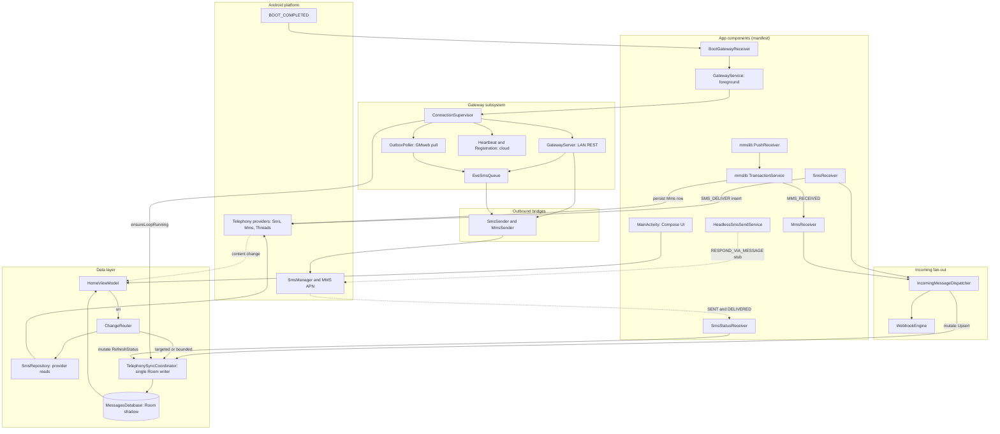

# System Overview

**Messages** is a single Android APK that plays two jobs at once: it is a full **default SMS/MMS app** (Compose UI, onboarding, notifications, app lock, search) and an embedded **self-hosted SMS/MMS gateway** (a LAN HTTP REST server plus optional cloud/GMweb bridges) that lets external automation drive the phone's radio. Every subsystem hangs off one Android process whose manifest wires the components Android requires of a default SMS app, and whose data plane runs on a strict rule: the **system Telephony content providers are the durable source of truth**, and everything else — the Room database, the UI, the gateway's inbox reads — is a derived view that must never claim authority over the providers.

The page is a map. The depth for each subsystem lives on the linked pages:

| Owned system | Where it lives | Deep-dive page |
|---|---|---|
| Compose UI, onboarding, default-app gate | `MainActivity` + `ui/` + `viewmodel/` | [ui-architecture](/openwiki/architecture/ui-architecture.md) |
| Room read-shadow + entities | `data/MessagesDatabase.kt`, `data/Entities.kt` | [data-model](/openwiki/architecture/data-model.md) |
| Single-writer sync coordinator | `data/TelephonySyncCoordinator.kt` | [sync-coordinator](/openwiki/architecture/sync-coordinator.md) |
| Incoming SMS/MMS reception | `receiver/`, mmslib | [incoming-messaging](/openwiki/architecture/incoming-messaging.md) |
| Outgoing SMS/MMS send | `sms/`, `mms/` | [outgoing-messaging](/openwiki/architecture/outgoing-messaging.md) |
| Gateway foreground service | `gateway/` | [gateway-service](/openwiki/architecture/gateway-service.md) |

## Architecture at a glance

Caption: the whole system — the manifest receivers/services on the outside, the Room shadow with its single-writer coordinator in the middle, and the gateway foreground service fanning out to the LAN REST server, the GMweb pull bridge, and the cloud components, all terminating in the outbound `SmsSender`/`MmsSender` bridges that drive the radio.

## The three storage tiers

The app deliberately splits its data across three tiers with very different authority. Confusing them is the single most common way to break the system, so the boundary is stated explicitly in the code.

1. **Telephony content providers — the durable source of truth.** `Telephony.Sms`, `Telephony.Mms`, and `Telephony.Threads` are owned by the Android platform. Receivers do not keep their own copy of an incoming message: `SmsReceiver` persists the PDU into `Telephony.Sms.Inbox` and then **reads the row back** from the provider before fanning out, and `SmsSender` writes outgoing rows into `Telephony.Sms.Sent` because `SmsManager.sendTextMessage` does not do that for non-default apps. All downstream consumers (UI, gateway inbox reads, webhooks) are built from provider state, not from broadcast extras.
2. **Room (`MessagesDatabase`) — the read-SSOT shadow for the UI.** This is a local mirror, not the truth. Its own header comment calls it "the app's local read-SSOT … the UI reads from here; TelephonySync keeps it in step with the system provider." A broken shadow (failed migration, corruption) must **downgrade to the provider path, never kill the app** — the shadow is explicitly "not the source of truth." `HomeViewModel` opens the Room Flow only behind a read-cutover gate and, if `MessagesDatabase.get()` throws, sets `roomUnavailable` and falls back to provider reads.
3. **SharedPreferences — gateway/feature config, including encrypted secrets.** `GatewayPreferences` owns the `sms_gateway_prefs` store: the user's intent to run the gateway, its runtime mirror, the consent version, the port, and the cloud/GMweb configuration. Secrets that must not sit in plaintext (the API key, webhook signing secret, cloud token) are written through `SecureStore`, which encrypts them with a non-exportable AES-256-GCM key from the hardware-backed Android Keystore and stores `enc:v1:`-prefixed Base64 in the same prefs file. The EVE queue has its own `eve_queue_prefs` store.

The reason for this exact shape — a realtime O(1) fast path and a separate, bounded reconciliation path instead of a full provider scan on every event — is the refactor documented in `docs/architecture-v2-sync.md`. The doc opens by naming the problem (every incoming SMS used to trigger `requestSync()` → full `syncSource(SMS)` + `syncSource(MMS)` + `rebuildConversations()` + `countUnread()` over up to 10,000 rows per thread) and states the governing principle:

> If you have the ID, operate on that ID. Full sync is repair, not the main path.

That principle is what produced the dual-channel coordinator and the targeted-mutation fast path described next.

## Default-SMS-app manifest wiring gates most behavior

Most of what the app can do is *gated* by being the default SMS app, and that status is expressed almost entirely in `app/src/main/AndroidManifest.xml`:

- **`SmsReceiver`** is exported with `android.permission.BROADCAST_SMS` and carries two priority-999 intent filters — one for `SMS_RECEIVED`, one for `SMS_DELIVER`. The manifest comments (and the receiver's own doc) are unambiguous: **`SMS_DELIVER` fires only when this is the default SMS app; `SMS_RECEIVED` fires for all apps.** When the app *is* default, `SmsReceiver` skips the `SMS_RECEIVED` for a PDU that `SMS_DELIVER` already owns, so it persists the row itself; when it is *not* default, only `SMS_RECEIVED` arrives, the system default app writes the row, and the app's content observer syncs it in.
- **mmslib's `com.android.mms.transaction.PushReceiver`** (exported, `BROADCAST_WAP_PUSH`, filtering `WAP_PUSH_DELIVER` for `application/vnd.wap.mms-message`) plus **`TransactionService`** are required of the default SMS app to take WAP pushes and download MMS payloads from the carrier MMSC. The app's **`MmsReceiver`** (not exported, discovered by `taskAffinity`) receives the library's explicit `MMS_RECEIVED` broadcast afterward.
- **`HeadlessSmsSendService`** is the `RESPOND_VIA_MESSAGE` service Android requires of every default SMS app (so the dialer can answer a call with an SMS). It is a thin stub — it logs and stops itself — but its presence is part of the contract.
- The **`GatewayService`** is declared `exported=false` with `foregroundServiceType="dataSync|specialUse"` (the special-use subtype "SMS Gateway Local REST API Server"), and **`BootGatewayReceiver`** listens for `BOOT_COMPLETED`/`LOCKED_BOOT_COMPLETED` so the gateway re-arms after a reboot.

`MainActivity` operationalizes the gate: `isDefaultSmsApp()` checks `RoleManager.ROLE_SMS` (API 29+) or `Telephony.Sms.getDefaultSmsPackage` otherwise, and `requestDefaultSmsApp()` drives the system role-request intent. Onboarding does not mark itself complete until disclosure is accepted, the default-app role is held, and the SMS permissions are granted.

## How the subsystems fit together

**UI (Compose).** `MainActivity` is the single `singleTask` launcher that also captures `SENDTO`/`SEND` share intents. `HomeViewModel` is the main consumer of the data layer: it registers a `SmsContentObserver` on the SMS and MMS providers, and once the Room read-cutover gate is open it drives the conversation list from `conversationDao().observeAll()` — Room **invalidation** re-emits the Flow after each committed mutation, so an incoming message repaints without any provider scan on the realtime path.

**Data layer / sync.** `TelephonySyncCoordinator` is the **single writer** into Room. It owns two channels: exact **mutations** (an `Upsert`, `Delete`, `RefreshStatus`, `MarkThreadRead`, or `DeleteThread`) that are never conflated — every event reaches Room exactly once, in a single `withTransaction` that writes the message and updates the conversation projection atomically — and **reconcile** requests (`FullSync` / `ForThread`) that *are* conflated, so N nudges collapse into one bounded repair pass. `SmsRepository` is the read side against the providers, and its `registerObserver` is what puts the ViewModels' `SmsContentObserver` on the SMS and MMS providers; the observer dispatches on the leading edge and coalesces any burst inside a 150 ms window into one trailing nudge, so a multipart message still ends with exactly one final reconcile.

**Incoming pipeline.** Both the default-app path (`SmsReceiver` after the provider insert) and the non-default/observer path converge on `IncomingMessageDispatcher.dispatch`, which imposes a fixed order: mirror into Room via `mutate(Upsert)` **first** (blocking is a notification policy, not a sync policy — the row stays persisted either way), then, for a non-blocked sender, emit to the `SmsEventBus`, fire the gateway's `WebhookEngine`, and show a notification unless the user is actively viewing that conversation. The provider-observer side is `SmsContentObserver` → `ChangeRouter`, which extracts the row id from the change URI when the OEM provides one (a targeted `mutate`) and otherwise falls back to a bounded reconcile — always offloaded off the main looper.

**Outgoing pipeline.** `SmsSender`/`MmsSender` persist the Sent row, hand the message to `SmsManager`/the MMS APN, and register explicit `PendingIntent`s. Delivery reports arrive at the manifest-declared `SmsStatusReceiver` (manifest lifetime is required so SENT/DELIVERED survive the initiating process going away) and are applied as a targeted `mutate(RefreshStatus)`.

**Gateway foreground service.** `GatewayService` is the exported-false foreground service that owns the persistent notification and the `ACTION_START`/`ACTION_STOP`/`ACTION_RETRY_NOW` intents (returning `START_STICKY`). Its real brain is the process-wide `ConnectionSupervisor`, one conflated reconcile loop over a declarative desired state (`state = f(desiredEnabled, hasConsent, online, serverIsUp, boundIp == nowIp)`). The supervisor starts/stops the **LAN `GatewayServer`** (a hand-rolled `ServerSocket` REST server), the **cloud `HeartbeatManager`/`RegistrationManager`**, the **`OutboxPoller`** GMweb pull bridge, and — importantly — the data layer's `TelephonySyncCoordinator.ensureLoopRunning()`, so the shadow keeps syncing while the gateway is online. The reconcile loop is itself the backoff: a bind failure (port taken) or a dropped component is retried on the loop with exponential backoff, which is what keeps `start()` non-blocking and non-throwing. The outbound bridges all funnel into `SmsSender`/`MmsSender`: the LAN REST send endpoints call them directly, and both the LAN `/send` (EVE) endpoint and the GMweb pull enqueue through the persistent priority **`EveSmsQueue`** and drain through the same sender.

**Reboot / recovery.** `gatewayDesiredEnabled` is the user's *intent*, persisted and never touched by runtime teardown; `BootGatewayReceiver` (or a `START_STICKY` null-intent revival) reads it plus consent and replays `ACTION_START`. Every gateway start is re-gated by `GatewayAccessPolicy.canStart`/`canTransmit` against the stored consent, so a revoked consent silently drops a start.
