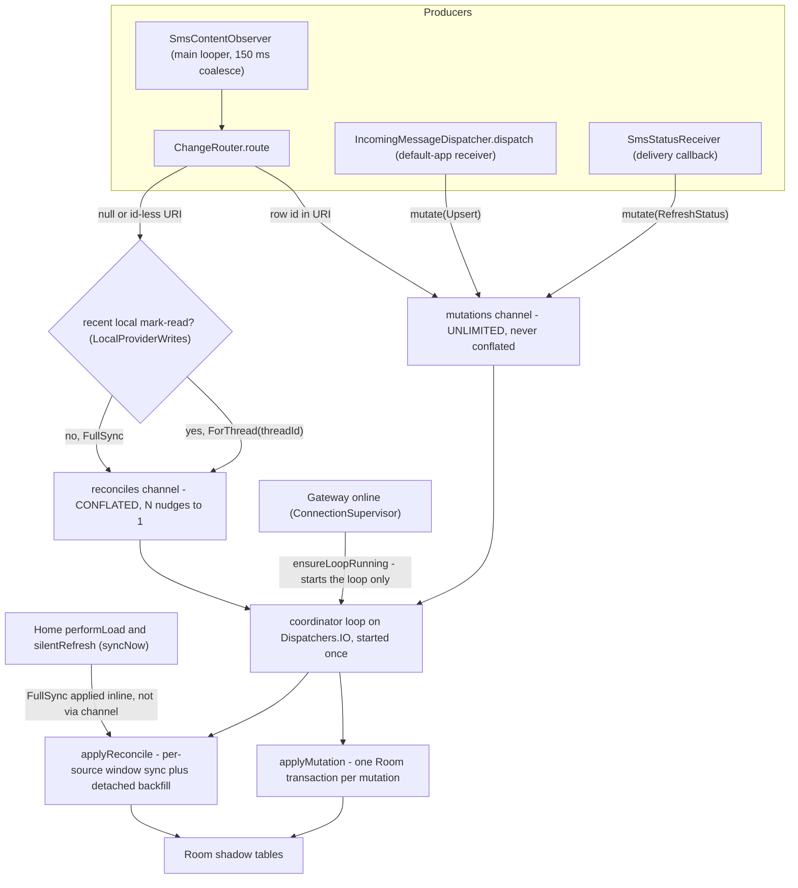
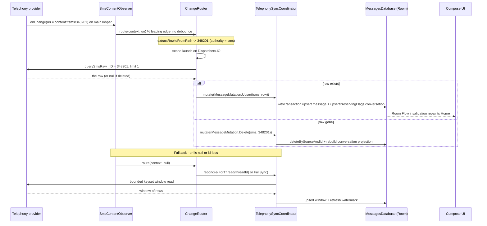

Telephony is the single source of truth for SMS and MMS; the app's Room database is a **shadow read model** that must mirror it fast enough to serve the UI. `TelephonySyncCoordinator` is the component that reconciles the two, and its central design decision is that **two very different kinds of change must travel on two completely separate channels** so that a realtime event is never throttled, merged, or dropped by the recovery machinery that handles the rest. The realtime events — a single message arriving, a delivery status callback, a row being deleted — must land in Room *exactly once*, one for one, in O(1). The recovery events — startup, crash, and the observer firing without enough information to target a row — can be collapsed, because a third "sync now" request arriving while one is already queued is pure redundancy. Conflating the first class with the second is the bug this architecture exists to prevent.

The flow starts at the platform and ends at Room: a `ContentObserver` attached to the `Telephony.Sms` and `Telephony.Mms` providers fires on the **main looper** and hands its URI (or `null`) to `ChangeRouter`, which decides whether the URI names a specific row (a cheap, targeted O(1) mutation) or only the table (a bounded reconcile). Either way the provider I/O is off the main thread, and the resulting value is queued to the coordinator, which is the **single writer into Room** and applies it on its own background loop. A read-cutover gate, `isShadowReady()`, decides whether Room may serve the UI at all — until *both* sources have mirrored their initial window, every read falls back to the provider path.

## The two channels

`TelephonySyncCoordinator` is a per-process singleton (`TelephonySyncCoordinator.get(context)`) holding two independent `Channel`s:

- **`mutations`** — `Channel<MessageMutation>(Channel.UNLIMITED)`. Exact, one-for-one, **never conflated**. The capacity is deliberately unbounded, not a leftover: a *bounded* channel plus `trySend` would **silently drop** an event under a burst (a hundred SMS arriving in a second), leaving that row stale in the shadow until the next reconcile. Each item is a small immutable value and the consumer drains continuously, so the queue stays near-empty in practice; the unbounded capacity trades a little worst-case memory for exactly-once delivery.
- **`reconciles`** — `Channel<ReconcileRequest>(Channel.CONFLATED)`. N queued nudges **collapse into exactly one** execution — only the latest matters.

`ensureLoop()` (guarded by an `AtomicBoolean` so it runs once) starts one long-lived coroutine scope on `Dispatchers.IO` with two consumers: an inner `for (mutation in mutations)` loop that applies each mutation sequentially (a failing one is logged and skipped, never dropped or retried in a tight loop), and the outer `for (request in reconciles)` loop that applies each reconcile. Both wrap their bodies in `try/catch` so one bad item cannot wedge the loop.

The value types are split the same way in `MessageMutation.kt`:

- `MessageMutation` — `Upsert(source, message)`, `Delete(source, providerId, threadId?)`, `RefreshStatus(source, providerId)`, `MarkThreadRead(threadId)`, `DeleteThread(threadId)`. Identity is the composite `(source, providerId)` that mirrors `MessageEntity`'s primary key. The docs are explicit: *NEVER conflated — every insert, delete, and status change must reach Room exactly once.*
- `ReconcileRequest` — `FullSync` (data object) and `ForThread(threadId)`. *CONFLATED — N nudges collapse into 1 execution.*

Caption: the two coordinator channels and every feeder — the observer's targeted path plus the receiver and status dispatch feed the UNLIMITED mutations channel; the id-less observer fallback feeds the CONFLATED reconciles channel (downgraded to `ForThread` when `LocalProviderWrites` claims a recent mark-read); Home's `syncNow` applies a `FullSync` inline; the gateway starts the loop without queueing work.

**Lifecycle and entry points.** The loop starts lazily: both `mutate()` and `reconcile()` call `ensureLoop()` first, so the first queued item wakes the consumers. The loop can also be started without queueing work — `GatewayService` wires `ConnectionSupervisor`'s `startSync` component to `ensureLoopRunning()` when the gateway comes online. Note that `syncNow()` differs from `reconcile(FullSync)`: it calls `applyReconcile(FullSync)` directly on the calling coroutine rather than enqueuing onto the CONFLATED channel, and Home's Room path relies on that — `performLoad`/`silentRefresh` call `coordinator.syncNow()` before reading conversations. `requestSync()` remains as a backward-compat alias for `reconcile(FullSync)`.

## The observer and ChangeRouter: extracting the cheapest operation

`SmsContentObserver` is a `ContentObserver` bound to the main-looper `Handler`. It implements **leading-edge dispatch**: the first change fires the callback immediately (no debounce delay, so the UI is millisecond-live), and any further change inside a `COALESCE_MS = 150 ms` window is collapsed into a single **trailing** call. The trailing runnable fires `onChange(null)` — a `null` URI is the sentinel meaning "unknown change type → reconcile." Two implementation notes that matter for correctness:

- `onChange(selfChange, uri)` must **not** call `super`, because the base `ContentObserver` delegates `onChange(selfChange, uri)` back into `onChange(selfChange)`, which this class also overrides — calling super would double-dispatch every provider change.
- The observer is registered per-viewmodel. Both `HomeViewModel` and `ConversationViewModel` call `SmsRepository.registerObserver(observer)` in `init` and `unregisterObserver` on `onCleared`. `registerObserver` attaches the same `ContentObserver` to **both** `Telephony.Sms.CONTENT_URI` and `Telephony.Mms.CONTENT_URI` (MMS registration is wrapped in its own `try/catch`). The two viewmodels then diverge on what they do with the URI: `HomeViewModel` bumps `ThreadMessageCache.generation` and routes the URI through `ChangeRouter`, while `ConversationViewModel` ignores the URI and triggers its bounded merge-based `refresh()` (its pager already runs a targeted tail query).

`ChangeRouter.route(context, uri)` is the decision point. It runs on the main looper (invoked from the observer), so it **must never do provider I/O inline** — every provider read is launched onto a `Dispatchers.IO` scope and the result is then queued to the coordinator:

1. **`uri == null`** — unknown change. Before defaulting to a full reconcile, it consults `LocalProviderWrites.claimRecentMarkRead()`. If a recent bulk mark-read is the cause (very common — a mark-read on an open conversation fires a URI-less burst), it downgrades to `ReconcileRequest.ForThread(threadId)` instead of a full dual-source crawl. Otherwise `ReconcileRequest.FullSync`.
2. **`uri != null`** — `extractRowIdFromPath(uri.path)` tries to pull a numeric row id off the last path segment. The source table is chosen by **authority** (`content://mms/…` → MMS, else SMS), not path substring, so `content://sms/thread/…` and OEM `mms-sms`-prefixed SMS URIs are not misrouted into the MMS reader. If a positive id is extracted, the router reads **exactly that one row** off the main thread (`SmsRepository.querySmsRaw`/`queryMmsRaw` with `_ID = ?`, `limit = 1`): a non-null result becomes `mutate(Upsert)`, a `null` result (the row was deleted externally) becomes `mutate(Delete)`. If no id can be extracted, it falls through to the same mark-read-aware fallback as the null case.

`extractRowIdFromPath` is deliberately conservative: `content://sms/12345` → `12345`; `content://sms` → `null`; and any path containing `/thread/` (or ending in `/thread`) → `null`, because the trailing number there is a **thread** id, not a row id — reading it as `_ID` would upsert a random unrelated message. A non-numeric last segment and blank/null paths also return `null`.

URI row ids are treated as an **optimization, not a contract**. Android *may* deliver `content://sms/12345` when a single row changes, but this is **not guaranteed on all OEM builds**. The whole reconcile channel exists precisely because the URI is frequently table-level or absent; a correct deployment must assume the id is absent and still converge.

## The hot path, grounded in the actual call sites

Caption: the realtime hot path (observer → ChangeRouter → `mutate(Upsert)` → one Room transaction → UI) and the fallback path (`null`/id-less URI → conflated `reconcile` → bounded window read).

In practice the hot path is usually *shorter* than the observer path: when the app is the default SMS app, `SmsReceiver`/`MmsReceiver` already hold the freshly-persisted row and call `IncomingMessageDispatcher.dispatch`, which does `mutate(Upsert(...))` directly — no second provider read. The observer path is what keeps the shadow authoritative for the **non-default app** (where only `SMS_RECEIVED` arrives and the system's default app wrote the row) and for external changes the app did not make itself. The two converge on the same `mutate` call, so Room sees one code path either way.

## Why non-default-app mode is reconcile-only

When this app is **not** the default SMS app, `SMS_DELIVER` never reaches it — only the platform-wide `SMS_RECEIVED` broadcast fires, and the *system's* default app is the one writing the row into the provider. Two consequences for sync:

- The observer is the **only** channel that sees those writes. `SmsContentObserver` + `ChangeRouter` is the mechanism that pulls an externally-written row into the shadow; there is no `mutate` from a receiver for it.
- Because the row was written by another process, the URI is very often table-level (or the OEM drops the row id entirely), so the realistic non-default path is `reconcile(FullSync)`/`ForThread` — the bounded window crawl — not the O(1) mutation. This is why URI row ids must be an optimization: in the role the app most needs the observer for, the id is most often absent.

Even in this mode the app still runs the `SMS_RECEIVED` broadcast fan-out (event bus, webhook, notification) from broadcast data as a fallback, but the *shadow* is only ever corrected by the observer. `LocalProviderWrites` is deliberately a **hint, never a source of truth**: a tiny fixed ring (32 entries, 2 s window) that the app's own write paths (notably `SmsRepository.markThreadAsRead`) record into, and `ChangeRouter` *claims* from (exactly once, consumed) to downgrade an id-less observer burst to a targeted `ForThread` repair — so that simply opening a chat (which triggers a bulk mark-read) cannot escalate into a full dual-source reconcile that races the backfill.

## applyMutation: the O(1) fast path in Room

`applyMutation` runs on `Dispatchers.IO`. The `Upsert` case is the important one and it does **two** things in a single `database.withTransaction` so message and projection commit atomically:

1. `findByKey(source, providerId)` to fetch the old row (for the unread delta).
2. `dao.upsertAll(listOf(entity))` to upsert the message.
3. `UnreadDelta.compute(oldExists, oldRead, newRead)` — a **signed** O(1) delta (new unread = +1, unread→read = −1, read→unread = +1, unchanged = 0) so the conversation badge moves without recounting the thread.
4. `convDao.upsertPreservingFlags(...)` to upsert the conversation projection, preserving `pinned`/`archived`, keeping `lastMessageDate` as `maxOf(new, existing)`, and adding the delta to `unreadCount`. This is a *true* upsert: a brand-new thread is INSERTed here, so Home never depends on a later rebuild.

The other cases: `Delete` removes the row and rebuilds that one conversation's projection (which also handles the "last message deleted → conversation disappears" case); `RefreshStatus` re-reads the single row from the provider and upserts it (status changes do not touch the projection); `MarkThreadRead`/`DeleteThread` are the bulk, thread-scoped operations. The coordinator also exposes `markThreadReadInShadow`, `deleteThreadFromShadow`, and `repairThreadInShadow` for the app-initiated write paths (`HomeViewModel` mark-all-read / delete-with-undo, `ConversationViewModel` open) to mirror provider writes straight into Room.

The provider read for a status refresh is `readExactMessage(source, providerId)` — one row by native id, O(1), no scan, no offset, no window. `toEntity` maps the `Sms` model into a `MessageEntity`, and `providerId(sms) = abs(sms.id)` normalizes the app's **negated-MMS-id** convention (`SmsRepository` encodes MMS rows with `id = -_id` so mixed UI lists never collide) back to the native positive row id that the `messages` table and the watermarks must share.

## The reconcile path and the read-cutover gate

`applyReconcile(FullSync)` is the repair path:

1. **Prune** the send-segment ledger to a 90-day horizon (piggybacks the full sync, which runs on start + pulls, never mid-conversation).
2. **`syncSource(SMS)`** then **`syncSource(MMS)`** — each mirrors only what its durable watermarks say is new. On first contact (no `initialWindowReady`) it reads the newest `FIRST_BATCH` (500) rows via keyset from a sentinel, `insertOrIgnore`s them, and advances both `newest` and `oldest` watermarks. In steady state it reads only rows strictly newer than the `(date, id)` watermark via `readNewerThan` (a keyset predicate `date > ? OR (date = ? AND id > ?)`, so a same-timestamp insert is still caught), upserts them, and advances `newest`. `Mms.DATE` is **seconds** while the app's watermarks are **milliseconds**; the readers divide by 1000 (exact, since MMS dates are whole seconds).
3. **Cutover ordering.** `syncSource` deliberately leaves `initialWindowReady` **false** when the window just landed. The flag may flip **only after** `fullRebuildConversations()` has rebuilt the `conversations` projection from the mirrored messages. This ordering fixes the "list showed, then went empty" failure: `isShadowReady()` gates Room reads, so the UI can never observe "ready" against an empty/missing projection. If the process dies in between, the next reconcile redoes the (idempotent) window + rebuild before marking again.
4. **Backfill** is scheduled **detached** — see below.

`isShadowReady()` is the read-cutover gate: it returns true only when **both** `sms` and `mms` sources have `initialWindowReady == true` in the `sync_state` table. Viewmodels consult it (guarded by `runCatching { ... }.getOrDefault(false)`) to set a `roomReadEnabled` latch. Until the latch is set, every read falls back to the provider path; `HomeViewModel` and `ConversationViewModel` also hold a `roomUnavailable` flag so a Room failure (e.g. a broken migration) permanently downgrades to the provider path rather than killing the app — the shadow is disposable, the provider is not.

## Backfill: durable keyset crawl, detached

History backfill must **never block the caller** — the original startup hang was `syncNow()` awaiting a 360K-row crawl inline. `scheduleBackfill()` launches one detached job on a single dedicated `MIN_PRIORITY` thread (`sms-backfill`) that crawls SMS then MMS and does **one** projection rebuild at the end. Two guards prevent overlap: a per-source `AtomicBoolean` in `backfillInFlight` keeps two reconciles from starting overlapping crawls, and the crawl itself is idempotent.

`backfillOlderKeyset` is a **keyset (watermark) crawl with no OFFSET**: each batch reads `WHERE (date, id) < watermark ORDER BY date DESC, id DESC LIMIT 500` and **persists the new watermark before yielding**. A process kill resumes exactly from the last durable cursor (on next start, `historyBackfillComplete=false` in steady state re-enters the crawl) — no restart from zero, no skipped row, no duplicate, and immune to provider inserts shifting window boundaries (the offset bug). The watermark updates are **targeted `UPDATE`s** (`advanceOldest`/`advanceNewest` in `SyncStateDao`), never a read-modify-write of the whole `SyncStateEntity` — a stale whole-entity copy written back at the end of the loop would stomp every cursor advanced during the run (the v2.6.2 bug). `markHistoryComplete` is set only when the batch under-fills, and `fullRebuildConversations()` runs once for the whole crawl.

`SyncStateEntity` (one row per source in `sync_state`) holds the **dual watermarks** that make this possible: `newestDate`/`newestId` (incoming direction) and `oldestDate`/`oldestId` (backfill direction), plus the `initialWindowReady` and `historyBackfillComplete` flags and `lastReconcileAt` bookkeeping. The two watermarks move independently and must not interfere.

## Invariants

The page-specific invariants the design is built to hold:

- **Exact mutations are NEVER conflated.** The `mutations` channel is unbounded and applied one-for-one; a burst cannot drop a row.
- **Reconcile requests ARE conflated.** N nudges collapse into one bounded pass; only the latest matters.
- **The coordinator is the single writer into Room.** Every path — the receiver hot path, the observer path, app-initiated mark-read/delete, and reconcile — funnels through `mutate`/`applyMutation` or the coordinator's shadow helpers; nothing else writes `messages`/`conversations`.
- **`isShadowReady()` gates Room reads.** Room serves the UI only once **both** sources' initial windows are ready and the projection is rebuilt; before that (and on Room failure) every read falls back to the provider.
- **No full rebuilds on the realtime path.** `fullRebuildConversations()` runs only during reconcile (and once at the end of the backfill crawl), never per message; the per-mutation `Upsert` maintains the conversation projection by signed delta, so a single arriving message costs O(1) and triggers no full scan, no full rebuild, and no thread-wide `countUnread`.

## Tests that pin the behavior

- `ChangeRouterExtractIdTest` pins URI extraction: single-row `sms`/`mms` paths yield the id; table-level, non-numeric, blank, and `null` paths yield `null`; and **thread URIs are not row ids** (`//sms/thread/123` must return `null` so it is not read as `_ID`).
- `LocalProviderWritesTest` pins the mark-read handoff: a note is claimed **exactly once** (a second claim misses), non-positive thread ids are never noted (so an address-only fallback can't downgrade a needed `FullSync` to nothing), entries expire outside the 2 s window, and the ring keeps the newest under flood.
- `SmsObserverTimingTest` pins the observer's timing contract: the first change fires **synchronously with no debounce delay** (leading edge), and a burst of ten changes fires exactly one synchronous leading-edge callback (the other nine collapse into a single trailing call scheduled on the `Handler`, which the JVM test does not run).

## Related pages

- /openwiki/architecture/conversation-paging.md — the reader-side window/keyset pagination and the `isShadowReady` gate that authorizes Room-first reads of a thread.
- /openwiki/architecture/data-model.md — the `Sms` model (MMS id negation, type/status fields) and the Room `MessageEntity`/`ConversationEntity`/`SyncStateEntity` tables behind the shadow.
- /openwiki/architecture/incoming-messaging.md — `SmsReceiver`/`MmsReceiver` and `IncomingMessageDispatcher.dispatch`, the receiver-side entrypoint that emits the same `mutate(Upsert)` hot path.
- /openwiki/workflows/incoming-message-pipeline.md — end-to-end walk of an inbound message from provider row to UI.
