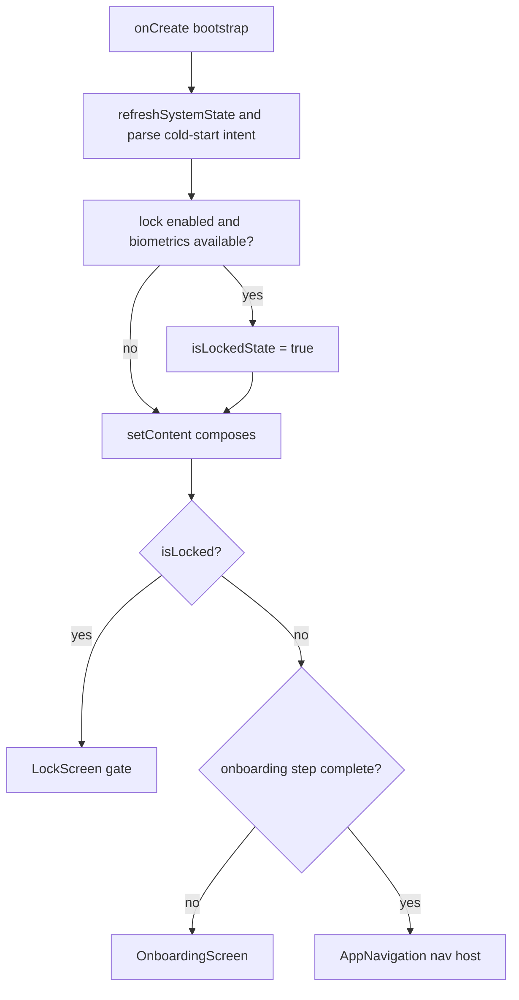
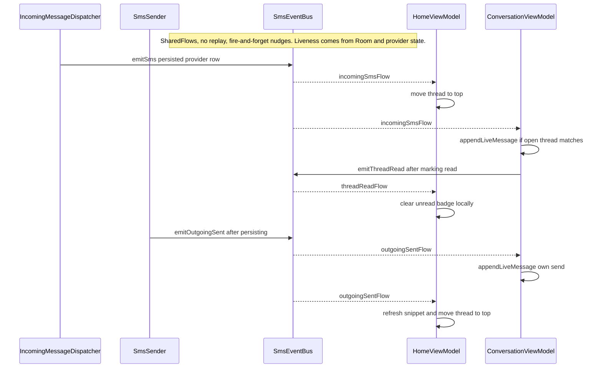

# UI, Navigation, and App Shell

Messages is a **single-activity** Android app. The manifest declares exactly one activity — `MainActivity` — and the entire user interface is Compose content mounted into it. There is no per-screen activity: conversations, settings, and the gateway are all destinations inside one `NavHost`. Two gates stand in front of that navigation graph, and both live in `MainActivity` itself, *not* inside a screen or the `NavHost`: the **onboarding flow** (privacy disclosure → default-SMS-app role → SMS permissions → optional permissions) and the **biometric app-lock gate**. Only when both are satisfied does `AppNavigation` compose and the app's screens become reachable.

The page is a composition map: the app-shell ordering in `MainActivity`, the onboarding and lock gates, the navigation graph and its external-intent routing, the screen/ViewModel inventory, and `SmsEventBus`, the app-wide bus that carries realtime nudge events between the message pipeline and the two always-relevant screens (Home and Conversation).

The data-plane authority model — Telephony providers as the durable source of truth, the Room read-shadow behind them — is owned by the [sync-coordinator](/openwiki/architecture/sync-coordinator.md) and [data-model](/openwiki/architecture/data-model.md) pages. This page only needs that fact to explain why the bus is a *nudge* layer rather than a source of truth.

## App-shell composition

`MainActivity.onCreate` runs a fixed bootstrap sequence, then hands the whole UI to `setContent`. The order matters because the two gates and the navigation graph all read from state established here:

Caption: the app-shell decision order inside `MainActivity` — the lock gate is checked first, then onboarding, and only then does the navigation graph compose.

The bootstrap does, in order: `enableEdgeToEdge()`, `NotificationHelper.createNotificationChannel(this)` (so the SMS notification channel exists before anything can post), constructs `OnboardingPreferences` and `AppLockPreferences`, calls `ThemeController.init(this)` (loads the persisted appearance before the first frame), `refreshSystemState()`, and — only on a true cold start (`savedInstanceState == null`) — `handleInboundIntent(intent)` to parse the launching intent before the first frame. Finally, if the lock is enabled **and** biometrics are available, it seeds `isLockedState = true`.

Inside `setContent`, the composable tree is a three-way branch evaluated from Compose state (`isLocked`, the resolved onboarding `step`, and the permission flags):

1. **`isLocked`** → `LockScreen` (full-screen gate; everything else is not composed).
2. **`step != OnboardingStep.COMPLETE`** → `OnboardingScreen` for the current step.
3. **otherwise** → `AppNavigation(...)`, which owns the `NavHost`.

In the compose order the lock is checked **first**, so if `isLocked` and an unfinished onboarding step were ever both true, `LockScreen` is what renders. In practice that never collides: the lock can only be enabled from the Settings screen, which itself is behind onboarding, so a first-time user walks through onboarding before the lock can ever be armed. The practical effect is that the lock protects a fully-set-up app, not the onboarding flow. The permission/role flags (`hasPermission`, `isDefaultSmsApp`) are threaded through to `AppNavigation` and its child screens so that Home and Settings can re-prompt when the app is not yet the default SMS app.

`refreshSystemState()` recomputes the four live flags (`isDefaultSmsApp`, `hasSmsPermissions`, `hasContactsPermission`, `hasNotificationsPermission`) and, once initialized, re-hydrates `disclosureAccepted` and `optionalStepCompleted` from preferences. It is called from `onResume` and from every permission/role launcher's result callback, so the gates re-evaluate after the user returns from a system dialog.

## Onboarding policy

Onboarding is a pure policy object, `OnboardingPolicy`, whose `resolveStep` maps four booleans to a single `OnboardingStep` enum in a fixed priority order:

| Precedence | Step | Gate it represents |
|---|---|---|
| 1 | `DISCLOSURE` | `!disclosureAccepted` |
| 2 | `DEFAULT_SMS_ROLE` | `!isDefaultSmsApp` |
| 3 | `SMS_PERMISSIONS` | `!hasSmsPermissions` |
| 4 | `OPTIONAL_PERMISSIONS` | `!optionalStepCompleted` |
| 5 | `COMPLETE` | all of the above satisfied |

Because the checks are ordered and re-run on every resume, the flow is *recoverable*, not linear-and-locked: if the user loses the default-SMS-app role later (e.g. switches it to another app), the next `refreshSystemState()` + `resolveStep` sends them back to `DEFAULT_SMS_ROLE` even if they have already accepted the disclosure and granted SMS permissions. This is the "restricted permissions must come after the role" invariant — the SMS role is what makes `SMS_DELIVER` and the send APIs usable, so it precedes the permission steps.

Two properties are persisted in `OnboardingPreferences` (`onboarding_preferences` SharedPreferences):

- **`disclosureAccepted`** is stored as an **integer version** (`disclosure_version >= DISCLOSURE_VERSION`, currently `1`), not a plain boolean. Bumping `DISCLOSURE_VERSION` in a future release forces the disclosure step to re-appear for existing users.
- **`optionalStepCompleted`** is a boolean gate so the optional step can be skipped explicitly.

The optional step (`OPTIONAL_PERMISSIONS`) offers `READ_CONTACTS` and (on API 33+) `POST_NOTIFICATIONS`. These are **not** required to reach `COMPLETE` beyond flipping `optionalStepCompleted`; the screen surfaces a "permanently denied" state (derived from `shouldShowRequestPermissionRationale`) that redirects to app settings instead of re-prompting. The required SMS permissions are the triple `READ_SMS` / `RECEIVE_SMS` / `SEND_SMS` (the `SMS_PERMISSIONS` array in `MainActivity`), and the SMS-permission request is gated on already being the default SMS app.

`OnboardingPolicy` is unit-tested directly in `OnboardingPolicyTest` (disclosure is always first, role precedes restricted permissions, optional step can be skipped, loss of the role returns to the role step).

## App lock gate

The app lock is an optional biometric gate, `LockScreen`, that composes *in place of* everything when `isLocked` is true. It is a pure UI gate with no crypto — the security comes from the system `BiometricPrompt`. `AppLock.kt` provides:

- `AppLockPreferences` — a single `lock_enabled` boolean in `app_lock_prefs` SharedPreferences. It is toggled from the Settings → Security section.
- `isBiometricAvailable(context)` — `BiometricManager.canAuthenticate(BIOMETRIC_WEAK or DEVICE_CREDENTIAL)`; the gate only engages when the device actually has a usable authenticator (fingerprint/face **or** PIN/pattern). If it does not, the lock is silently unavailable and the toggle is disabled in Settings.
- `showBiometricPrompt(...)` — fires the system prompt with `BIOMETRIC_WEAK or DEVICE_CREDENTIAL`; any authentication error (including user cancel) is treated as "still locked."

The re-lock lifecycle is what makes it a *foreground* gate rather than a one-time splash:

- `onPause` sets `SmsEventBus.isAppInForeground = false` and remembers `wasPausedForLock = true`.
- `onStart` re-locks (`isLockedState = true`) **only** if `wasPausedForLock` is set, the lock is enabled, and biometrics are available. The `wasPausedForLock` flag exists so a config change (rotation) that recreates the activity *without* a prior `onPause` does not re-nag the user mid-session.
- `LockScreen`'s Unlock button calls `MainActivity.requestUnlock(...)`, which shows the prompt and clears `isLockedState` on success; "Turn off" flips `AppLockPreferences.isEnabled = false`.

The lock composes in front of the navigation graph but *behind* nothing: `pendingShare`/`pendingNavigation` state (see below) survives the lock, so a notification deep-link tapped while locked is still honored after the user unlocks.

## Navigation graph and deep-linking

`AppNavigation` builds a `NavHost` with `rememberNavController()` and `startDestination = "splash"`. The graph is declared in `Screen.kt` (a sealed class of routes) and wired in `AppNavigation.kt`:

| Route | Destination | Notes |
|---|---|---|
| `splash` | `SplashScreen` | animated intro; navigates to `home`, popping `splash` |
| `home` | `HomeScreen` | root list; carries `hasPermission`/`isDefaultSmsApp` + re-prompt callbacks |
| `new_conversation?forward={forward}&draft={draft}(&shared_phone=…)` | `NewConversationScreen` | optional `forward`, `draft`, `shared_phone` query args |
| `gateway` | `GatewayScreen` | gateway UI (see [gateway-service](/openwiki/architecture/gateway-service.md)) |
| `settings` | `SettingsScreen` | carries permission/role flags + re-prompt callbacks |
| `messaging_settings` | `MessagingSettingsScreen` | SIM / SMSC / delivery-report options |
| `appearance_settings` | `AppearanceSettingsScreen` | theme preset / dark mode / calendar |
| `quick_replies` | `QuickRepliesScreen` | quick-reply template CRUD |
| `scheduled_messages` | `ScheduledMessagesScreen` | WorkManager-backed scheduled sends |
| `conversation/{threadId}?phone=…&name=…&forward=…&draft=…` | `ConversationScreen` | `threadId` is a path arg (Long); `0` means phone-only |

Two external-entry mechanisms are resolved **outside** the `NavHost`, in `AppNavigation`, using `LaunchedEffect`, because the `NavHost` starts on `splash` and cannot navigate until it has actually reached a usable destination.

### Share / send → NewConversation draft (one-shot)

`MainActivity.parseShareIntent` turns an inbound `ACTION_SEND` (`EXTRA_TEXT`) or `ACTION_SENDTO` (`sms:`/`smsto:` links, via `IncomingShareParser.fromSendTo`) into an immutable `SharePayload(phone, text)`, or `null` when there is no usable payload. This is stashed in `pendingShareState`. `AppNavigation` then, in a `LaunchedEffect(share)`, routes it **once** into `Screen.NewConversation.createDraftRoute(phone, text)` with `popUpTo(Home)`, then calls `onShareConsumed()` to clear the state — so a rotation or recomposition cannot re-trigger it. Critically, an external share lands in the composer as a **DRAFT** (the user still presses Send); it is never auto-sent.

### Notification / deep-link → Conversation (one-shot, splash-aware, lock-aware)

`NotificationHelper` builds each SMS notification's tap intent with `action = AppLaunchIntent.ACTION_OPEN_CONVERSATION` plus `EXTRA_THREAD_ID` / `EXTRA_PHONE` / `EXTRA_NAME` and a per-thread data URI (so `PendingIntent`s for different threads stay distinct). `MainActivity.handleInboundIntent` runs `AppLaunchIntent.parse(intent)` on every inbound intent (cold start and `onNewIntent`, where `setIntent` is also called so a later recomposition or process death still sees the newest intent). `AppLaunchIntent.parse` returns an `AppLaunchTarget.Conversation` only for the `OPEN_CONVERSATION` action with a positive `threadId` or non-blank phone; everything else yields `null`.

The target is stashed in `pendingNavigationState` and consumed by a `LaunchedEffect(pendingNavigation)` in `AppNavigation` that **waits** until the back stack actually reaches `home` or an existing `conversation/…` (via `currentBackStackEntryFlow.first { … }`), then navigates to the target thread with `popUpTo(Home) { inclusive = false }` and `launchSingleTop = true`. The `launchSingleTop` + current-thread guard (`currentThread != target.threadId`) keep a same-thread notification tap from stacking a duplicate destination. Waiting on the back stack (rather than navigating immediately) is what lets the four cases behave correctly: app closed (splash → home → conversation), app on home, app on another conversation (pop it, open the target), and app locked (the target survives and is consumed after unlock composes `AppNavigation` again).

### Route encoding hygiene

`Screen.encode` percent-encodes query arguments — deliberately **not** `URLEncoder.encode`'s form style — replacing the form `+` with `%20`, because Navigation decodes query args percent-style (`Uri.getQueryParameter`), where a literal `+` is a plus and only `%20` is a space. Form-encoding a display name once turned "hamid dadash" into "hamid+dadash" in the header. `Screen.cleanArg` is a second, defense-in-depth layer: a navigation argument that still contains a route placeholder (`{forward}`, `{draft}`) is a **leaked route pattern**, not user data, so `cleanArg` drops any value containing `{` or `}` to `""`. This guards every caller, including a process-death restore of a stale pattern route. `NavigationRouteEncodingTest` pins the round-trip behavior (space → `%20`, `+` prefix survives, `&`/`=` cannot split args, embedded `%XX` is not double-decoded, non-Latin names round-trip).

### First-paint handoff: `ConversationLaunchStore`

A subtle UX invariant is that tapping a conversation row must not flash a blank frame before the real messages paint. `ConversationLaunchStore` is an ephemeral, in-memory `ConcurrentHashMap` snapshot bridge (explicitly *not* a database or cache) between Home and Conversation: when the user taps a row, Home already holds the last bubble (threadId, phone, name, snippet, date, direction), so it `put`s a `Snapshot`; `ConversationScreen` `peek`s it for its first composition and renders a `LaunchPreview` while the first Room page is in flight, crossfading to the real rows. The snapshots are transient — their whole purpose is the first frame.

## Screen → ViewModel → repository inventory

Every screen is a `@Composable` in `ui/screens/`. Most own an `AndroidViewModel` (constructed with `viewModel()` from the activity scope, so it survives config changes and is shared across the single activity). The mapping and the repositories each ViewModel reaches into:

| Screen | Route | ViewModel | Key repositories / singletons it uses |
|---|---|---|---|
| `HomeScreen` | `home` | `HomeViewModel` | `SmsRepository` (provider reads + `SmsContentObserver`), `ChangeRouter`, `TelephonySyncCoordinator` (Room shadow), `MessagesDatabase` (conversation + FTS + send-segment DAOs), `ArchiveRepository`, `PinRepository`, `BlocklistRepository`, `DraftRepository`, `ContactRepository`, `ConversationCache` |
| `ConversationScreen` | `conversation/{threadId}` | `ConversationViewModel` | `SmsRepository` + `SmsContentObserver`, `ThreadPager` (windowed paging), `ThreadMerge`, `ThreadMessageCache`, `SmsSender`, `MmsSender`, `MessagingPreferences`, `SimRulesRepository`, `SimManager`, `DraftRepository` |
| `NewConversationScreen` | `new_conversation` | `NewConversationViewModel` | `ContactRepository` (ContactsContract + SMS-table contact merge) |
| `GatewayScreen` | `gateway` | `GatewayViewModel` | `GatewayPreferences`, `BackendClient`, `RegistrationManager`, `HeartbeatManager`, `GatewayService`/`GatewayServer` singletons (see gateway page) |
| `SettingsScreen` | `settings` | `DataToolsViewModel` (data-tools section) | `SmsRepository`, `ExportRepository`, `BackupRepository`; the rest of the screen reads `AppLockPreferences` and `QuietHoursPreferences` directly and links out to the gateway/messaging/appearance sub-screens |
| `MessagingSettingsScreen` | `messaging_settings` | `MessagingSettingsViewModel` | `MessagingPreferences`, `SimManager` |
| `AppearanceSettingsScreen` | `appearance_settings` | — (no VM) | `ThemeController` (process-wide appearance `StateFlow`) |
| `QuickRepliesScreen` | `quick_replies` | — (no VM) | `QuickRepliesPreferences` |
| `ScheduledMessagesScreen` | `scheduled_messages` | — (no VM) | `GatewayScheduler` (WorkManager-backed) |
| `SplashScreen` | `splash` | — (no VM) | animation only; navigates to `home` |
| `OnboardingScreen` / `LockScreen` | (not in `NavHost`) | — (no VM) | driven by `MainActivity` state + `AppLockPreferences` / `OnboardingPreferences` |

Two of the larger ViewModels are worth noting as the app's realtime surface:

- **`HomeViewModel`** owns the conversation list, search (Room FTS4-backed global search over message bodies), archive/pin/block/delete-with-undo, and the "sent segments today" chip (a Room `Flow` over the send-segment ledger, re-windowed at local midnight). Its content-observer callback does **not** full-reload; it routes each provider URI through `ChangeRouter` for targeted O(1) mutations. Its list is driven by a Room `conversationDao().observeAll()` Flow **behind a read-cutover gate** (`roomReadEnabled`): if the shadow DB cannot be opened (failed migration, corruption), it sets `roomUnavailable` and falls back to the provider path — the shadow is never allowed to kill the app.
- **`ConversationViewModel`** owns the windowed, bidirectional message list (see [conversation-paging](/openwiki/architecture/conversation-paging.md)). Every background job is wrapped in a `crashGuard` coroutine handler that converts a failing provider/Room/pager query into an on-screen `errorMessage` (shown once as a snackbar) rather than an uncaught coroutine exception that would kill the process. `MessagesApp` installs a last-resort global uncaught-exception handler that logs full context and then delegates to the platform handler.

## Theme and appearance

`ThemeController` is a process-wide `StateFlow<ThemeController.State>` (preset id, dark-mode, Persian/Gregorian calendar). It is initialized in `MainActivity.onCreate` *before* `setContent`, so the first frame already reflects the persisted appearance. `MessagesTheme` collects the controller with `collectAsState()`, so changes made in `AppearanceSettingsScreen` (which mutates the controller and persists via `AppearancePreferences`) apply live to the whole tree without any navigation or activity restart. The calendar choice also drives `CalendarBridge.current`, which affects date formatting across the app.

## SmsEventBus: the realtime nudge layer

`SmsEventBus` is an app-wide singleton (`object`) that carries realtime SMS events and app-state flags between the message pipeline and the ViewModels. Its central design rule — stated in its own header — is that it is **not** a source of truth:

> "No replay: a NEW ViewModel collector must not re-receive the LAST message … Liveness comes from Room/provider state, not the bus; the bus is a fire-and-forget nudge."

All four event channels are `MutableSharedFlow` with **no replay cache** and a small `extraBufferCapacity` (so fast bursts are not dropped, but a cold collector never sees history). The consequence is intentional: the bus only tells an *already-live* screen "something changed, go reconcile against the provider/Room now." It never carries the authoritative row content for rendering.

Caption: how the three nudge flows keep Home and Conversation in step with provider state — the bus signals, the ViewModels reconcile.

The channels and their semantics:

- **`incomingSmsFlow: SharedFlow<Sms>`** — fired by `IncomingMessageDispatcher` *after* the row has been persisted to the Room shadow (`mutate(Upsert)`). `HomeViewModel` prepends the thread to the top of the list (removing the existing row first, respecting archive); `ConversationViewModel`, if the open thread matches (`ContactRepository.sameConversation`), appends the row live and marks it read. This is an *optimistic* nudge — the authoritative copy is the provider/Room row, and the Room `conversationDao()` Flow re-emits the authoritative Home row afterward.
- **`threadReadFlow: SharedFlow<ThreadRead>`** — fired by `ConversationViewModel` whenever its thread is marked read (on load and on cache-hit open). `HomeViewModel` listens and clears the unread badge locally via `markConversationReadLocally`, so opening a chat instantly drops its Home badge without a provider round-trip.
- **`outgoingSentFlow: SharedFlow<OutgoingSent>`** — fired by `SmsSender` right after an outgoing message is persisted. This is the key to the single-activity back stack: the Home list is *behind* the open Conversation in the same activity, so it cannot rely on `onResume` to update. The nudge moves the thread to the top with the new snippet **while the chat is still open**. `ConversationViewModel` also listens to this flow so sends persisted *elsewhere* (e.g. a quick-reply from a notification, the EVE queue, a scheduled send) appear in an open chat immediately.
- **`refreshFlow: SharedFlow<Unit>`** — a reload signal fired from `MainActivity.onResume` (via `notifyResume()`) and from `ConversationViewModel.onCleared`. The second is important: navigating **chat → home never passes through `Activity.onResume`**, so without `onCleared` firing `notifyResume()`, Home could keep a pre-chat snapshot (stale snippet/badge). Both ViewModels treat a `refreshFlow` signal as "reload from the DB."

Two `@Volatile` fields carry lightweight app state that the pipeline reads (not the other way around):

- **`isAppInForeground`** — set in `onResume`/`onPause`. `IncomingMessageDispatcher` uses it (together with `activeConversationPhone`) to **suppress the notification** when the user is actively viewing that exact conversation — the message is still appended to the open chat via `incomingSmsFlow`, just not re-notified.
- **`activeConversationPhone`** — set by `ConversationViewModel` when a thread opens/sends and cleared in `onCleared`; it is the "which conversation is the user looking at" token the dispatcher matches against.

Because the bus never replays, a screen opened *after* an event was emitted does not get that event — it reads the current state from Room/provider on its first load instead. This is the deliberate trade: no stale-`SharedFlow` "flash" of an old message in a freshly opened conversation, at the cost of requiring every screen to reconcile from durable state on open and on each `refreshFlow`/`incomingSmsFlow` nudge.

## Cross-cutting invariants

- **Provider state wins.** Every nudge in `SmsEventBus` is a "reconcile now" signal; the row content that is rendered always comes from the Telephony provider (via `SmsRepository`) or the Room read-shadow. A broken shadow degrades to the provider path and never crashes the app.
- **Gates precede navigation.** Onboarding and the lock are composed in `MainActivity` *before* `AppNavigation`; no screen is reachable until both are satisfied, and external deep-links (`pendingShare`/`pendingNavigation`) are parked in activity state and consumed only once Home is actually mounted — surviving the lock gate.
- **External input is a draft, never a send.** Share/send payloads pre-fill the composer; only an explicit `forward` argument (in-app forward) or a user Send press causes a send.
- **One-shot external intents.** `pendingShare` and `pendingNavigation` are cleared as soon as they are consumed, so recomposition, rotation, or process-death restore cannot re-fire them.
- **Config-change resilience.** ViewModels live in the activity scope and survive rotation; the lock's `wasPausedForLock` flag prevents a mid-session rotation from re-nagging; route args are percent-encoded and pattern-sanitized so a stale restored route cannot inject `{placeholder}` text.

## Focused tests

The UI/navigation layer's pure logic is covered by JVM unit tests:

- `OnboardingPolicyTest` — step precedence, role-before-permissions, explicit skip, and role-loss regression.
- `NavigationRouteEncodingTest` — route arg percent-encoding round-trips (space, `+` prefix, `&`/`=` escaping, no double-decode, non-Latin names) that protect the `conversation/…` and `new_conversation` headers.
- `IncomingShareParserTest` — `ACTION_SEND`/`ACTION_SENDTO` parsing (encoded `+` numbers, `sms_body` extra precedence, `EXTRA_TEXT` fallback, text-only share).

The ViewModels and Compose screens themselves are not unit-tested in isolation; their behavior is exercised through these pure helpers plus the data-plane tests (see the sync-coordinator and conversation-paging pages).
