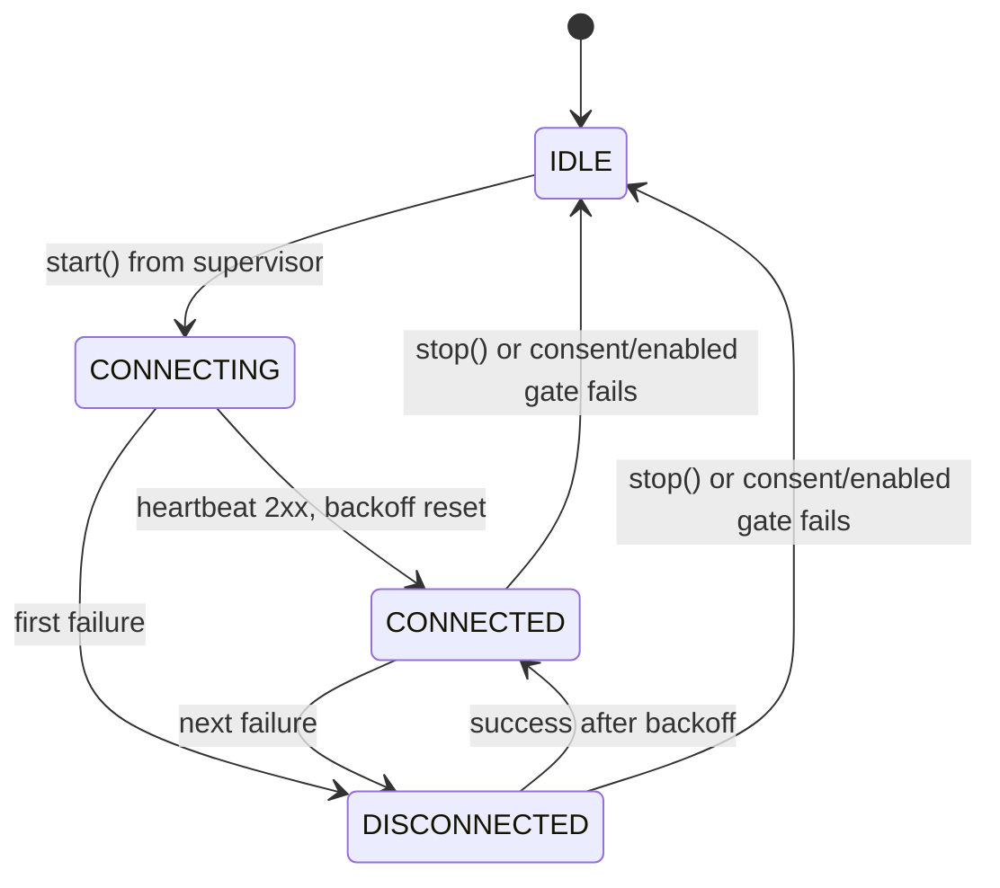
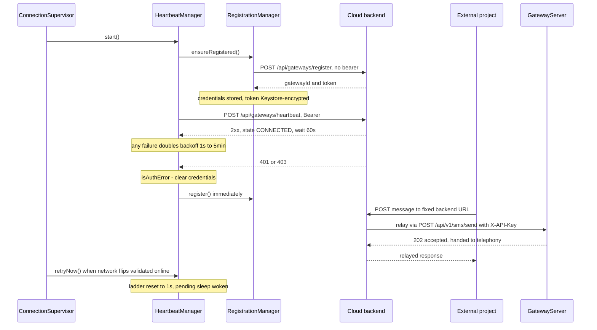
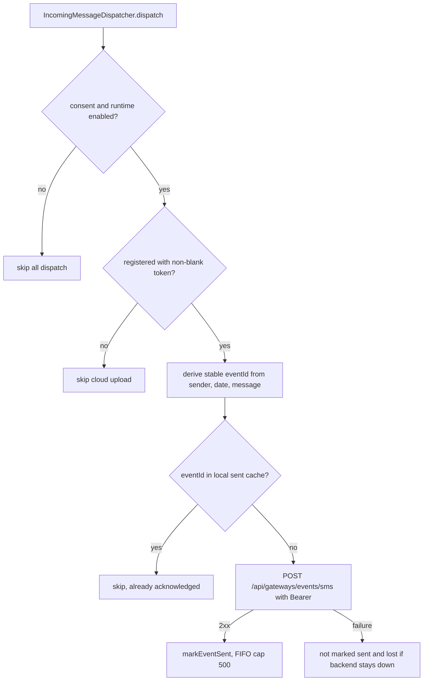

The cloud relay is the gateway's optional **push-style bridge**: instead of exposing the phone's changing LAN IP to the internet, the phone dials *out* to a fixed HTTPS URL and keeps a channel alive so external projects can reach it through that backend. It has three outbound responsibilities, all implemented in `com.autonomousone.messages.gateway`, plus the inbound leg where the backend relays messages back to the device:

- **Registration** — `RegistrationManager` registers the device once (and re-registers automatically) and stores the issued `gatewayId` + bearer `token`.
- **Heartbeat** — `HeartbeatManager` sends a status heartbeat every 60 s while healthy, with exponential backoff (1 s → 5 min) on failure.
- **Event upload** — `WebhookEngine` uploads each incoming SMS as an event, using a deterministic `eventId` so the backend can deduplicate replays.
- **Inbound leg** — when an external project posts a message to the fixed backend URL, the backend relays it to the device, which receives it on its local `GatewayServer` (the same `POST /api/v1/sms/send` endpoint LAN clients use) — see [REST API](/openwiki/integrations/rest-api.md).

The first three funnel through one HTTP client, `BackendClient`, and all outbound traffic is gated on versioned privacy consent **and** the supervisor-derived runtime `isEnabled` flag — nothing leaves the phone unless the gateway service is enabled and consent was given. The relay components are supervised like every other gateway component by `ConnectionSupervisor` (see [Gateway service](/openwiki/architecture/gateway-service.md)); this page covers the cloud side only. The GMweb pull bridge is the alternative outbound-only mode ([GMweb pull bridge](/openwiki/integrations/gmweb-pull.md)).

## Components

| Component | Role |
|---|---|
| `BackendClient` | The single HTTP client for all cloud traffic: JSON POST only, 15 s connect / 30 s read timeouts, sealed `Result<T>` (no exceptions leak to callers), Bearer auth from prefs, HTTPS refusal. |
| `RegistrationManager` | First-time and re-registration; builds the device payload, sends the optional pairing secret, parses and persists the issued credentials. |
| `HeartbeatManager` | 60 s cadence, backoff ladder, connection state for the UI, 401/403 → re-registration, `retryNow()` backoff cancellation. |
| `WebhookEngine.sendCloudEvent` | Fire-and-forget incoming-SMS event upload with local idempotency cache. |
| `GatewayPreferences` | Owns the `cloud_*` preference keys: `backendUrl`, `gatewayId`, Keystore-encrypted `gatewayToken` and `registrationSecret`, `isRegistered`, `lastHeartbeatAt`, and the sent-event-ID store. |

## Backend contract

The app calls three endpoints on the configured backend (documented for backend implementers in `docs/api/README.md` and the `x-cloud-backend-contract` block of `docs/api/openapi.yaml`):

| Endpoint | Auth | Body |
|---|---|---|
| `POST {backend}/api/gateways/register` | **No bearer token**; optional `X-Registration-Secret` header | `{ deviceId, name, appVersion, androidVersion, deviceModel }` |
| `POST {backend}/api/gateways/heartbeat` | `Authorization: Bearer <token>` | `{ appVersion, batteryLevel, networkType, timestamp }` |
| `POST {backend}/api/gateways/events/sms` | `Authorization: Bearer <token>` | `{ eventId (stable UUID), type: "sms.received", sender, message, timestamp }` |

All three require HTTPS; plaintext URLs are rejected by the client before any request is made. Registration is idempotent on the backend side, keyed by `deviceId`: if the token is lost from SharedPreferences, a re-registration issues a **new** token and the old one becomes invalid.

### Registration

`RegistrationManager.ensureRegistered()` short-circuits to `true` when `isRegistered && gatewayToken.isNotBlank()` — a stale token is detected later by the heartbeat's 401/403, not by the client. `register()` (suspend, `Dispatchers.IO`, consent-gated) builds the payload and posts it unauthenticated (`authenticated = false`) so no bearer header is attached:

- **`deviceId`** is `Settings.Secure.ANDROID_ID` — unique per app signing key and reset on factory reset. When it is blank or unreadable, a random 32-hex ID generated once and persisted in the prefs is used (`deviceFallbackId`); `Build.SERIAL`/`Build.ID` are deliberately avoided as deprecated or guessable.
- **`X-Registration-Secret`** is sent only when the user configured a pairing secret (stored Keystore-encrypted under `cloud_registration_secret`). Its purpose is to let the backend reject unauthenticated registration attempts that would hijack or invalidate this gateway; clearing it in the UI logs "backend must allow open registration".

On a 2xx response the client parses `gatewayId` and `token` out of the body and persists them (`gatewayToken` via Keystore encryption), sets `isRegistered = true`, and logs "Registered as gateway: …". A parse failure or any non-2xx result returns `false` without touching stored credentials — the caller retries with backoff.

### Heartbeat loop and backoff

`HeartbeatManager.start()` launches one coroutine (service scope) that loops while the scope is active:

1. **Gate** — if `GatewayAccessPolicy.canTransmit(hasGatewayConsent, isEnabled)` is false, the loop breaks and the state goes `IDLE` (consent revoked or the supervisor turned the gateway off).
2. **Register if needed** — before the first (or any) heartbeat with blank/missing credentials, `sendHeartbeat()` calls `registrationManager.ensureRegistered()`; without a token it returns failure and the loop backs off.
3. **Send** — `POST /api/gateways/heartbeat` with `{ appVersion, batteryLevel, networkType, timestamp }` (battery as 0–100 percent or `-1`; network type is `"mobile"` when the telephony data state is connected, otherwise `"unknown"` — Wi-Fi detection is deliberately skipped as it would need an extra permission).
4. **Success** — records `prefs.lastHeartbeatAt`, sets `CONNECTED`, resets the backoff to 1 s, then waits 60 s.
5. **Failure** — sets `DISCONNECTED` and waits on the backoff ladder: **1 s → 2 s → 4 s → … doubling, capped at 5 minutes** (`INITIAL_BACKOFF_MS = 1_000`, `MAX_BACKOFF_MS = 300_000`).

Both waits — the 60 s interval *and* the backoff sleep — are interruptible through a conflated `wake` channel, and the loop state is exposed via `stateFlow` (`IDLE, CONNECTING, CONNECTED, DISCONNECTED, ERROR`) for UI binding. The manager never writes `ERROR` itself: the UI layer derives it (e.g., a failed manual re-registration in `GatewayViewModel.reconnectNow()`), and the screen's "connected" chip is computed from `lastHeartbeatAt < now − 90 s` plus `isRegistered`.

*Caption: `HeartbeatManager.ConnectionState` transitions; `ERROR` is declared in the enum but only ever set by the UI layer, never by the manager.*

**401/403 → automatic re-registration.** `BackendClient` classifies HTTP 401/403 as `Failure(isAuthError = true)`. When the heartbeat sees an auth error it **clears the stored credentials** (`prefs.clearCloudCredentials()` — removes `gatewayId`, `gatewayToken`, `isRegistered`) and calls `registrationManager.register()` immediately, so the next loop iteration registers fresh before heartbeating. This is the recovery path for lost or invalidated tokens.

**`retryNow()` cancels an in-flight backoff.** `HeartbeatManager.retryNow()` resets the ladder to 1 s and sends a token into the conflated `wake` channel, which ends whatever `withTimeoutOrNull` sleep (backoff or 60 s interval) the loop is sitting in. `ConnectionSupervisor.retryNow()` calls it — via the `retryHeartbeat` component callback — the moment `NetworkMonitor` validates that the network is online again, and also from the manual "Reconnect now" UI action (a plain `start()` would no-op while the job is alive and silently keep the old backoff in force). Without this, a 5-second Wi-Fi re-association would wait out up to 5 minutes of the exponential ladder before the next attempt.

*Caption: Registration, steady-state heartbeat, 401/403 re-registration, `retryNow()` backoff cancellation, and the inbound relayed-message leg landing on the local `GatewayServer`.*

### Incoming-SMS event upload

`IncomingMessageDispatcher.dispatch()` — the single entry for every received SMS — fires `WebhookEngine.sendIncomingSmsWebhook(context, sms)` fire-and-forget. The engine first enforces `GatewayAccessPolicy.canTransmit(consent, isEnabled)` (skipping *all* dispatch, including the local webhook), then dispatches two independent coroutines on its own IO scope: the user's local HTTPS webhook (with optional HMAC `X-Signature` — see [Incoming webhooks](/openwiki/integrations/incoming-webhooks.md)) and the cloud event upload.

The cloud path (`sendCloudEvent`):

1. Requires `isRegistered` and a non-blank `gatewayToken` — an unregistered phone silently drops the event.
2. Derives a **stable `eventId`**: `UUID.nameUUIDFromBytes("${sender}|${date}|${message.take(100)}")`. Because it is derived from the SMS itself (not random), two processes or a process restart re-deriving the same SMS produce the same ID, and the backend can safely deduplicate replays.
3. Checks the local idempotency cache — up to **500 sent event IDs** kept insertion-ordered with FIFO trimming in `GatewayPreferences`. A cached ID means the backend already acknowledged the event; the send is skipped.
4. Posts `{ eventId, type: "sms.received", sender, message, timestamp }` to `/api/gateways/events/sms` with the Bearer token.
5. Only a 2xx marks the event sent. On failure the ID is *not* cached — but since `SMS_DELIVER` fires once, a permanently-down backend means the event is effectively lost; the comment in the code notes backend-side retry is expected to handle downstream delivery, not app-side replay.

*Caption: Cloud event upload path with the two consent/registration gates and the deterministic-eventId idempotency check.*

## Inbound leg: relayed messages to the device

The relay closes the loop in the other direction with no app-side polling: an external project POSTs to the fixed backend URL, and the backend forwards the message to the device. The app contains **no code that pulls or receives relayed messages from the backend** — the delivery lands on the always-on local `GatewayServer`, exactly like a LAN client:

- `GatewayServer` listens on the device's LAN IPv4 address (port `prefs.port`, default 8080) and serves `POST /api/v1/sms/send` — body `{ phone, message }` plus optional `subscription_id` / `smsc` overrides — authenticated by `X-API-Key` (a `Bearer` Authorization header is accepted as fallback), with constant-time comparison and per-IP rate limiting (429 after repeated failures).
- `GatewayService` starts the `GatewayServer` as one of the components `ConnectionSupervisor` manages, so the inbound relay path is up whenever the supervisor considers the gateway online — independent of registration state.
- A successful send returns **202** (`status: "accepted"` + row id, handed to telephony; SENT/DELIVERED come later via status callbacks); a modem rejection returns **503** (`status: "failed"`), never a lying 200 (v2.6.10).
- The README describes this contract from the project side: "Projects POST messages to the backend; it relays them to your device" — so the phone never exposes its changing LAN IP, and the LAN server itself needs no change.

Because the relay backend is a separate external service (its code is not in this repo), the app-side boundary is: keep the `GatewayServer` alive and authenticated, keep the registration token fresh so the backend will forward to this `gatewayId`.

## Backend URL config chain

The backend URL resolves through a three-level chain, each level overriding the previous:

1. **Build flag** — `app/build.gradle.kts` reads the Gradle property `GATEWAY_BACKEND_URL` (`./gradlew assembleDebug -PGATEWAY_BACKEND_URL=https://your-relay.example.com`, or set in `gradle.properties`/`local.properties`) and writes it into `BuildConfig.GATEWAY_BACKEND_URL`.
2. **Build-time default** — when the property is absent, the default is **`https://gaitway.autonomousone.in`**.
3. **User setting** — `GatewayPreferences.backendUrl` returns the stored `cloud_backend_url` value if present, otherwise falls back to `BuildConfig.GATEWAY_BACKEND_URL`. The setter trims whitespace and trailing `/`, **requires `https://`** (empty string is allowed and clears the override, restoring the build default), and throws `IllegalArgumentException` for anything else.

Note the current UI state: the cloud configuration card (and the other advanced transport cards) is compiled in but hidden behind `showAdvancedGatewayModes = false`, with GMweb pull bridge positioned as the only recommended server connection. The effective URL is still visible — the gateway screen's REST card shows the cloud URL as the base when connected in "Cloud Mode" (falling back to `https://gaitway.autonomousone.in` in display), and the persistent foreground notification carries `Cloud: <backendUrl>`.

**HTTPS is enforced at both ends of the chain.** The `backendUrl` setter refuses non-HTTPS values at write time, and `BackendClient.post` re-checks `prefs.backendUrl.startsWith("https://")` at request time and returns `Failure("Insecure backend URL rejected — HTTPS required")` before opening any connection — so a bearer token can never travel over plaintext HTTP, even for a URL persisted before the check existed.

## Alternatives to the cloud relay

The README's "Accessing the Gateway over the Internet" table positions the cloud backend as the zero-setup option (a default public endpoint) alongside four alternatives that expose the *same* local `GatewayServer` directly, with no relay backend and no registration:

| Alternative | Best for | How |
|---|---|---|
| **Cloudflare Tunnel** | Free stable domain | `cloudflared tunnel --url http://localhost:8080` |
| **Tailscale** | Private devices only | Mesh VPN, no exposed ports |
| **Port forwarding + DDNS** | Fixed home Wi-Fi | Router configuration |
| **ADB reverse** | Emulator / testing | `adb reverse tcp:8080 tcp:8080` |

None of these use `BackendClient`, the registration/heartbeat machinery, or the `GATEWAY_BACKEND_URL` chain — they are pure transport choices for the LAN server, so consent and the runtime `isEnabled` gate apply exactly as before.

## Consent, gating, and secret storage

No cloud traffic is possible unless **both** gates hold:

- **Versioned consent** — `hasGatewayConsent` is `storedVersion >= CURRENT_CONSENT_VERSION` (currently 1), so material data-use changes force a fresh opt-in. Registration is blocked outright without it ("Cloud registration blocked: gateway consent is required"), the heartbeat loop exits without consent, and `GatewayService` refuses `ACTION_START`.
- **Runtime enabled** — the supervisor-derived `isEnabled` mirror. `GatewayAccessPolicy.canTransmit(consent, isEnabled)` is checked by the heartbeat loop (top of each iteration and inside `sendHeartbeat`), by the WebhookEngine dispatch entry, and is the flag `ConnectionSupervisor` flips `false` before tearing components down when disabled or offline. `GatewayAccessPolicyTest` unit-tests this exact truth table — the only JVM test covering this subsystem, since `BackendClient`, `HeartbeatManager`, and `RegistrationManager` are Android-dependent (ConnectivityManager, battery intents, Keystore) and are exercised on-device via the gateway screen's log flow; the live smoke script `scripts/test-gateway-api.ps1` targets the LAN API, not the cloud backend.

**Revocation is total.** `revokeGatewayConsent()` removes the consent version/timestamp, resets `isEnabled`, `gatewayDesiredEnabled`, and `autoStartOnBoot`, calls `clearCloudCredentials()` (drops `gatewayId`, `gatewayToken`, `isRegistered`), and the view model stops the service — so registration, heartbeat, and forwarding all stop, and no stored credential can resurrect traffic after a reboot.

**Secrets never sit in plaintext.** `gatewayToken` and `registrationSecret` (like the LAN API key and webhook secret) are stored under the `enc:v1:` prefix via `SecureStore` (AES/GCM with a hardware-backed Android Keystore key); legacy plaintext values are transparently re-encrypted on first read. The persistence is **fail-closed** (v2.6.10): `storeEncrypted` throws when the Keystore is unavailable rather than demoting to plaintext — callers see an empty value until the Keystore recovers or the secret is re-issued, which is why a dead Keystore manifests as "not registered" instead of a token leak.

The foreground-service notification, the consent dialog, and `PRIVACY.md` all state the user-facing contract in the same terms: when enabled, the gateway can send the sender phone number, full message text, message time, device details, and heartbeat data to the configured backend (default `https://gaitway.autonomousone.in`) and any configured HTTPS webhook; data leaves the phone only while the gateway is enabled.

## Failure semantics at a glance

| Condition | Behavior |
|---|---|
| Heartbeat network/HTTP failure | `DISCONNECTED`, wait with exponential backoff (1 s doubling to 5 min cap) |
| Heartbeat 401/403 | Clear stored credentials, re-register immediately, then continue the backoff cycle |
| Not registered / blank token | `ensureRegistered()` before each heartbeat; failure → backoff retry |
| Registration non-2xx or unparseable body | `false` to caller; stored credentials untouched; retried with backoff |
| Non-HTTPS `backendUrl` | Rejected at setter write time and re-checked at every request |
| Event upload failure | Not marked sent; no app-side replay (event lost if backend stays down) |
| Network flap | `ConnectionSupervisor.retryNow()` on validated-online flip → heartbeat backoff reset to 1 s and current sleep woken |
| Consent missing or gateway disabled | Heartbeat loop exits to `IDLE`; registration and event dispatch refuse to run |

## Tests

- `app/src/test/java/com/autonomousone/messages/GatewayAccessPolicyTest.kt` — unit-tests the transmission gate truth tables (`canStart` requires consent; `canTransmit` requires consent **and** enabled), the exact predicate every cloud path is gated on. Run with `./gradlew test`.
- The relay's network-facing components have no JVM unit tests in-repo; their behavior is observed on-device through the gateway screen log flow (`GatewayService.logFlow`) and the state chips.
- The documented backend contract (`docs/api/README.md`, `docs/api/openapi.yaml` `x-cloud-backend-contract`) is the integration contract a relay backend implementation must satisfy — keep it updated in the same PR as any endpoint change, per the docs' versioning rule.

## Related pages

- [Gateway service](/openwiki/architecture/gateway-service.md) — the `ConnectionSupervisor` reconcile loop that starts/stops this page's heartbeat and derives the runtime `isEnabled` gate.
- [GMweb pull bridge](/openwiki/integrations/gmweb-pull.md) — the alternative outbound-only bridge (`OutboxPoller`), the currently recommended server connection.
- [Incoming webhooks](/openwiki/integrations/incoming-webhooks.md) — the local-webhook dispatch path that shares the `WebhookEngine` entry and consent gate.
- [Build and release](/openwiki/operations/build-and-release.md) — build-time overrides such as `GATEWAY_BACKEND_URL` and release signing.
