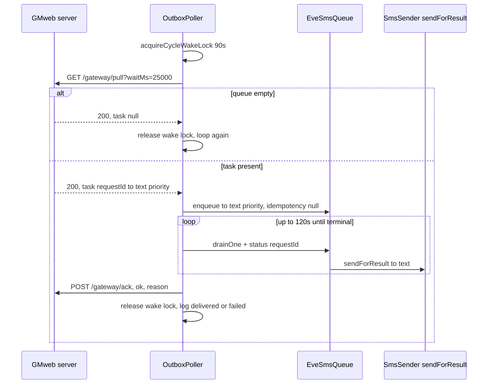

The **GMweb pull bridge** is the phone's outbound-only transport to a GMweb-API server (github.com/aibedini/GMweb-API). Unlike the LAN REST server and the cloud relay, it never exposes the phone's changing LAN IP to the internet: the phone *dials out* over HTTPS to a fixed URL, and the server hands back one queued send at a time. There is **no tunnel, no inbound port, and no static IP** — so changing mobile IPs or firewalls never breaks the link. It is implemented by the single class `com.autonomousone.messages.gateway.OutboxPoller` and started/stopped by `ConnectionSupervisor` exactly like the other gateway components (see [Gateway service](/openwiki/architecture/gateway-service.md)). The alternative push-style outbound bridge is the [Cloud relay](/openwiki/integrations/cloud-relay.md).

The bridge has three responsibilities, all inside `OutboxPoller`:

- **Long-poll** — `GET {gmwebUrl}/gateway/pull?waitMs=25000`. When the GMweb queue is empty the server holds the request for up to ~25 s before answering `{"task":null}`; when a send is queued it answers immediately with `{"task":{requestId,to,text,priority}}`.
- **Deliver** — the polled task is enqueued through the **same** persistent priority `EveSmsQueue` the LAN `/send` endpoint uses, so a cloud-originated send gets identical persistence, ordering, and radio-level failure semantics as a local one (see [Outgoing messaging](/openwiki/architecture/outgoing-messaging.md)).
- **Ack** — `POST {gmwebUrl}/gateway/ack` reports the outcome back to the server's ledger.

## Protocol contract

The phone makes only two kinds of requests against the base URL stored in `GatewayPreferences.gmwebUrl` (trailing `/` trimmed):

| Endpoint | Method | Timeouts | Result |
|---|---|---|---|
| `{gmwebUrl}/gateway/pull?waitMs=25000` | GET | 15 s connect / 40 s read (`PULL_TIMEOUT_MS`) | `{"task":null}` or `{"task":{requestId,to,text,priority}}` on HTTP 200; anything else throws |
| `{gmwebUrl}/gateway/ack` | POST | 15 s connect / 15 s read (`ACK_TIMEOUT_MS`) | JSON `{requestId, ok, reason?, sentAt}`; 2xx accepted, otherwise a warning is logged |

Both requests are built by the private `open()` helper, which sets `X-API-Key` (the phone's own gateway API key), `Accept: application/json`, and `Content-Type: application/json` for the POST.

**Auth reuses the phone's gateway API key.** There is no separate GMweb credential on the phone: the poller sends `prefs.apiKey` (the same key that protects the local REST server, Keystore-encrypted at rest) as the `X-API-Key` header on every pull and ack. The GMweb side is configured with that identical value in its `GMWEB_ANDROID_DEVICE_KEY` setting, so the two sides match without transcribing a long random string twice — the setup flow is documented in `docs/release-v2.1.1.md`. Because the URL setter requires `https://`, the key never crosses plaintext HTTP.

## Configuration and lifecycle

- **Enabled by URL.** The bridge is active whenever `prefs.gmwebUrl` is non-blank. The setter (`GatewayPreferences.gmwebUrl`) `require`s an `https://` prefix and treats an empty value as "bridge disabled" — the LAN and cloud features keep working regardless.
- **Supervised.** `GatewayService.onCreate` constructs the `OutboxPoller` (service scope, `NetworkMonitor` singleton) and hands its `start`/`stop` to the supervisor as the `startPoller`/`stopPoller` `ManagedComponents` callbacks. `ConnectionSupervisor.reconcile()` calls `components.startPoller()` **only when `prefs.gmwebUrl.isNotBlank()`**; the disabled and offline paths call `components.stopPoller()`, and `shutdown()` stops it on service teardown.
- **Consent + runtime gate.** Each loop iteration checks `GatewayAccessPolicy.canTransmit(hasGatewayConsent, isEnabled)` and breaks to `IDLE` if either is false, so a revoked-consent or supervisor-stopped gateway stops polling even if the process still lives.
- **Network gate.** Before each cycle the poller requires a *validated* route (`NetworkMonitor.isOnline()`); while offline it suspends on `onlineFlow().first { online }` — **zero HTTP requests** while the radio is down, waking the instant the network returns (event-driven, not a poll timer).
- **State for the UI.** The poller exposes a `StateFlow<State>` with `IDLE, POLLING, DELIVERING, ERROR`. `GatewayService` mirrors it into the persistent notification so the bridge is diagnosable from the lock screen: `POLLING → "GMweb bridge: live"`, `DELIVERING → "…delivering"`, `ERROR → "…retrying…"`, `IDLE → "…idle"` (or blank when no URL is set), and exposes it app-wide via `bridgeStateFlow` for the Gateway screen.

## A pull cycle

One `cycle()` is one round trip: pull → deliver → drain → ack. It throws only on transport errors (a non-200 pull, a read timeout, or a network exception), which the outer `start()` loop catches, sets `ERROR`, and retries after `ERROR_RETRY_MS` (5 s).

*Caption: One `cycle()` — acquire wake lock, long-poll, enqueue through `EveSmsQueue`, drain until the record is terminal (≤120 s), then ack the server and release the lock.*

Delivery detail:

1. **`pull()`** issues the long-poll. A missing `task` object means the server held for 25 s with nothing queued — the cycle simply returns and loops. A present task is parsed into `Task(requestId, to, text, priority)` with `priority` defaulting to `"announcement"`.
2. **`EveSmsQueue.enqueue(to, text, priority, null)`** — note the `null` idempotency key: the *server* already de-duplicated the task, so the queue records a fresh `requestId` and the polled `requestId` is tracked separately for the ack. Unknown priorities fall back to `announcement` inside the queue.
3. **`drainUntilTerminal(requestId)`** polls the queue (calling `EveSmsQueue.drainOne()` each pass so delivery proceeds even if the queue's own worker thread is busy) until the record reaches a terminal status — `SENT`, `FAILED`, or `CANCELLED` — or a **120 s** deadline expires (treated as failure).
4. **`ack()`** posts `ok = true` on success, or `ok = false` with `reason = "device_send_failed"` on failure/timeout. A **lost ack is deliberately not retried locally** — the GMweb server times the task out and owns the retry, so the phone must never re-send.

Because the queue's sender lambda is `{ to, text -> smsSender.sendForResult(to, text) != null }` (installed by `GatewayServer.start()`), a modem/SIM rejection yields a real `false`, the record becomes `FAILED`, and the ack reports `device_send_failed` — the same radio-level honesty the LAN path provides.

## Doze survival (v2.6.11)

The wake lock is the reason the bridge is reliable. In Doze, the CPU sleeps between maintenance windows and an **in-flight long-poll socket dies silently**. The server then sees "no device polling" and — per GMweb's `outbox.readyState()` pre-handler (`waitingPhones == 0 && lastPullAt` older than 90 s) — answers `failed (http_503: android_gateway_unreachable)` to every Eve send. This was the root cause fixed in v2.6.11 (see `docs/release-v2.6.11.md`).

`OutboxPoller` holds a **partial wake lock** (`Messages:OutboxPoller`) for *exactly the in-flight part* of each cycle:

- **Acquired per cycle** — `acquireCycleWakeLock()` calls `wakeLock.acquire(90_000)` once per `cycle()`. The **90 s** timeout is the anti-leak safety net (a cycle is a 40 s pull + delivery + ack; re-acquired every cycle anyway); normal release always happens in the `finally` block via `releaseCycleWakeLock()`. A lock failure is swallowed — the bridge is never blocked on a power failure.
- **Released in the idle gap** — the lock is dropped in `finally` before the loop's ~5 s idle/error gap, so the device sleeps normally between cycles. Battery cost is therefore proportional to actual bridge duty, not wall-clock time.
- **Complemented by the host service** — the `WAKE_LOCK` permission and the honest `dataSync|specialUse` foreground-service type (declared in the manifest and set at `startForeground`) give the OS the correct Doze policy signal, and `GatewayService`'s `setExactAndAllowWhileIdle` watchdog re-fires `ACTION_START` if the service dies. The wake lock and the service-level protections are together what keep the pull loop alive.

## Failure and boundary semantics

- **Unconfigured URL** — a blank `gmwebUrl` makes `cycle()` idle quietly (a 30 s delay) rather than error, and the supervisor never starts the poller at all.
- **Pull transport error** → `ERROR` state + 5 s backoff, then retry.
- **Delivery timeout** (120 s) or **radio failure** → ack with `ok=false, device_send_failed`.
- **Ack failure** → logged only; *no* local re-send (server-side timeout owns it).
- **Offline / no consent / not desired** → poller stops transmitting (network gate suspends; `canTransmit` gate breaks to `IDLE`).

## Tests

The queue the bridge depends on is unit-tested in `EveSmsQueueTest` (driven deterministically through `drainOne()` with the worker stopped): priority ordering, idempotency, the `QUEUED → ACTIVE → SENT|FAILED` flow, cancellation, and the GMweb-compatible verification fields (`confirmed` on success, `manual_review_required` on failure, with a persistence round-trip). `GatewayAccessPolicyTest` pins the `canTransmit` consent/enabled gate the poller's loop relies on. `OutboxPoller` itself is not directly unit-tested (it needs a live network), so its behavior is verified by the release gates and the live-bridge notification telemetry described above.

## Related

- [Gateway service](/openwiki/architecture/gateway-service.md) — the foreground service and `ConnectionSupervisor` that host and supervise the poller.
- [Outgoing messaging](/openwiki/architecture/outgoing-messaging.md) — `EveSmsQueue` and `SmsSender.sendForResult`, the native send path the bridge feeds.
- [Send pipeline](/openwiki/workflows/send-pipeline.md) — the end-to-end send trace showing the GMweb pull door feeding the same `SmsSender` funnel as the other entry points.
- [Cloud relay](/openwiki/integrations/cloud-relay.md) — the alternative push-style outbound bridge.
- [REST API](/openwiki/integrations/rest-api.md) — the LAN endpoints that share `EveSmsQueue`.
- [Device operations](/openwiki/operations/device-operations.md) — boot/process/Doze recovery.
- [Gateway lifecycle](/openwiki/workflows/gateway-lifecycle.md) — the start/stop/reconcile flow the poller follows.
