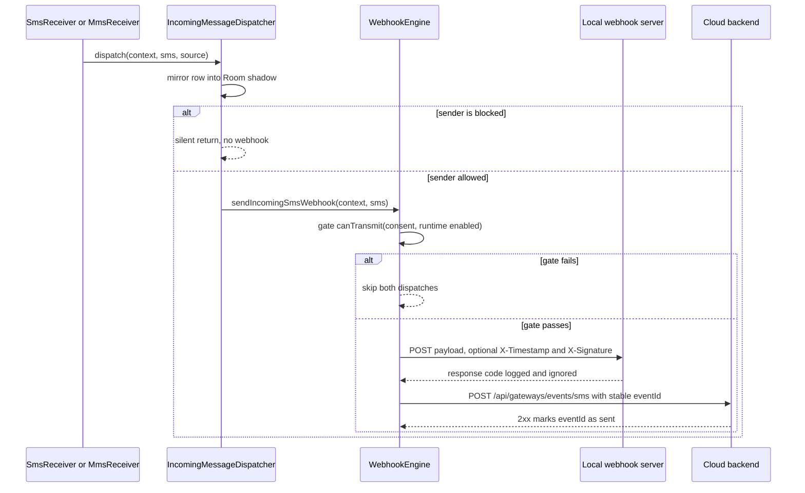
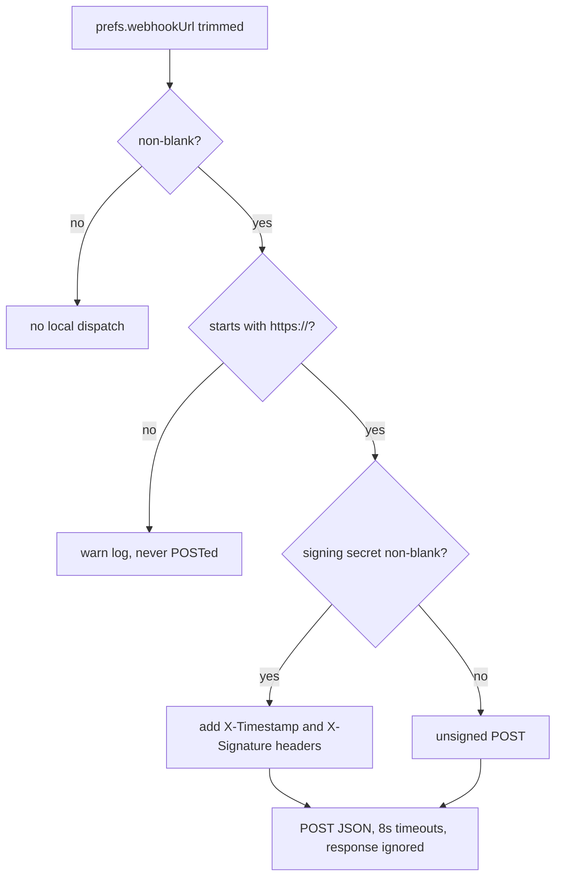

The app's outbound notification path for *received* messages has two independent legs that share one entrypoint — `WebhookEngine.sendIncomingSmsWebhook(context, sms)`, called from `IncomingMessageDispatcher.dispatch`, the single funnel every inbound SMS and MMS passes through:

1. **Local webhook** — a JSON `POST` to a user-configured **HTTPS** URL (set on the Gateway screen), optionally signed with **HMAC-SHA256** so the receiver can verify authenticity and reject replays.
2. **Cloud event upload** — the same message posted as an `sms.received` event to the cloud backend used by the [Cloud relay backend](/openwiki/integrations/cloud-relay.md), made idempotent by a **deterministic `eventId`** plus a local cache of already-acknowledged event IDs.

Both legs are **fire-and-forget**: each runs in its own coroutine on `WebhookEngine`'s private IO scope, response codes are only logged, and no failure can block or fail the receiver — the SMS UI and notification paths never depend on webhook success.

## Entrypoint and gating

`SmsReceiver` (for `SMS_DELIVER`/`SMS_RECEIVED`) and the mmslib-backed `MmsReceiver` each persist the message into the Telephony providers first, then hand the provider-confirmed model to `IncomingMessageDispatcher.dispatch` — so webhooks fire from **persisted state**, never from raw broadcast extras. The dispatcher's fixed order is: mirror into the Room shadow → **blocklist check** → invalidate address caches → emit on `SmsEventBus` → **`WebhookEngine.sendIncomingSmsWebhook`** → show the notification (suppressed while viewing the conversation). The blocklist short-circuits *before* the webhook call: a message from a blocked sender produces no bus event, no webhook, and no notification, while the row stays persisted. Blocked senders are therefore invisible to webhook consumers by construction, not by receiver-side filtering.

Inside the engine, a single gate precedes both legs: `GatewayAccessPolicy.canTransmit(prefs.hasGatewayConsent, prefs.isEnabled)` — versioned consent **and** the supervisor-derived runtime `isEnabled` flag. Consent is versioned (`hasGatewayConsent` = stored version `>= CURRENT_CONSENT_VERSION`, currently 1), so a material data-use change forces a fresh opt-in. If the gate fails, *both* dispatches are skipped at once — there is no partial dispatch where, say, the cloud event goes out while the local webhook is off.



*Caption: the single fan-out — blocklist silence, the consent/runtime gate, and the two independent fire-and-forget legs.*

## Local webhook contract

The request is a JSON `POST` with `Content-Type: application/json; charset=utf-8`, `User-Agent: Android-SMS-Gateway/<APP_VERSION>`, and 8 s connect / 8 s read timeouts. The body is a fixed five-field object (schema `WebhookPayload` in `docs/api/openapi.yaml`):

| Field | Value |
|---|---|
| `event` | always the literal `"sms_received"` |
| `sender` | originating address |
| `message` | full message body (for MMS: the text part, falling back to subject or `[MMS]`) |
| `timestamp` | `sms.date` — Unix epoch **milliseconds** |
| `threadId` | the platform thread id (0 when unresolvable) |

The response status is read only to be logged; it is never acted on.

**HTTPS-only, enforced at dispatch time.** The trimmed URL must start with `https://`; anything else is logged (`Webhook URL rejected — HTTPS required`) and never sent. Note the asymmetry with `backendUrl`: the `webhookUrl` setter performs **no** scheme check, so a non-HTTPS URL can be saved in the UI but will be rejected on every dispatch attempt.

**Signature scheme (opt-in).** When the user-configured signing secret is non-blank, the request carries two extra headers:

```
X-Timestamp = <System.currentTimeMillis() as string>
X-Signature = hex( HMAC_SHA256(secret, "<X-Timestamp>.<raw-body>") )
```

The HMAC is computed over the exact bytes that are POSTed (the serialized JSON), keyed with the UTF-8 secret, and rendered as lowercase hex via `javax.crypto.Mac` (`HmacSHA256`). Including the timestamp in the signed string is what makes replay detection possible: `docs/api` instructs receivers to compare the signature in constant time and to reject timestamps older than a few minutes. With a blank secret, the request is sent **unsigned** — no `X-*` headers at all — so signing is purely opt-in.

The secret itself is stored Keystore-encrypted (see below); the URL is plain in SharedPreferences.



*Caption: local-webhook validation ladder — URL presence, HTTPS enforcement, and the optional HMAC signing branch.*

## Cloud event upload

The cloud leg (`sendCloudEvent`) is the event side of the [cloud relay](/openwiki/integrations/cloud-relay.md); this page covers only the incoming-SMS event, not registration or heartbeats.

1. **Registration gate.** Runs only when `prefs.isRegistered` and `prefs.gatewayToken` is non-blank — an unregistered phone silently drops the event (registration happens independently in the heartbeat loop).
2. **Deterministic `eventId`.** `UUID.nameUUIDFromBytes("${sms.sender}|${sms.date}|${sms.message.take(100)}")` — a name-based UUID derived from the SMS itself, not random. The same SMS re-derived after a process restart (or by two processes) produces the **same** ID, so the backend can safely deduplicate replays on the `eventId` field.
3. **Local idempotency cache.** `GatewayPreferences.hasEventBeenSent(eventId)` skips events the backend already acknowledged; only a 2xx response leads to `markEventSent(eventId)`.
4. **Post.** `{ eventId, type: "sms.received", sender, message, timestamp }` goes to `POST {backend}/api/gateways/events/sms` through `BackendClient` — Bearer token, 15 s connect / 30 s read timeouts, HTTPS re-checked at request time, sealed `Result<T>` (401/403 classified as `isAuthError`). Note the payload differs from the local webhook: it carries `eventId`/`type` instead of `event`/`threadId`.

**Failure semantics.** On any `Failure` (network error, non-2xx, including auth errors) the event is *not* marked sent — but since `SMS_DELIVER` fires only once, there is no app-side replay, and an event whose upload failed is effectively lost if the backend stays down. The code comments state that backend-side retry is responsible for downstream delivery failures, not the app. Unlike the heartbeat loop, `sendCloudEvent` does **not** clear credentials on 401/403; token recovery rides on the heartbeat's re-registration path.

**The sent-event-ID store.** `GatewayPreferences` keeps the acknowledged IDs as a JSON array under the `cloud_sent_event_ids` key, capped at **500** (`MAX_EVENT_IDS`). `markEventSent` removes any existing occurrence of the ID and re-inserts it at the tail, then trims from the head — insertion-ordered, oldest-first eviction. The list is read back through a `try/catch` that returns an empty list on a corrupt value, so a damaged store degrades to "replay, let the backend dedupe" rather than blocking uploads.

## Configuration and operations

- **Gateway screen.** `GatewayViewModel.saveWebhookUrl` trims and persists the URL (`gateway_webhook_url`); `saveWebhookSecret` trims and persists the secret — a blank value disables signing (the screen logs "Webhook signing disabled" vs "Webhook HMAC signing enabled (X-Signature header)"). There is no separate on/off toggle for the local webhook: a non-blank URL plus a passing gate is the whole condition.
- **Secrets fail closed.** `webhookSecret` (like `gatewayToken` and the LAN API key) is stored under the `enc:v1:` prefix via `SecureStore` (AES/GCM with a hardware-backed Android Keystore key); legacy plaintext is re-encrypted on first read. Persistence is **fail-closed** (v2.6.10): `storeEncrypted` throws instead of degrading to plaintext when the Keystore is unavailable, so a dead Keystore shows up as an *empty* secret — the webhook is sent unsigned or the cloud leg is skipped, never with a plaintext secret.
- **Revocation is total.** `revokeGatewayConsent()` removes the consent version/timestamp, resets `isEnabled`, `gatewayDesiredEnabled`, and `autoStartOnBoot`, and calls `clearCloudCredentials()` (drops `gatewayId`, `gatewayToken`, `isRegistered`). Both notification legs stop immediately and cannot resurrect after a reboot.
- **Documented contract.** `docs/api/README.md` and `docs/api/openapi.yaml` are the shareable contract for webhook receivers and backend implementers: `x-webhooks.sms.received`, the `IncomingSmsWebhook` callback, the `WebhookPayload` schema, signature-verification guidance, and `x-cloud-backend-contract` for the `events/sms` endpoint. The docs' versioning rule is to keep `openapi.yaml` updated in the same PR as any endpoint change.

## Failure semantics at a glance

| Condition | Behavior |
|---|---|
| Consent absent or gateway runtime-disabled | Both legs skipped at the single entry gate |
| Blocked sender | No webhook (no bus event, no notification); row stays persisted |
| `webhookUrl` blank | No local dispatch; the cloud leg is unaffected |
| `webhookUrl` not `https://` | Logged as rejected, never POSTed (saveable, but undeliverable) |
| Webhook timeout (8 s) or HTTP error | Logged; no retry; receiver unaffected |
| Signing secret blank | Request sent unsigned, no `X-*` headers |
| Not registered / blank `gatewayToken` | Cloud upload silently skipped |
| `eventId` already in the 500-ID cache | Cloud upload skipped (already acknowledged) |
| Cloud upload non-2xx | Not marked sent; no app-side replay — event lost if the backend stays down |
| 401/403 on event upload | Logged only; credentials recovered via the heartbeat re-registration path |
| Corrupt sent-event cache | Read as empty; duplicates deduplicated by the backend on `eventId` |

## Tests

- `app/src/test/java/com/autonomousone/messages/GatewayAccessPolicyTest.kt` — unit-tests the exact gate truth tables (`canStart` requires consent; `canTransmit` requires consent **and** runtime-enabled) that both legs are gated on; run with `./gradlew test`. It is the only in-repo JVM test covering this subsystem.
- `WebhookEngine`, `BackendClient`, and `GatewayPreferences` are Android-dependent (`HttpURLConnection`, SharedPreferences, Keystore) and have no in-repo JVM tests; their behavior is observed on-device via logcat (`WEBHOOK_ENGINE`, `BACKEND_CLIENT` tags) and the gateway screen's log flow.
- The `docs/api` package (OpenAPI spec + interactive viewer + smoke script) is the acceptance contract a webhook receiver or relay backend must satisfy.

## Related pages

- [Gateway service](/openwiki/architecture/gateway-service.md) — owns `GatewayAccessPolicy` usage across the service, the runtime `isEnabled` mirror, and `SecureStore` secret encryption.
- [Incoming SMS/MMS reception](/openwiki/architecture/incoming-messaging.md) — the receiver layer and `IncomingMessageDispatcher` fan-out that this page's hooks sit on.
- [Cloud relay backend](/openwiki/integrations/cloud-relay.md) — registration, heartbeat, and the `BackendClient` config chain shared by the cloud leg.
- [Incoming message pipeline](/openwiki/workflows/incoming-message-pipeline.md) — end-to-end walkthrough of a received message from broadcast to all downstream effects.
