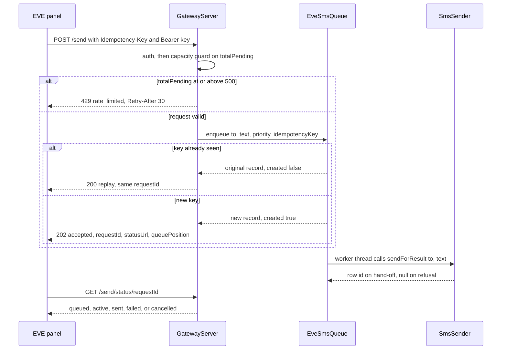
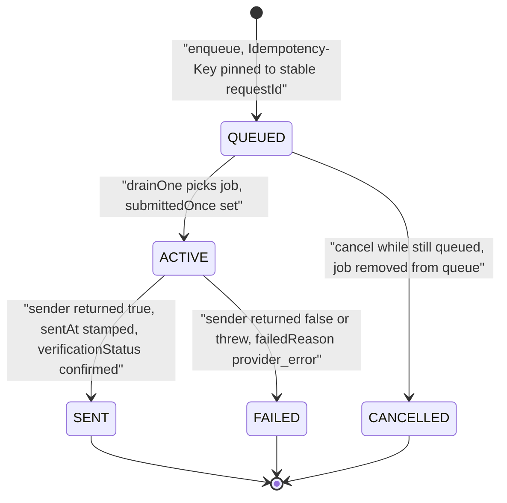

`GatewayServer` is the app's only inbound network surface: a hand-rolled, `ServerSocket`-based HTTP server (no `com.sun.net.httpserver`, which is absent from the Android runtime) that listens on the device's LAN and serves two API groups. The **app API** under `/api/v1/…` lets any LAN client send SMS/MMS and query the message store; the **EVE provider contract** at the unversioned root (`/send`, `/send/status`, `/send/cancel`, `/send/capacity`, `/ready`, `/health`) implements the EVE panel's *Custom HTTP* SMS provider so the panel's queue can be drained through the device's own SIM. `docs/api/openapi.yaml` (OpenAPI 3.0.3) is the machine-readable source of truth for request/response shapes; this page's endpoint table follows the actual routing `when`-clauses in `GatewayServer.kt`.

## The server

`GatewayServer` is the embedded HTTP server that serves both API groups. Clients address it at `http://<device-lan-ip>:8080` — the current address, port, and API key are shown on the app's Gateway screen, and that same key is what the EVE panel is configured with. The `EveSmsQueue` behind the `/send*` endpoints runs inside the gateway process; its liveness is one of the three `GET /ready` readiness signals. The server's threading model, binding/port mechanics, lifecycle, and DoS hardening are documented on the [Gateway service](/openwiki/architecture/gateway-service.md) page.

## Endpoint table

| Method | Path | Auth | Outcomes |
|---|---|---|---|
| GET | `/health` | **none** (the only unauthenticated endpoint) | 200 `{"status":"ok"}` |
| GET | `/ready` | key | 200 `{"status":"ready"}` · 503 `not_ready` with `serverRunning`/`defaultSmsApp`/`queueRunning` booleans |
| POST | `/send` | key + `Idempotency-Key` | 202 accepted · 200 idempotent replay · 400 `invalid_request`/`invalid_priority` · 429 `rate_limited` with `Retry-After: 30` |
| GET | `/send/status/{requestId}` | key | 200 status record · 404 `not_found` |
| POST | `/send/cancel/{requestId}` | key | 200 `ok:true` (cancelled) or `ok:false` (`not_cancellable`) · 404 |
| GET | `/send/capacity` | key | 200 pending counts per priority + announcement headroom |
| POST | `/api/v1/sms/send` | key | 202 accepted (row id) · 503 rejected by telephony · 400 |
| POST | `/api/v1/mms/send` | key | 200 success · 500 failed · 400 (missing fields, unsupported `imageUrl`) |
| GET | `/api/v1/sms/inbox` | key | 200 latest 50 messages · 500 |
| GET | `/api/v1/sms` | key | 200 filtered/paged query · 500 |
| GET | `/api/v1/status` | key | 200 `online` with ip/port/battery/default-SMS flags |
| POST | `/api/v1/sms/schedule` | key | 202 created · 200 replay · 400 · 429 `too_many_pending` |
| GET | `/api/v1/sms/schedule` | key | 200 `{schedules: [...]}` |
| GET | `/api/v1/sms/schedule/{scheduleId}` | key | 200 entry · 404 `not_found` |
| DELETE | `/api/v1/sms/schedule/{scheduleId}` | key | 200 `ok:true` · 409 `not_cancellable_or_unknown` |

Any other path is 404 `{"error":"Endpoint not found"}`; any method other than GET/DELETE on a `/api/v1/sms/schedule/{id}` path is 405 `method_not_allowed`. Path matching strips the query string and a trailing slash, so `/health/` routes the same as `/health`.

## Authentication and abuse protection

Every route requires the gateway API key — the `gw_…` value shown on the app's Gateway screen — sent as `X-API-Key: gw_…` **or** `Authorization: Bearer gw_…`; the OpenAPI spec defines both headers as equivalent ways to carry the same key (`ApiKeyAuth`/`BearerAuth`). **`GET /health` is the one exception**: it is the only endpoint reachable without authentication, per the EVE spec — the panel's connectivity check uses it, so it must not fail on a bad key.

Failed authentications count toward a per-client-IP lockout (see the error reference); the smoke-test script deliberately runs its no-key case *last* because of it. The lockout mechanics, constant-time comparison, and secret storage live on the [Gateway service](/openwiki/architecture/gateway-service.md) page.

## Transport limits

The server enforces request limits before any handler (request-body size cap, header caps, no chunked `Transfer-Encoding`) — part of its DoS hardening, documented on the [Gateway service](/openwiki/architecture/gateway-service.md) page. The status codes those limits produce are in the error reference below; note in particular that `POST /send` rejects `Transfer-Encoding: chunked` with 411, so EVE/GMweb clients must send `Content-Length`.

## App API (`/api/v1`)

### POST /api/v1/sms/send

Body `{phone, message, subscription_id?, smsc?}`. `phone` is Persian/Arabic-digit-normalized (below) and both fields are required (400 `phone and message required`). `smsc`, when present, must match `^\+?[0-9]{5,20}$` (400); `subscription_id`, when present, must be ≥ −1 (400). The send goes through `SmsSender.sendWithOutcome`, which gives the gateway an **explicit outcome** (v2.6.10): `Accepted` → **202** with `status:"accepted"`, the row `id`, and the echoed request fields; `Rejected` (modem refused: SIM unavailable, radio off, …) → **503** with `status:"failed"` and the reason. "Accepted" means *handed to telephony*, not delivered — SENT/DELIVERED arrive later via the status callbacks. Note the drift: `openapi.yaml` still documents this endpoint as 200 `success`, and the smoke script's opt-in live-send assertion still expects 200 — both predate the 202/503 split; the code above is authoritative.

### POST /api/v1/mms/send

Body `{phone, imageUrl}`; both required (400). For remote REST callers only `https://` URLs are accepted — `content://` is no longer honored on this path and plain `http://` stays rejected — and the URL must pass the server's SSRF public-host policy (an `imageUrl` that fails it is a 400 `imageUrl must be an https:// URL on a public host`). The image is fetched by the device, attached, and dispatched via `MmsSender.sendImage`; dispatch success → **200** `success`, failure → **500** `failed`. The SSRF and download details (10 MB cap, redirects disabled, private-range refusal) live on the [Gateway service](/openwiki/architecture/gateway-service.md) page.

### GET /api/v1/sms/inbox and GET /api/v1/sms

`/api/v1/sms/inbox` returns the **latest 50** rows as `{status, count, messages:[{id, sender, message, date, type}]}` (`type` = `received` for platform type 1, else `sent`). `/api/v1/sms` adds filters and paging: `limit`, `offset`, `type` (`received`/`sent`, other values ignored), `phone` or `from` (substring match), `from_date`/`to_date` (Unix epoch milliseconds **or** `yyyy-MM-dd` in device-local time); each row additionally carries `threadId` and `unread`. Both return 500 with a generic `Failed to query SMS database` on error — internal exception details are never leaked to API clients.

### GET /api/v1/status

200 `{"status":"online", "version":"1.0", "ip", "port", "batteryLevel", "isDefaultSmsApp", "timestamp"}` — the health probe for app-API consumers; `batteryLevel` is the battery capacity in percent (−1 when unavailable), and `isDefaultSmsApp` tells a client whether the device can actually send right now (the app holds the default-SMS role).

## Scheduled sends (`/api/v1/sms/schedule`)

`GatewayScheduler` exposes a small CRUD for time-delayed sends used by external projects:

- **POST** body `{phone, message, sendAt? (epoch ms), delaySeconds?}`. `phone` is normalized; validation requires ≥ 10 digits and a non-blank message (400). Without `sendAt`/`delaySeconds` the entry is scheduled now; a `sendAt` more than 5 s in the past is rejected 400 (`sendAt must be in the future`). **Idempotent replay** on the exact `(phone, message, sendAt)` triple while the entry is still `scheduled` returns the existing entry with **200** and `created:false`; a new entry is **202** with `scheduleId` (`sch_` + 16 hex). When pending entries reach `MAX_PENDING = 200`, `schedule()` throws and the route answers **429** `too_many_pending` — the device-abuse cap for scheduled traffic.
- **GET** (no id) lists recent entries (message truncated to 80 chars); **GET `/{scheduleId}`** returns one entry with `status`, `sentAt`, `failedReason`; **DELETE `/{scheduleId}`** cancels a still-`scheduled` entry (200 `ok:true`) or answers 409 `not_cancellable_or_unknown`.

Delivery survives reboot: the index is persisted in the `gateway_schedule_prefs` SharedPreferences (the 100 most recent entries by `createdAt`) and each schedule is a WorkManager `OneTimeWorkRequest` (unique per `scheduleId`, `setInitialDelay` until `sendAt`). `SendWorker` sends through the same `SmsSender.sendForResult` pipeline as manual sends (so SIM/SMSC prefs and delivery reports behave identically); on a failed hand-off it retries while `runAttemptCount < 3`, then marks the entry `failed` with `failedReason:"dispatch_failed"`. Entry statuses are `scheduled → sent | failed | cancelled`.

## EVE provider contract (Custom HTTP)

In the EVE SMS settings the panel is pointed at this device with Provider `Custom HTTP`, Base URL `http://<device-ip>:8080`, the same `gw_…` key, and a 15 s timeout. `docs/api/openapi.yaml` documents the contract under the `EVE` tag (schemas `EveSendRequest`, `EveSendAccepted`, `EveStatusResponse`, `EveCancelResponse`, `EveCapacityResponse`); the queue behind it is [EveSmsQueue](#evesmsqueue-the-persistent-priority-queue).

*Caption: the EVE send round-trip — capacity guard, idempotent enqueue, asynchronous single-worker dispatch, and status polling.*

- **GET /health** — the *only* endpoint reachable without a key; 200 `{"status":"ok"}` as soon as the socket accepts. This is what the EVE panel's connectivity check uses.
- **GET /ready** — 200 `{"status":"ready"}` only when **all three** hold: the server is listening, the app holds the default-SMS role, and `EveSmsQueue` is running; otherwise 503 with the three booleans (`serverRunning`, `defaultSmsApp`, `queueRunning`) so the panel can show which condition is missing.
- **POST /send** — body `{to, text, priority?}`. The `Idempotency-Key` header (required by the spec) is passed to the queue, which pins it to a stable `requestId`; a duplicate key returns the **original** record as HTTP 200 with `created:false` — never a second SMS. The queue accepts even without the header, but then has no replay protection. Validation: `to` must normalize to ≥ 10 digits and `text` must be non-blank (400 `invalid_request`); a non-blank `priority` outside the four known names is 400 `invalid_priority`; a blank priority defaults to `announcement`. New requests get 202 with `requestId`, `jobId`, `statusUrl` (`/send/status/{requestId}`), `status:"queued"`, `priority`, `priorityLevel`, and `queuePosition` — the 1-based count of queued jobs that will be sent no later than this one. If `EveSmsQueue.totalPending()` (QUEUED + ACTIVE, all priorities) has reached `ANNOUNCEMENT_LIMIT = 500`, the request is refused **before** parsing with 429 `rate_limited`, both as a `Retry-After: 30` header and a `retryAfterSeconds` body field.
- **GET /send/status/{requestId}** — 404 for unknown ids; otherwise 200 with the full record: `status` (`queued|active|sent|failed|cancelled`), EVE `state` (`queued|running|completed`), `stage` (`queue|provider_send|provider_delivery|sending_failed|cancelled`), `terminal`/`successful` flags, priority fields, `submittedOnce` (true once handed to the SMS stack, or for any terminal record), `requestedTo`/`sentTo`, the GMweb-compatible verification fields, `sentAt` as an ISO-8601 UTC string (`2026-08-23T10:00:02Z`, null while pending), and `failedReason` (null unless failed).
- **POST /send/cancel/{requestId}** — 404 for unknown ids; 200 with `ok:true, status:"cancelled"` when the message was still `QUEUED`; 200 with `ok:false, reason:"not_cancellable"` once it is active or terminal — a message that has been handed to the radio can never be recalled.
- **GET /send/capacity** — 200 with `priorities` (queued counts per name, always all four keys) and the `announcement` bucket: `limit: 500`, `pending`, `available`, and `recommendedBatchSize` = min(50, available) (`RECOMMENDED_BATCH_SIZE = 50`) so the panel batches large sends politely.

## EveSmsQueue: the persistent priority queue

`EveSmsQueue` (object, in `com.autonomousone.messages.eve`) is the state owner behind every `/send*` endpoint: a persistent priority send-queue processing messages highest-priority-first through a **single worker thread** (`eve-sender`, 400 ms idle sleep), with per-request status/cancel and queue capacity — exactly what the EVE panel polls.

**Priority levels.** `PRIORITY_LEVELS` maps `critical → 1`, `expired → 3`, `expiring → 6`, `announcement → 10` (lower number = sooner). Jobs sit in a `PriorityQueue` ordered by level, then insertion sequence — FIFO within a level. An unknown priority passed directly to `enqueue` falls back to `announcement` (the HTTP layer rejects unknown names first).

**Idempotency.** `enqueue(to, text, priority, idempotencyKey)` first consults the idempotency map: a previously seen key returns the original `Record` with `created = false` without creating or re-offering a job. New records get a stable `requestId` (`sms_` + 20 hex) and `jobId` (`job_` + 12 hex); the key→requestId map is trimmed to `MAX_IDEMPOTENCY_KEYS = 500`.

*Caption: the EveSmsQueue record lifecycle — `QUEUED → ACTIVE → SENT | FAILED`, with `QUEUED → CANCELLED`; terminal records never change again.*

**Lifecycle and the no-duplicate-send invariant.** `drainOne()` polls the next job; if the record is no longer `QUEUED` (cancelled meanwhile) it is skipped without sending. Otherwise the record becomes `ACTIVE` with `submittedOnce = true` *before* the sender lambda runs, then transitions once to `SENT` (with `sentAt` and `verificationStatus = "confirmed"`) or `FAILED` (`failedReason = "provider_error"`, `verificationStatus = "manual_review_required"`). The worker never retries within a run: each record's sender lambda is invoked exactly once while the queue is alive; the only path to a second attempt is a process death caught mid-`ACTIVE`, which is requeued on the next boot (persistence, below). In production the sender is the silent machine-sender `SmsSender.sendForResult` — a successful hand-off to telephony returns the row id, a refusal returns `null`, and that `false` is exactly what lands the record in `FAILED` (see [Outgoing messaging](/openwiki/architecture/outgoing-messaging.md) for the full machine-send funnel). `SENT`/`FAILED`/`CANCELLED` are terminal (`Record.terminal`); only `SENT` is `successful`.

**Persistence.** The `Store` interface keeps the core JVM-unit-testable (`MemoryStore` in tests); at runtime `SharedPrefsStore` serializes records and the idempotency map as JSON into the `eve_queue_prefs` SharedPreferences (`records_json`, `idempotency_json`). At most the **300 most recent records** are persisted (`MAX_PERSISTED_RECORDS`); saves are asynchronous on a single `eve-persist` executor thread, and a failed load/save degrades to empty state with a warning rather than crashing. On `start()`/`bootstrap`, loaded records are re-offered into the priority queue in `createdAt` order, and any record found `ACTIVE` — i.e. interrupted mid-send by a process death — is demoted back to `QUEUED`, so a queued send survives app restarts and reboots but a half-dispatched one is re-dispatched (the `submittedOnce` flag and idempotency key keep the EVE panel from double-counting).

**Capacity.** `totalPending()` counts QUEUED + ACTIVE records; the `/send` guard at 500, the `/send/capacity` reporting, and `RETRY_AFTER_SECONDS = 30` together implement the backpressure contract: callers must expect 429 and honor `Retry-After` once the device is holding 500 machine sends.

**Verification fields for the EVE/GMweb panels.** Each record carries `verificationStatus` and `verificationAttempts`, persisted and echoed by `/send/status` together with explicit `null`s for `recipientEvidence` and `conversationUrl`. The Eve panel poller (`panel/jobs/messaging.py`) parses these fields uniformly across providers, which is how the Android gateway sits behind GMweb's `android-gateway` transport without special-casing (release v1.9.2). Because a native SIM send is confirmed by the radio — there is no separate DOM verification pass — success is reported directly as `confirmed` and failure as `manual_review_required`.

## Persian digit normalization

Phone-number fields are normalized before validation or dispatch: `POST /api/v1/sms/send` normalizes `phone`, `POST /api/v1/sms/schedule` normalizes `phone`, and `POST /send` normalizes `to`, all through `DigitNormalizer.toAsciiDigits`. That converts Persian (۰–۹) and Arabic-Indic (٠–٩) digits, Persian decimal/thousands separators, common dash variants, and the Arabic comma to ASCII, so a caller can submit `۰۹۱۲۳۴۵۶۷۸۹` and still reach `09123456789`. Digit-count validation (≥ 10 digits) runs on the normalized value, and the normalized address is what gets stored on the queue record and dispatched to `SmsSender`.

## Error reference

All error responses are JSON `{"error": "..."}` over `Content-Type: application/json; charset=utf-8`, with `Connection: close`; exception details are never surfaced to clients (unhandled handler exceptions yield a generic 500 `Internal server error`).

| Status | Where | Meaning |
|---|---|---|
| 400 | headers, all POSTs, `/send`, schedule | malformed headers, truncated body, missing/blank fields, bad `smsc`/`subscription_id`/`imageUrl`, `invalid_request`/`invalid_priority`, `sendAt must be in the future` |
| 401 | every route except `/health` | invalid or missing API key (each failure counts toward lockout) |
| 404 | routing, `/send/status`, `/send/cancel`, schedule id | unknown path or unknown `requestId`/`scheduleId` |
| 405 | `/api/v1/sms/schedule/{id}` | method other than GET/DELETE |
| 409 | `DELETE /api/v1/sms/schedule/{id}` | entry not cancellable or unknown (`not_cancellable_or_unknown`) |
| 411 | any route | `Transfer-Encoding: chunked` unsupported |
| 413 | any route | body over 1 MB |
| 429 | auth, `/send`, schedule | IP locked out (auth), queue at 500 pending with `Retry-After: 30` (`rate_limited`), schedule cap at 200 pending (`too_many_pending`) |
| 500 | inbox/query, MMS dispatch, unhandled | internal failure, generic message |
| 503 | `/ready`, `/api/v1/sms/send` | not ready (server/role/queue down), telephony rejected the send |

## Documentation, versioning, and tests

- **`docs/api/`** is the shareable documentation package: `openapi.yaml` (OpenAPI 3.0.3, spec version 1.2.1) is the machine-readable source of truth — import it into Swagger UI, Postman, or SDK generators; `index.html` is a self-contained Swagger UI viewer (`python -m http.server 8000`, then `http://localhost:8000/docs/api/index.html?key=gw_…`); `README.md` is the quick reference. The documented convention is that `openapi.yaml` is updated **in the same PR** as any endpoint change. The `/api/v1/sms/schedule` endpoints are not in the spec yet; their contract is documented in the `GatewayScheduler` KDoc and this page.
- **Versioning** is URL-based: breaking changes ship under `/api/v2/…`; the EVE contract deliberately stays at the unversioned root because the panel's Custom HTTP provider only knows fixed path names.
- **JVM unit tests** — `app/src/test/.../EveSmsQueueTest.kt` pins the queue semantics (idempotency, priority ordering, lifecycle, verification fields, persistence restore) as pure JVM tests against an in-memory `Store`, run with `./gradlew test`; the broader test-strategy context lives on the [Testing strategy](/openwiki/testing/unit-tests.md) page.
- **Live smoke tests** — `scripts/test-gateway-api.ps1` (reachability: `adb forward tcp:8080 tcp:8080` then `-HostIp 127.0.0.1`, or the LAN IP) asserts the documented read-only behavior against a running device: `/api/v1/status` 200 with ip/port/battery, 401 on a wrong key and on a missing key (the no-key case is deliberately last, since it counts toward lockout), inbox `count <= 50`, filtered query with `type` and both date-range forms, 400 on blank `phone`/`message`, 400 on a `http://` MMS `imageUrl`, and 404 on an unknown route. Real SMS/MMS sends are opt-in via `-SendTestSms -To <number>` (and destructive — they cost real messages); that opt-in assertion still expects the pre-v2.6.10 200/`success` shape.

## Related pages

- [Gateway service](/openwiki/architecture/gateway-service.md) — the supervisor lifecycle, consent flags, and server hardening that host this API.
- [Outgoing messaging](/openwiki/architecture/outgoing-messaging.md) — the `SmsSender` variants (`sendWithOutcome`, `sendForResult`) that the gateway and the queue dispatch through.
- [Device operations](/openwiki/operations/device-operations.md) — turning the gateway on, reading the API key, and operating the device.
- [Send pipeline](/openwiki/workflows/send-pipeline.md) — what happens downstream once a message is handed to telephony.
