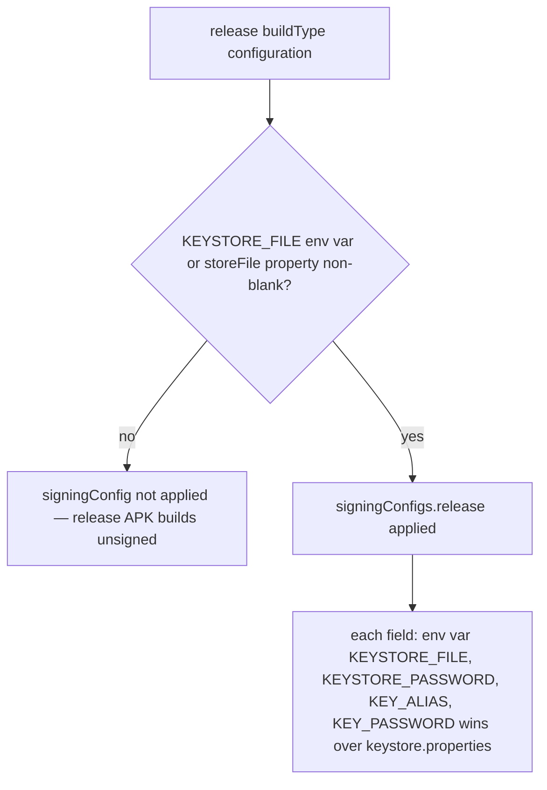
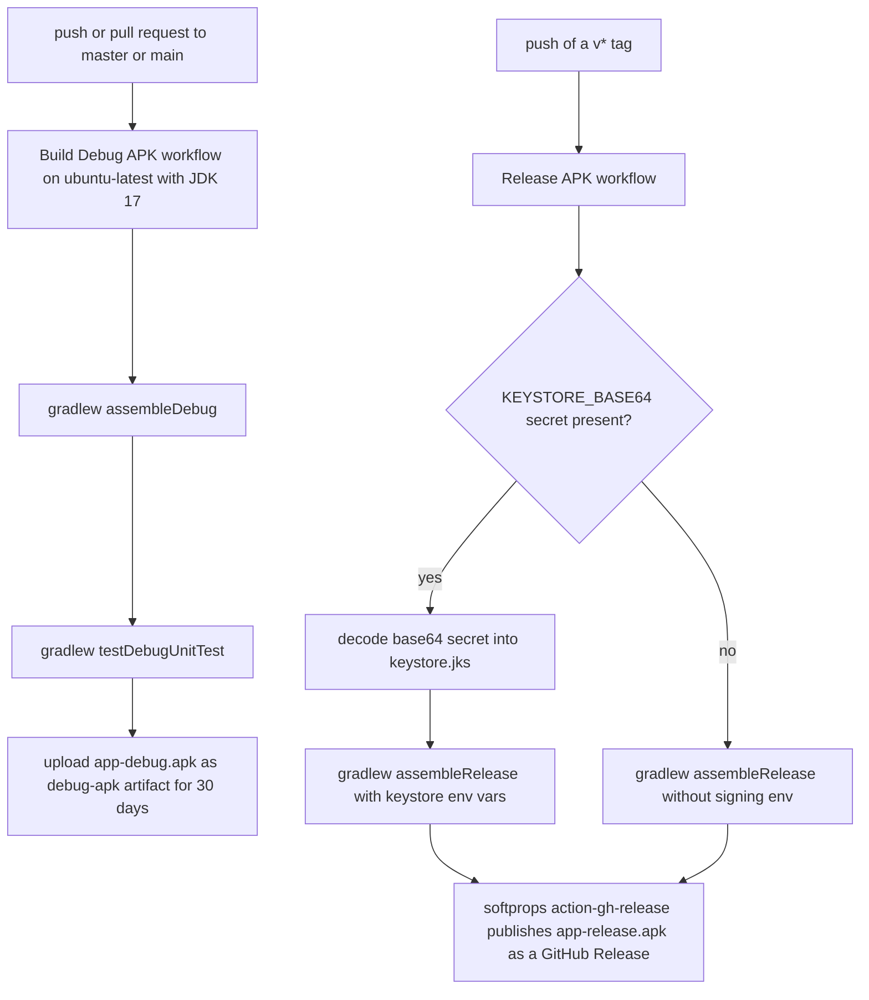

# Build, CI, and Release

The repository is a single-module Android Gradle project — `settings.gradle.kts` sets `rootProject.name = "Messages"` and includes only `:app` — plus a small set of release tooling around it: three GitHub Actions workflows, a gitignored local keystore file, and a PowerShell script that produces the release metadata used for Google Play Protect appeals. The top-level `build.gradle.kts` declares the shared plugins (AGP, Kotlin, Kotlin Compose, KSP) with `apply false`; the app module applies them from the version catalog.

Per `AGENTS.md`, the narrowest quiet command proves each build behavior on this page: `./gradlew assembleDebug` (module + mmslib resolution), `./gradlew testDebugUnitTest` (headless unit suite), `./gradlew assembleRelease` (minified release with the signing fallback path), and `./gradlew assembleDebug -PGATEWAY_BACKEND_URL=https://your-relay.example.com` (BuildConfig override).

## Gradle setup

### Toolchain and module configuration

| Item | Value | Where |
|---|---|---|
| AGP | 8.10.1 | `gradle/libs.versions.toml` |
| Kotlin (compiler + Compose plugin) | 2.2.10 | `gradle/libs.versions.toml` |
| KSP | 2.2.10-2.0.2 | `gradle/libs.versions.toml` |
| Compose BOM | 2026.02.01 | `gradle/libs.versions.toml` |
| Room | 2.8.4 | `gradle/libs.versions.toml` |
| Gradle wrapper | 8.11.1 (sha256-verified) | `gradle/wrapper/gradle-wrapper.properties` |
| Daemon JVM | toolchain 21 via `org.gradle.toolchains.foojay-resolver-convention` 1.0.0 | `gradle/gradle-daemon-jvm.properties`, `settings.gradle.kts` |
| CI JDK | 17 (Temurin) | both Gradle workflows |
| App bytecode | Java 11 `sourceCompatibility`/`targetCompatibility`, `JvmTarget.JVM_11` | `app/build.gradle.kts` |

The app module targets `namespace`/`applicationId = com.autonomousone.messages`, `compileSdk = 36`, `minSdk = 26`, `targetSdk = 36`, and enables both `compose` and `buildConfig` in `buildFeatures` — the `buildConfig` flag matters because both build-time flags on this page are consumed as `BuildConfig` fields. The current `defaultConfig` is `versionCode = 61` / `versionName = "2.6.19"`.

### Repository order and fallback mirrors

Both `pluginManagement` and `dependencyResolutionManagement` in `settings.gradle.kts` resolve from `google()` and `mavenCentral()` first, then from a scoped Aliyun mirror (`https://maven.aliyun.com/repository/google`) as a **last-resort fallback** for networks where `dl.google.com` is unavailable. The mirror is content-scoped to `com.android.*`, `com.google.*`, and `androidx.*` groups only, and the comments explicitly warn that mirrors "occasionally return 5xx, which must not break CI" — Central stays first. The Room Gradle plugin (`androidx.room`) is noted as resolving through this mirror when `dl.google.com` 404s — the restricted-network failure mode the comments describe. `repositoriesMode` is `FAIL_ON_PROJECT_REPOS`, so module-level repository declarations are a build error.

### Gradle daemon settings (`gradle.properties`)

- `org.gradle.jvmargs=-Xmx2048m -Dfile.encoding=UTF-8`
- `org.gradle.configuration-cache=false` — the configuration cache is **intentionally disabled** to prevent stale AGP `JdkImageTransform` jlink path errors when IDE JDK paths change. Re-enabling it is a known breakage path, not a performance win to chase.
- `org.gradle.java.home` is present but **commented out for CI compatibility** so Gradle uses the environment `JAVA_HOME` (the Temurin 17 the workflows install) instead of a machine-specific path.
- `android.useAndroidX=true`, `kotlin.code.style=official`.

### Vendored mmslib AAR (decision that must be preserved)

The MMS stack — a Fossify fork of klinker `android-smsmms` (`org.fossify:mmslib:1.0.0`) — is **not** fetched from any remote repository. JitPack, its only remote publication, has had repeated multi-day outages that failed CI dependency resolution, so the binary is committed at `app/libs/mmslib-1.0.0.aar` and consumed with `implementation(files("libs/mmslib-1.0.0.aar"))`. JitPack has been removed from the repository list entirely; nothing else in the build depends on it. Do not revert this to a JitPack coordinate — the vendored AAR is the reliability decision, and the app's MMS receive path (`com.android.mms.transaction.PushReceiver` and `TransactionService` are manifest-referenced in `AndroidManifest.xml`) depends on it resolving deterministically on every CI run.

Because a `files(...)` dependency carries no transitive metadata, the three runtime dependencies declared by the published `org.fossify:mmslib:1.0.0` POM are declared explicitly in `app/build.gradle.kts` (versions pinned in `libs.versions.toml`): `com.klinkerapps:logger:1.0.3`, `com.squareup.okhttp:okhttp:2.5.0`, and `com.squareup.okhttp:okhttp-urlconnection:2.5.0`.

`app/proguard-rules.pro` protects this stack in release (minified) builds: `-keep class com.klinker.android.** { *; }` and `-keep class com.android.mms.** { *; }` (the transaction/PDU machinery is reached through the library's own broadcast wiring, not the manifest, so it is kept whole), plus `-dontwarn` for the bundled legacy deps (`com.squareup.okhttp`, `org.apache.http`). The app's own `gateway.**` and `model.**` packages are also kept.

### Other build-time hooks

- Room schemas are exported by KSP to `app/schemas/` (`room.schemaLocation`, with `exportSchema = true` on `MessagesDatabase`) and **committed**. The committed JSON files (`app/schemas/com.autonomousone.messages.data.MessagesDatabase/2.json` … `6.json`) are exported schema-history artifacts — the record of how `messages.db` evolved — not hand-editable build inputs; regenerating them overwrites the history. The history already carries its payoff: the database is at version 6 with real `Migration` objects (`MIGRATION_2_4` through `MIGRATION_5_6`) wired via `.addMigrations(...)`, and the destructive fallback (`fallbackToDestructiveMigration(dropAllTables = true)`) is applied **only in debug builds** — in release, a missing migration must fail loudly in QA rather than silently wipe the local read model.
- `testOptions.unitTests.isReturnDefaultValues = true` makes `android.util.Log` and friends harmless no-ops in JVM unit tests, which is what lets the full JUnit suite run headlessly in CI via `testDebugUnitTest`.

## BuildConfig flags

Two `buildConfigField`s in `app/build.gradle.kts` `defaultConfig` are load-bearing for the gateway:

- **`GATEWAY_BACKEND_URL`** (String) — defaults to `https://gaitway.autonomousone.in` (the domain is spelled exactly like that; keep it verbatim). It can be overridden at build time with the `-P` property, e.g. `./gradlew assembleDebug -PGATEWAY_BACKEND_URL=https://your-relay.example.com`. At runtime `GatewayPreferences.backendUrl` returns a stored user preference if present and otherwise falls back to `BuildConfig.GATEWAY_BACKEND_URL`, and any stored value must be `https://` (insecure URLs are rejected so the bearer token is never sent in cleartext); the build-time value is also displayed in `SettingsScreen`. See [Cloud Relay Backend](/openwiki/integrations/cloud-relay.md).
- **`APP_VERSION`** (String) — built from `versionName`, making `defaultConfig` the single source of truth for the app version. The gateway components all identify themselves with it: `BackendClient` sets `User-Agent: AndroidGateway/<APP_VERSION>`, `WebhookEngine` sets `User-Agent: Android-SMS-Gateway/<APP_VERSION>`, and `HeartbeatManager` / `RegistrationManager` send it as the `appVersion` field in their payloads. Bumping `versionName` without touching those files is the whole versioning story.

## Signing chain

Credentials resolve with a strict precedence: **CI environment variables win over the gitignored local file, field by field.**

| Credential | Environment variable | `keystore.properties` key |
|---|---|---|
| Keystore path | `KEYSTORE_FILE` | `storeFile` |
| Keystore password | `KEYSTORE_PASSWORD` | `storePassword` |
| Key alias | `KEY_ALIAS` | `keyAlias` |
| Key password | `KEY_PASSWORD` | `keyPassword` |

Mechanics, all in `app/build.gradle.kts`:

1. `signingConfigs.release` loads `keystore.properties` from the repo root *if it exists*, then sets each field as `System.getenv(<ENV_VAR>) ?: props.getProperty(<key>)`. `storeFile` is only assigned when a path is available from either source.
2. `buildTypes.release` computes `keystoreAvailable` = `KEYSTORE_FILE` env set **or** non-blank `storeFile` property. The `release` signing config is applied **only** when that is true — otherwise the release build skips signing entirely and produces an unsigned APK (which is exactly what happens when the CI `KEYSTORE_BASE64` secret is missing and the decode step is skipped). Running `./gradlew assembleRelease` with no keystore material anywhere is the minimal demonstration: it succeeds and emits an unsigned `app-release.apk` instead of failing.

`keystore.properties` is local-only by design: `.gitignore` blocks `*.jks`, `*.keystore`, `keystore-base64*.txt`, `keystore-final.txt`, `password.txt`, `alias.txt`, `app/release/`, and `keystore.properties` itself under a "NEVER commit keystores or passwords" rule. Local release builds work purely off the local file; CI works purely off secrets.

*Release signing decision: no keystore anywhere means an unsigned release APK, not a build failure.*

## CI workflows

Three workflows live in `.github/workflows/`:

*The two shipping paths: PR/push validation and tag-triggered release, sharing the same JDK 17 Temurin + Gradle-cache setup.*

### `build-debug.yml` — "Build Debug APK"

Triggers on **push and pull request** to `master` **or** `main` (both branch names are listed). On `ubuntu-latest`: Temurin JDK 17 with `cache: gradle`, `chmod +x gradlew`, then `./gradlew assembleDebug` and `./gradlew testDebugUnitTest`, and finally uploads `app/build/outputs/apk/debug/app-debug.apk` as the `debug-apk` artifact with 30-day retention. This is the only workflow that runs the unit-test suite — see [Unit tests](/openwiki/testing/unit-tests.md).

### `release.yml` — "Release APK"

Triggers only on **push of a `v*` tag**; requests `contents: write`. Steps:

1. **Decode Keystore** — `printf '%s' "$KEYSTORE_BASE64" | base64 -d > keystore.jks`, guarded by `if: env.KEYSTORE_BASE64 != ''` so an empty secret cleanly skips it (and the build falls back to the unsigned path above).
2. **Build Release APK** — `./gradlew assembleRelease` with the signing chain env vars mapped from secrets: `KEYSTORE_FILE` → `$GITHUB_WORKSPACE/keystore.jks`, plus `KEYSTORE_PASSWORD`, `KEY_ALIAS`, `KEY_PASSWORD`.
3. **Create GitHub Release** — `softprops/action-gh-release@v1` uploads `app/build/outputs/apk/release/app-release.apk` to a non-draft, non-prerelease GitHub Release named `Release <tag>`.

Note the asymmetry: the release workflow does **not** run unit tests; test coverage is enforced on PRs and pushes by `build-debug.yml`, so a release is trusted on the same code that passed (or was merged from) the PR pipeline.

### `openwiki-update.yml` — "OpenWiki Update"

The documentation refresh loop: scheduled at `0 6 * * *` (06:00 UTC daily) plus manual `workflow_dispatch`, with `contents: write` / `pull-requests: write`. It checks out with `fetch-depth: 0` — full history is required so `openwiki code --update` can diff HEAD against the commit it last documented (a shallow clone silently produces an empty change summary), installs Node 22 and `openwiki` (plus `mermaid@11.16.0`/`jsdom@29.1.1` for diagram validation), runs `openwiki code --update --print` against a configured OpenAI-compatible model (DashScope endpoint, `qwen3.8-27b`), removes transient run state (`openwiki/.run.json`), then opens a PR from branch `openwiki/update` covering `openwiki`, `AGENTS.md`, `CLAUDE.md`, and the workflow file itself. The run step is `continue-on-error`; if the outcome is `failure`, a final `exit 1` step propagates the failure to the workflow status while the PR still preserves the pages completed before the failure (merge it to make that progress the baseline for the next run).

## Release process and metadata

1. **Bump the version** — increment `versionCode` and `versionName` in `defaultConfig` (currently `61` / `2.6.19`). Each shipped version gets a `docs/release-vX.Y.Z.md` note recording the versionCode, schema state, and changes; that convention is how `versionCode` history is tracked.
2. **Tag it** — push a `v<version>` tag (e.g. `v2.6.19`); `release.yml` builds the signed APK and publishes the GitHub Release automatically. No manual upload step is expected in the normal path.
3. **Emit metadata for Play Protect** — `scripts/generate-release-metadata.ps1` (Windows PowerShell, run against a local release build; defaults to `app/build/outputs/apk/release/app-release.apk`) locates the newest Android build-tools (SDK root from `sdk.dir` in `local.properties`, else `%LOCALAPPDATA%\Android\Sdk`), then writes `release-metadata.txt` containing the artifact name, the `aapt dump badging` package line, the APK SHA-256, the signer #1 certificate SHA-256 from `apksigner verify --print-certs`, and a fixed `play_protect_status` note. `docs/PLAY_PROTECT_APPEAL.md` requires this file when appealing the internet-sideload warning: upload the exact release APK without rebuilding or renaming it, and cite both hashes from the metadata file.

## Invariants and pitfalls

- Keep the mmslib AAR vendored in `app/libs/`; JitPack is deliberately absent from all repositories and must stay that way.
- Do not re-enable the Gradle configuration cache without resolving the AGP `JdkImageTransform` jlink path issue it was disabled for.
- Do not un-comment `org.gradle.java.home`; CI relies on the environment `JAVA_HOME`.
- Do not commit any keystore, password, or `keystore.properties` content; signing must work with zero secrets present (unsigned fallback) so a missing secret degrades gracefully instead of blocking the tag.
- Keep `APP_VERSION` derived from `versionName` — any second version constant will drift and misidentify the device to the relay backend.
- The Aliyun mirror is a scoped last resort; adding unscoped mirrors ahead of `mavenCentral()` reintroduces the 5xx flakiness the comments warn about.
- Never hand-edit the committed `app/schemas/` JSONs — they are the schema history; schema changes ship by bumping the `@Database` version and adding a real `Migration` to `.addMigrations(...)`.

## Related

- [Cloud Relay Backend](/openwiki/integrations/cloud-relay.md) — runtime consumer of `GATEWAY_BACKEND_URL` and `APP_VERSION`
- [Quickstart](/openwiki/quickstart.md) — local build and run commands
- [Device Operations](/openwiki/operations/device-operations.md) — device-side gateway setup, diagnostics, and backup
- [Unit tests](/openwiki/testing/unit-tests.md) — the suite `testDebugUnitTest` runs in CI
