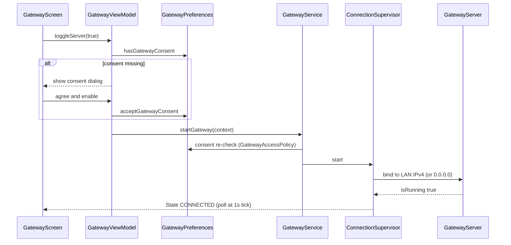

# On-Device Operations: Setup, Networking, Diagnostics, Backup

This page covers what an operator actually does on the phone and around it: turning the SMS gateway on from the 3-Dots menu, managing its API key, understanding what the LAN server binds to by default, exposing the gateway to the internet (LAN, tunnel, Tailscale, port forwarding, adb reverse), exercising the REST API, verifying each step with the narrowest quiet signal (smoke script or a specific logcat tag), exporting the privacy-aware diagnostic log, and backing up / restoring the message store. The gateway's internal lifecycle, supervisor state machine, and endpoint reference are documented on [Gateway service](/openwiki/architecture/gateway-service.md), [Gateway REST API and EVE Provider Contract](/openwiki/integrations/rest-api.md), and [Gateway lifecycle](/openwiki/workflows/gateway-lifecycle.md); this page is the operational layer on top of those.

## Enabling the gateway: in-app flow

The gateway is reached from the app's top-bar overflow menu: **3-Dots Menu → SMS Gateway** (`TopBar.kt` renders the `MoreVert` dropdown with the "SMS Gateway" item first), which opens `GatewayScreen`. The screen itself walks the operator through three numbered steps: (1) turn the gateway on (first time asks for privacy consent), (2) connect a server — GMweb bridge, cloud backend, or LAN, (3) share the API key with that server.

### Privacy consent is a hard gate

The gateway is disabled by default and requires separate, versioned consent (`CURRENT_CONSENT_VERSION = 1` in `GatewayPreferences`). The first time you toggle the main switch on, `GatewayViewModel.toggleServer(true)` finds no consent and shows the "Enable SMS Gateway?" dialog instead of starting anything; the dialog states that the gateway can send the sender phone number, full message text, message time and device details to the backend URL and any configured HTTPS webhook, and that authenticated clients can ask the phone to send SMS at possible carrier cost. "Agree and enable" (`acceptGatewayConsentAndStart()`) records the consent version and timestamp, then proceeds with the normal start path. `GatewayService.startGateway` independently re-checks `GatewayAccessPolicy.canStart(consent)` before `startForegroundService`, and the service's `onStartCommand` blocks and `stopSelf`s if consent is missing — consent is enforced at the UI, the start entry, and the service boundary, not just in one place.

Consent is revocable at any time from the gateway screen's "Revoke consent and stop Gateway" button. `revokeGatewayConsent()` stops the service, clears the consent version, resets `gatewayDesiredEnabled`/`isEnabled`/`autoStartOnBoot`, and wipes stored cloud credentials (`clearCloudCredentials()`), so a revoked phone no longer registers, heartbeats, or forwards.



*Caption: Enabling the gateway from the in-app menu, from consent check to the LAN socket listening.*

The main switch is bound to the *user's intent* (`gatewayDesiredEnabled`) rather than runtime truth, so an offline gateway still shows "on" while the supervisor waits for a network instead of the switch fighting the user during a WiFi blip. The screen polls `GatewayService.supervisorState` every second and renders it as a status chip ("Gateway Active", "Waiting for network…", "Reconnecting…", "Gateway error — retrying", "Gateway Stopped"). A "Reconnect now" button calls `GatewayService.reconnectNow`, which pokes the live supervisor (`retryNow()` cancels backoff and re-reconciles); if a backend URL is configured the view model additionally attempts a cloud re-registration.

## API key management

The gateway authenticates every REST request with the `X-API-Key` header (only `/health` is unauthenticated — see [Gateway REST API](/openwiki/integrations/rest-api.md)). Keys are generated as `gw_` + 32 hex characters — 128 bits from a cryptographically strong RNG (`SecureStore.randomHex(16)`). The "API Key Authentication" card in the advanced gateway modes provides copy-to-clipboard and regeneration ("Generate New Key" via `generateNewApiKey()`, which invalidates every client holding the old key); that card is currently hidden behind `showAdvancedGatewayModes = false`, so on the visible screen the key appears only in masked form (`take(7)…takeLast(4)`) in the GMweb card's supporting text. The on-screen live log also records only the masked form, never the full key. A manual key-set path (`updateApiKey`, the GMweb card's "Shared API key" field) lets the operator paste a key generated elsewhere — e.g. a GMweb server's `GMWEB_ANDROID_DEVICE_KEY` — so both sides share one secret without copy-pasting in both directions; a blank key is rejected with a toast.

At rest the key is AES-encrypted with the Android Keystore (`enc:v1:` prefix via `SecureStore`), and legacy plaintext values are transparently re-encrypted on first read. The store is fail-closed: if the Keystore is unavailable, `storeEncrypted` throws instead of persisting the secret in plaintext.

## LAN server: port 8080 default and the bind escape hatch

With the gateway on, the local REST server listens at `http://<phone-ip>:8080` — `DEFAULT_PORT = 8080` in `GatewayPreferences`, and the gateway screen displays this exact base URL in a monospace line.

Two non-defaults matter for operators:

- **LAN-only bind by default.** `GatewayServer.start()` binds to the detected LAN IPv4 address (`getLocalIpAddress()`), not `0.0.0.0`, limiting exposure to the local network. The "Bind to all interfaces" switch on the gateway screen sets `bindAllInterfaces`; when true the socket binds to `0.0.0.0` (reachable on every interface). The change is persisted and **takes effect on the next server start**, per the log line the app writes ("Server will bind to all interfaces (0.0.0.0) on next start" / "…LAN address only (recommended) on next start").
- **DHCP rebind.** While the gateway runs, `ConnectionSupervisor` compares the bound IP against the current LAN IP on a 10-second cadence; when the phone's address changes (WiFi switch, DHCP renew) the supervisor stops the old server, constructs a fresh one, and logs "LAN address changed (old → new) — rebinding server". When `bindAllInterfaces` is on, the bound IP is reported as `0.0.0.0` and the rebind check is skipped. A bind failure (e.g. port taken) lands the supervisor in `ERROR` with 5 s → 300 s exponential backoff until the port frees up.

The port is persisted in prefs with validation `1024..65535` in `GatewayViewModel.savePort`, and the UI notes that a port change requires a server restart to apply; note the current `GatewayScreen` does not render a port input field, so the 8080 default is the practical operating value unless you drive the view model from elsewhere.

## Reboot and crash recovery: nothing to do, but know the signals

The gateway is expected to come back on its own after a reboot or process death, and the operator's job is only to confirm it did:

- **Reboot.** `BootGatewayReceiver` (registered for `ACTION_BOOT_COMPLETED` in the manifest) re-plays `ACTION_START` whenever `gatewayDesiredEnabled` and consent both persist in SharedPreferences — no manual step. Confirm with `adb logcat -s BOOT_GW` (a "Boot: restarting gateway (user intent persisted)" line) or simply watch for the persistent "SMS Gateway Active" notification to return.
- **Doze/force-stop adjacent kill.** `GatewayService.onDestroy` schedules a 15 s exact `AlarmManager` watchdog (`setExactAndAllowWhileIdle`) that revives the service even from Doze, but only while the gateway is still desired-enabled — so after an operator-initiated stop or a consent revocation the phone correctly stays down.
- **Process death with the app open.** The `START_STICKY` null-intent restart re-enters the same `supervisor.start()` path and replays `desiredEnabled` from prefs.

The split between *intent* (`gatewayDesiredEnabled`, never touched by runtime teardown) and *runtime* (`isEnabled`, re-derived by the supervisor) is what makes all three paths automatic; see [Gateway lifecycle](/openwiki/workflows/gateway-lifecycle.md) for the full state machine.

## Exercising the API

The README's canonical curl examples, with the key from the gateway screen:

```bash
# Send now
curl -X POST http://PHONE_IP:8080/api/v1/sms/send \
  -H "X-API-Key: KEY" -H "Content-Type: application/json" \
  -d '{"phone": "+989124887338", "message": "Hello!"}'

# Send in 1 hour (survives reboot)
curl -X POST http://PHONE_IP:8080/api/v1/sms/schedule \
  -H "X-API-Key: KEY" -H "Content-Type: application/json" \
  -d '{"phone": "09124887338", "message": "Reminder", "delaySeconds": 3600}'

# Check a scheduled send
curl http://PHONE_IP:8080/api/v1/sms/schedule/sch_xxxx -H "X-API-Key: KEY"
```

Scheduled sends created this way survive reboot via WorkManager; status of a scheduled send is a `GET` (and `DELETE` to cancel) on `/api/v1/sms/schedule/{id}`.

For repeatable validation there is a live smoke-test script, `scripts/test-gateway-api.ps1`, which runs against a running gateway device. It takes `-HostIp` (default `127.0.0.1`, i.e. after `adb forward tcp:8080 tcp:8080` over USB, or the phone's LAN IP), `-Port` (default 8080), and a mandatory `-ApiKey`. The default run is read-only and checks:

- `GET /api/v1/status` returns 200 with `status=online`, non-null `ip`/`batteryLevel`, `port > 0`;
- auth enforcement: inbox with a wrong key → 401, and no key → 401 (the no-key case runs last because it counts toward the per-IP brute-force lockout);
- `GET /api/v1/sms/inbox` with the valid key returns 200 with `count <= 50` and a `messages` array;
- `GET /api/v1/sms` filtering: `limit`/`offset`/`type=received` returns only received rows, and date ranges accept both epoch-ms (`from_date`/`to_date`) and `yyyy-MM-dd` forms;
- validation errors: blank send fields → 400, an `http://` (non-HTTPS) `imageUrl` on `/api/v1/mms/send` → 400, unknown path → 404.

Real sends are **opt-in**: `-SendTestSms -To <number>` performs a live SMS (asserting `status=success`) and a live MMS with a remote HTTPS image URL. The script exits non-zero on any failure, so it doubles as a CI-able gateway health check.

## Exposing the gateway to the internet

The README's exposure matrix, kept as the reference for choosing a transport:

| Option | Best for | Notes |
|---|---|---|
| **Cloud backend** | Zero-setup public URL | Default endpoint `https://gaitway.autonomousone.in` provided |
| **Cloudflare Tunnel** | Free stable domain | `cloudflared tunnel --url http://localhost:8080` |
| **Tailscale** | Private devices only | No exposed ports; mesh VPN |
| **Port forwarding + DDNS** | Fixed home WiFi | Router config required |
| **ADB reverse** | Emulator/testing | `adb reverse tcp:8080 tcp:8080` |

Two on-device transports complement this matrix:

- **GMweb pull bridge (recommended in the current UI).** The phone dials *out* to a GMweb-API server over HTTPS — no tunnel, no inbound port, no static IP, so changing mobile IPs and NAT/firewalls need no configuration. You enter the server URL (must be `https://`) and optionally paste the server-side key; on the server side the matching value is `GMWEB_ANDROID_DEVICE_KEY=<the same key>`. The phone then long-polls `GET {gmwebUrl}/gateway/pull?waitMs=…` (25 s server hold), sends queued jobs through the local send path, and acks them; the device appears online within roughly 25 s of saving. An empty URL disables the bridge. Details on [GMweb pull bridge](/openwiki/integrations/gmweb-pull.md).
- **Cloud relay backend.** The gateway can register itself with a relay (default `https://gaitway.autonomousone.in`, overridable at build time with `-PGATEWAY_BACKEND_URL=…`) and then send periodic heartbeats (battery, signal, queue depth) while the Gateway Service is enabled; external projects POST to the fixed HTTPS URL and the relay forwards to the phone. The backend URL is user-configurable but HTTPS is enforced — the `backendUrl` setter rejects anything not starting with `https://` so the bearer token can never ride plaintext HTTP. Nothing is transmitted unless you enable the service. Details on [Cloud relay backend](/openwiki/integrations/cloud-relay.md).

In the current UI the GMweb card, the server-status card (with base URL and bind switch), the REST-endpoints card, and the live-logs card are the visible sections; the Cloud backend card, API-key-auth card, and Incoming SMS Webhook card are wired but hidden behind the `showAdvancedGatewayModes = false` flag, so operators currently reach webhook configuration, cloud registration, and the full key/copy/regenerate controls through code/prefs state rather than the screen. The REST-endpoints card shows the effective base URL with a Cloud Mode / LAN Mode badge: when a cloud registration is active it shows the backend URL (falling back to the default relay URL) plus the LAN fallback address; otherwise it shows `http://<local-ip>:<port>`.

The **incoming SMS webhook** (when configured): incoming SMS are POSTed as JSON to the configured endpoint, and when a signing secret is set the payload is HMAC-SHA256-signed over `"<timestamp>.<body>"` and sent as the `X-Signature` header (with `X-Timestamp`) by `WebhookEngine` so receivers can verify authenticity and reject replayed payloads; the secret is stored Keystore-encrypted, and a blank secret disables signing. Blocked numbers never trigger webhooks. Details on [Incoming webhooks](/openwiki/integrations/incoming-webhooks.md).

## Diagnostics: privacy rules and export

`DiagnosticLog` is a small, privacy-aware, rotating on-device diagnostic log in app-private storage (`<filesDir>/diagnostics/`). Its contract:

- **Never records SMS bodies or full phone numbers.** It records state transitions and raw numeric result codes. Any message passing through it is sanitized: a regex matches 7–15 digit sequences (optionally `+`-prefixed, not embedded in a longer alphanumeric run) and replaces each with `phone#<token>`, where the token is the first 5 bytes of the SHA-256 of the phone number, hex-encoded — a one-way truncation that lets you correlate events about the same number without revealing it. The code comment notes this broad pattern may occasionally redact long numeric ids, which is deliberately preferred to leaking a number. Messages are also truncated to 24,000 characters before redaction.
- **3 × 384 KB rotating files.** The current file is `messages-diagnostics.log`; when it reaches `MAX_BYTES = 384 * 1024` it rotates (`GENERATIONS = 3`): the oldest generation is deleted, each generation shifts up, and the current file becomes generation 1. Total retained history is bounded at ~1.15 MB.
- **Write failures are swallowed.** A logging error only produces a `Log.w` — diagnostics must never break the app.

`initialize()` is called from `MessagesApp.onCreate`, where the default uncaught-exception handler also writes `DiagnosticLog.event("CRASH", …)` with the full stack trace before delegating to the previous handler — so a crash is always captured on-device even though logcat may have rotated past it.

**Export is user-initiated and explicit.** Settings → Data tools → "Export diagnostic log" calls `DiagnosticLog.createExportFile`, which writes a merged snapshot to the cache dir (`messages-diagnostics-<ts>.txt`) and hands it out through `FileProvider` in an `ACTION_SEND` share sheet (no storage permission needed). The export header explicitly states "SMS bodies and full phone numbers are intentionally excluded.", and the generations are appended oldest-first with `===== <file> =====` separators so the file reads chronologically. The originals always stay app-private. The gateway screen separately offers a **live server log** feed (last 100 supervisor/service log lines) with a share button for quick debugging without leaving the app.

### Narrowest quiet validation: logcat tags

When a device behavior needs proof (and logcat is narrower than a full export), each gateway component logs under a stable tag:

| Tag | Proves | Look for |
|---|---|---|
| `GATEWAY_SERVER` | LAN socket bound and request handling | `GatewayServer listening on …` after enable/rebind; `⚠️ 401 …` / `⛔ 429 …` on auth failures |
| `GATEWAY_SCHED` | Scheduled send persisted / fired | schedule create and delivery lines |
| `OUTBOX_POLLER` | GMweb pull bridge cycles | "Outbox poller started", "Pulled …", "✅ Delivered …" per job |
| `BOOT_GW` | Gateway re-armed after reboot | "Boot: restarting gateway (user intent persisted)" |
| `CRASH_GUARD` | Last-resort uncaught-exception capture | "Uncaught on '<thread>'" with the full stack |
| `DIAGNOSTICS` | Diagnostic file write failures | "Unable to write diagnostic log" (should be rare) |

Example: after enabling the gateway, `adb logcat -s GATEWAY_SERVER` showing `listening on <ip>:8080` is the quiet confirmation the LAN server is up; after a reboot, `adb logcat -s BOOT_GW` is the one-line proof auto-restart ran. The in-app Live Server Logs card renders the same supervisor/service activity in real time (capped at 100 lines) if a PC is not attached.

## Backup and restore

Both paths live in Settings → Data tools and run through `DataToolsViewModel` on a background dispatcher with a single `busy` guard (only one data operation at a time; a status line like "Backed up N messages" reports the outcome). Note that writing into the SMS/MMS providers — restore and delete, above all — requires the app to hold default-SMS-app status, which the README quick start establishes during onboarding.

### XML backup/restore — SMS Backup & Restore-compatible

`BackupRepository` streams the entire `Telephony.Sms` table to/from Android-compatible XML in the same shape as the classic "SMS Backup & Restore" app, so backups stay portable between apps and human-readable:

```xml
<?xml version='1.0' encoding='utf-8' standalone='yes' ?>
<smses count="2">
  <sms date="1755..." body="hi" type="1" address="+98..." ... />
  ...
</smses>
```

- **Backup** (`backupTo`, launched through the SAF `CreateDocument("application/xml")` contract with a suggested name `messages-backup.xml`) writes one `<sms>` element per row with attributes `address`, `body`, `date`, `dateSent`, `read`, `type`, `status`, `threadId`, in ascending date order; the row `_ID` is deliberately omitted so restored rows get fresh ids.
- **Restore** (`restoreFrom`, SAF `OpenDocument` with a confirmation dialog: "Messages from the backup file will be added back to this phone. Existing messages are kept.") is **additive** — it inserts rows, never replaces or wipes. Each `<sms>` element is mapped back to `ContentValues` with defaults (`read` → 1, `status` → -1, `date` → 0 when missing); rows without an `address` attribute are skipped, a failing insert is logged and the remaining rows continue, and `THREAD_ID` is intentionally dropped on restore so the provider recomputes it (thread ids are device-specific). After restore, `SmsRepository.notifyExternalChange()` refreshes the UI.

Note the coverage split: **both the XML backup and the JSON export cover the SMS provider only** — MMS provider rows (and their media attachments) are not part of either archive. The "Export all chats" path (`ExportRepository.exportAllChats`) dumps every SMS conversation as surfaced by `SmsRepository.getSmsWithFilters` (an unfiltered `Telephony.Sms` query) into a single JSON document (`app`, `exportedAt`, `conversationCount`, `messageCount`, `conversations[]` with per-message `type`/`sender`/`message`/`date`/`dateSent`/`status`), groups them by thread id (falling back to address), sorts each conversation by date, writes it to the cache dir, and shares it via `FileProvider` — no storage permission required.

### Delete by period

"Delete messages by period" bulk-deletes everything before or after a chosen date and time, across **both** providers: `deleteSmsByRange` filters `Telephony.Sms.DATE` in milliseconds, while `deleteMmsByRange` filters `Telephony.Mms.DATE` in seconds (the MMS provider stores seconds — the cutoff is divided by 1000 to compensate). The operation requires default-SMS-app status, and the result toast reports both counts ("Deleted N SMS, M MMS"); either provider failing yields `-1` for that count rather than aborting the other.

## Operations checklist

| Task | Where | Notes |
|---|---|---|
| Enable gateway + get key | 3-Dots → SMS Gateway → toggle on, copy key | Consent dialog on first enable; key is `gw_…`, Keystore-encrypted at rest; full key + copy/regenerate live in the hidden Advanced card, visible UI shows the masked form only |
| Regenerate / replace key | Gateway screen (key card) or GMweb card manual key | Regeneration invalidates old clients; logs show masked key only |
| Reach the API on the LAN | `http://<phone-ip>:8080` + `X-API-Key` | Binds to the LAN IPv4 by default; "Bind to all interfaces" → `0.0.0.0` next start; confirm with `adb logcat -s GATEWAY_SERVER` |
| USB/testing access | `adb forward tcp:8080 tcp:8080` (or `adb reverse tcp:8080 tcp:8080` for emulators) | Use `-HostIp 127.0.0.1` |
| Internet exposure | GMweb bridge (outbound HTTPS, recommended) · cloud relay · Cloudflare Tunnel · Tailscale · port forwarding + DDNS | See table above; Tunnels/Tailscale need no in-app config — they front the LAN port; bridge liveness via `adb logcat -s OUTBOX_POLLER` |
| Verify after reboot | no manual step — `adb logcat -s BOOT_GW` | Boot receiver replays the start when intent + consent persist; 15 s AlarmManager watchdog covers Doze kills |
| Smoke test the API | `.\scripts\test-gateway-api.ps1 -HostIp … -ApiKey …` | Read-only by default; `-SendTestSms -To …` costs real SMS/MMS |
| Export diagnostics | Settings → Data tools → Export diagnostic log | Merged 3-generation snapshot; SMS bodies and full numbers excluded by construction |
| Backup / restore | Settings → Data tools → Backup / Restore (SAF) | SMS Backup & Restore-compatible XML; restore is additive; archives cover the SMS provider — MMS rows/media are not archived |
| Stop everything | Gateway screen → "Revoke consent and stop Gateway" | Stops service, clears consent, desired/auto-start, and cloud credentials; the phone then correctly stays down across reboots |

## Related pages

- [Gateway service](/openwiki/architecture/gateway-service.md) — foreground service, `ConnectionSupervisor` reconcile loop, `GatewayServer` hardening, boot/crash recovery.
- [Gateway REST API and EVE Provider Contract](/openwiki/integrations/rest-api.md) — full endpoint table, auth/lockout semantics, error codes.
- [Gateway lifecycle](/openwiki/workflows/gateway-lifecycle.md) — start/stop/reconnect lifecycle states.
- [Cloud relay backend](/openwiki/integrations/cloud-relay.md) — registration, heartbeat, and relay configuration.
- [GMweb pull bridge](/openwiki/integrations/gmweb-pull.md) — the outbound-only pull transport.
- [Incoming webhooks](/openwiki/integrations/incoming-webhooks.md) — webhook payload, HMAC signing, delivery queue.
- [Build, CI, and Release](/openwiki/operations/build-and-release.md) — `GATEWAY_BACKEND_URL` build-time override, versioning, signing.
