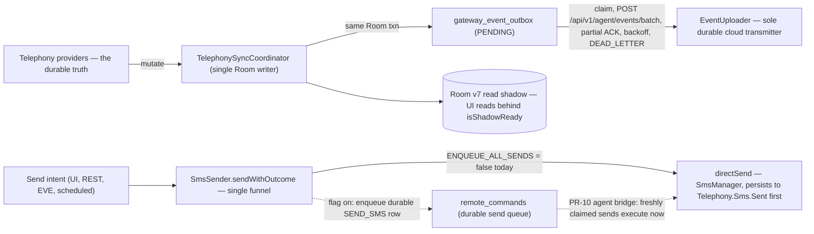

# Messages: Android SMS App + Self-Hosted SMS Gateway

**Messages** is a single Android APK that plays two jobs at once. First it is a full
**default SMS/MMS app** — Jetpack Compose UI (Material 3), onboarding with default-app
gating, notifications, quick replies, drafts, blocklist, biometric app lock, FTS search,
and backup/restore. Second it embeds a **self-hosted SMS/MMS gateway**: a hand-rolled
`ServerSocket` HTTP REST server (default port `8080`, `X-API-Key` auth) plus a webhook
engine, an EVE "Custom HTTP" provider queue, an optional cloud relay (register/heartbeat),
an outbound-only GMweb long-poll bridge, and — since v2.6.20 — a durable gateway-sync
layer (Room v7 outbox/command tables, `EventUploader`). Turn any Android phone into a
SMS/MMS automation endpoint with no third-party cloud fees. The gateway hardens itself
against abuse: per-IP brute-force lockout (8 failed auth attempts in 10 minutes →
5-minute lockout) and a 1 MB request-body cap, on top of the `X-API-Key`. It is a heavily
extended fork of
[manjitrana/Messages](https://github.com/manjitrana/Messages)
(current version `2.6.20`, versionCode `62`; `compileSdk` 36, `minSdk` 26 / Android 8.0+).

v2.6.20 is **Phase 1 of the Messaging Platform**: the durable gateway-sync foundation
(PR-01..PR-03). The **outbound event** leg is live end to end (Room outbox →
`EventUploader`), while the **durable send** leg (the `SEND_SMS` command queue) is present
but gated off by `ENQUEUE_ALL_SENDS = false` — see [Durable gateway sync (in flight)](#durable-gateway-sync-in-flight)
and the [Durable Gateway Sync](/openwiki/architecture/durable-gateway-sync.md) page.

## Invariant: three storage tiers

One set of invariants governs the whole data plane:

- **Telephony content providers are the durable truth.** `Telephony.Sms` / `Telephony.Mms`
  (and `Threads`) are the only stores whose loss means lost messages. `SmsSender` persists
  to `Telephony.Sms.Sent` *before* dispatch, and incoming dispatch consumes the persisted
  provider row (its real id + threadId), not broadcast extras.
- **Room is a read shadow.** `MessagesDatabase` (v7) is an explicitly labeled local
  read-SSOT the UI reads from; `TelephonySyncCoordinator` (the single Room writer) keeps
  it in step and is the durable recovery path — any Room state is rebuildable from the
  provider, and UI reads fall back to the provider until the shadow is ready.
- **Prefs hold config and secrets.** `GatewayPreferences` (SharedPreferences) carries
  gateway config — desired-enabled intent, versioned consent, port, webhook URL, cloud
  relay/GMweb URLs — plus the API key, webhook secret, and cloud bearer token encrypted
  with the Android Keystore (fail-closed: never persisted as plaintext). The runtime
  `isEnabled` flag is a supervisor-derived mirror, not a component-owned switch.

See [System Overview](/openwiki/architecture/overview.md).

## Repo layout

```
/
├── app/                          # the ONLY Gradle module (:app)
│   ├── build.gradle.kts          #   namespace/applicationId com.autonomousone.messages,
│   │                             #   GATEWAY_BACKEND_URL + APP_VERSION BuildConfig fields
│   ├── src/main/
│   │   ├── AndroidManifest.xml   #   default-SMS-app wiring: receivers, services, permissions
│   │   └── java/com/autonomousone/messages/
│   │       ├── data/             #   Room v7 shadow + PR-01 durable tables, DAOs, FTS,
│   │       │                     #   TelephonySyncCoordinator, GatewayEventFactory
│   │       ├── repository/       #   UI repositories, ThreadPager, ThreadMerge, drafts,
│   │       │                     #   GatewaySyncRepository (PR-01 boundary)
│   │       ├── gateway/          #   GatewayService, ConnectionSupervisor, GatewayServer,
│   │       │                     #   WebhookEngine (local only), Heartbeat/Registration,
│   │       │                     #   OutboxPoller (GMweb), EventUploader (PR-02),
│   │       │                     #   SecureCommandPoller (PR-10 agent bridge)
│   │       ├── receiver/         #   SmsReceiver, MmsReceiver, IncomingMessageDispatcher, boot
│   │       ├── sms/ mms/ eve/    #   SmsSender funnel + GatewayOutgoingPipeline (PR-03),
│   │       │                     #   scheduled sends, EveSmsQueue
│   │       ├── viewmodel/ ui/ navigation/ onboarding/   # Compose MVVM shell
│   │       └── event/ model/ messaging/ settings/ utils/
│   ├── src/test/java/…/          # headless JUnit 4 unit-test suite (the CI gate),
│   │                             #   incl. the durable-sync test family
│   ├── src/androidTest/java/…/   # placeholder + GatewayDurabilityDeviceTest (device-only)
│   ├── libs/mmslib-1.0.0.aar     # VENDORED mmslib (JitPack intentionally absent)
│   └── schemas/                  # exported Room schemas (2.json … 7.json)
├── settings.gradle.kts           # rootProject "Messages", include(":app"), repo fallbacks
├── build.gradle.kts              # root plugin declarations only
├── gradle/libs.versions.toml     # version catalog (AGP 8.10.1, Kotlin 2.2.10, Room 2.8.4)
├── docs/                         # per-version release notes, docs/api/openapi.yaml,
│   ├── adr/                      #   ADR-001..004 (trust root, command encryption,
│   │                             #   Doze/SLO availability, repo boundaries)
│   └── …                         #   architecture-v2-sync.md, room-migration-strategy.md
├── scripts/                      # generate-release-metadata.ps1 (Play Protect),
│                                 #   test-gateway-api.ps1 (live API smoke tests)
├── .github/workflows/            # build-debug, release, openwiki-update
└── openwiki/                     # GENERATED wiki — never hand-edit
```

All app code lives under `app/src/main/java/com/autonomousone/messages/`; there are no
other Gradle modules. The manifest (`app/src/main/AndroidManifest.xml`) is the map of the
Android-side surface: `MainActivity` (singleTask, `sms:`/`smsto:`/`mms:`/`mmsto:` SENDTO
plus `text/plain` SEND filters), `SmsReceiver` (priority-999 `SMS_RECEIVED` +
`SMS_DELIVER` filters), the vendored mmslib `PushReceiver`/`TransactionService` for WAP
push, `MmsReceiver`, `HeadlessSmsSendService` (required `RESPOND_VIA_MESSAGE` for default
SMS apps), `SmsStatusReceiver` (durable SENT/DELIVERED callbacks), `BootGatewayReceiver`
(reboot recovery), and the non-exported `GatewayService` foreground service
(`foregroundServiceType="dataSync|specialUse"`).

## Build and test

```bash
./gradlew assembleDebug          # debug build → app/build/outputs/apk/debug/app-debug.apk
./gradlew testDebugUnitTest      # headless JVM unit-test suite (JUnit 4, no Robolectric)
./gradlew :app:connectedDebugAndroidTest   # device-only durability tests (device attached)

# Optional: override the cloud relay backend baked into BuildConfig at build time
./gradlew assembleDebug -PGATEWAY_BACKEND_URL=https://your-relay.example.com
```

Facts about this build worth knowing before touching it:

- The only Gradle module is **`:app`** (root project name `Messages`); namespace and
  applicationId are `com.autonomousone.messages`.
- `-PGATEWAY_BACKEND_URL` replaces the default `https://gaitway.autonomousone.in` in the
  generated `BuildConfig.GATEWAY_BACKEND_URL`; a user-configured in-app setting can still
  override both at runtime (see [Cloud Relay Backend](/openwiki/integrations/cloud-relay.md)).
  `BuildConfig.APP_VERSION` is derived from `versionName` — keep it that way.
- Unit tests run on a bare JVM because `testOptions { unitTests.isReturnDefaultValues = true }`
  makes Android APIs like `android.util.Log` no-op; a test-only `org.json:json` dependency
  supplies the real JSON implementation for JVM round-trip tests. The durable-sync test
  family (`GatewaySyncSchemaTest`, `GatewaySyncPolicyTest`, `GatewayEventFactoryTest`)
  pins the v7 schema, the LOCK-13 upload policy, and event identity rules on the JVM.
  The instrumented suite adds a device-only `GatewayDurabilityDeviceTest` (real Room +
  Keystore process-death contract) alongside a placeholder — run it on a device/emulator.
  Details on [Testing Strategy](/openwiki/testing/unit-tests.md).
- Room schemas are exported to `app/schemas/` (KSP `room.schemaLocation`) — never edit the
  JSON files; they are build artifacts of schema history (exported 2.json … 7.json, matching
  `MessagesDatabase` v7, whose `MIGRATION_6_7` is purely additive and adds the five
  PR-01 durable tables). Since v2.6.10 the destructive migration fallback is debug-only, so
  a release build with a missing migration path fails loudly instead of silently wiping the
  local read model.
- `mmslib` is vendored as `app/libs/mmslib-1.0.0.aar` with its three POM deps declared
  explicitly, because JitPack (its only remote source) has repeated CI-breaking outages.
  Keep JitPack out of `settings.gradle.kts`; the Aliyun mirror there is a scoped
  last-resort fallback for Google artifacts only.
- Release builds sign from `KEYSTORE_*` env vars or a gitignored `keystore.properties`, and
  must degrade to an unsigned build when secrets are absent. See
  [Build, CI, and Release](/openwiki/operations/build-and-release.md).

CI: `build-debug.yml` (push/PR to `master`/`main`) runs `assembleDebug` then
`testDebugUnitTest` and uploads the debug APK — it is the only workflow that runs unit tests.
`release.yml` (push of a `v*` tag) builds the signed release APK and publishes the GitHub
Release. `openwiki-update.yml` runs daily (06:00 UTC) to regenerate this wiki.

## First run on a device

1. Install a release/debug APK on an Android 8.0+ phone with an active SIM.
2. Complete onboarding: accept the disclosure → set Messages as the **default SMS app** →
   grant SMS/Contacts permissions.
3. Open **3-Dots Menu → SMS Gateway** → toggle it on → copy the API key
   (generated on first launch, `gw_` + 32 hex chars, stored encrypted with the Android
   Keystore). The gateway also requires a separate versioned consent; without it
   `GatewayService.startGateway` refuses to start and nothing transmits
   (`GatewayAccessPolicy`).
4. Hit the API from the LAN:

   ```bash
   curl -X POST http://PHONE_IP:8080/api/v1/sms/send \
     -H "X-API-Key: gw_…" -H "Content-Type: application/json" \
     -d '{"phone": "+989124887338", "message": "Hello!"}'
   ```

   After a reboot, `BootGatewayReceiver` replays the start action when the user's persisted
   intent (`gatewayDesiredEnabled`) and consent survive — no manual step. Exercise every
   endpoint with `scripts/test-gateway-api.ps1` (read-only by default; real sends are opt-in).
   Remote exposure options (tunnel, Tailscale, `adb reverse`, cloud relay) are covered on
   [On-Device Operations](/openwiki/operations/device-operations.md).
5. Optional cloud legs: heartbeats and registration run against the configured cloud relay
   backend, while `EventUploader` and the GMweb pollers additionally require a configured
   `gmwebUrl` — all are gated by the supervisor's runtime `isEnabled` flag, so nothing is
   sent until the gateway is declared online.

## Durable gateway sync (in flight)

The durability layer of v2.6.20, in one paragraph each — full state machines, invariants,
and the honest gap list are on [Durable Gateway Sync (PR-01..PR-03)](/openwiki/architecture/durable-gateway-sync.md):

- **Room v7 (PR-01).** Five additive tables — `remote_conversation_map`,
  `gateway_event_outbox`, `remote_commands`, `remote_command_executions`, `sync_cursors` —
  whose three unique indexes *are* the exactly-once/dedupe contract (eventUuid,
  idempotencyKey, threadId). Payload columns are crypto-friendly opaque blobs
  (`ciphertext` + `encoding` + `schemaVersion` + `cryptoVersion`; `cryptoVersion = 0` is
  UTF-8 JSON today, an AEAD envelope in Phase 7 with zero schema change).
  `GatewaySyncRepository` is the deliberately dumb boundary: no crypto, no networking.
- **Event outbox (PR-02, LIVE).** Every message mutation that lands in the Room shadow
  commits its cloud event **in the same Room transaction**
  (`TelephonySyncCoordinator` → `enqueueCloudEvent` → `insertOrIgnore` on
  `gateway_event_outbox`), so message and event live or die together; a crash loses both
  and the provider reconcile re-mirrors and re-enqueues for free. `EventUploader` is the
  sole durable cloud transmitter: it requeues crash-orphaned `SENDING` rows on start,
  transactionally claims batches, POSTs `POST /api/v1/agent/events/batch`, applies
  per-`eventUuid` partial ACKs, and backs off with full jitter on transport failure —
  permanent 4xx (≠429) and undecodable payloads go to a *visible* `DEAD_LETTER`, never a
  silent drop. The old fire-and-forget cloud leg in `WebhookEngine` is **deleted**; what
  remains there is the user-configured local webhook only (best-effort, consent-gated,
  HTTPS-only, HMAC `X-Signature`).
- **Durable send queue (PR-03, present but NOT the live default).** All five send sources
  funnel through `SmsSender.sendWithOutcome`; `directSend` stays the only `SmsManager`
  touchpoint. When `GatewayOutgoingPipeline.ENQUEUE_ALL_SENDS` is on, sends enqueue a
  durable `SEND_SMS` row in `remote_commands` (unique `idempotencyKey`, 24 h expiry floor,
  guarded `RECEIVED → ACCEPTED → EXECUTING → COMPLETED/FAILED` transitions) — but the flag
  **defaults to `false`** until the ADR-003 device process-death matrix passes, so
  production sends still take the direct path. The durable send executor (draining
  `remote_commands`) and the execution-row audit trail are not yet wired; the PR-10
  `SecureCommandPoller` (agent-bridge claim/ingest/ack) does execute freshly claimed
  `SEND_SMS` commands immediately through the same funnel.



*Caption: the in-flight durable sync layer — the outbound event path (providers →
coordinator → outbox → EventUploader → GMweb) is live; the durable send queue is present
behind `ENQUEUE_ALL_SENDS` but not yet the live default (dotted legs).*

## Repo conventions (from AGENTS.md)

These are binding for anyone (human or agent) changing this repo:

1. **Source code and tests are authoritative** over docs and wiki. An open question in a
   brief is a verification gap, not an automatic requirement — go read the code.
2. **Do not hand-edit generated `openwiki/` pages** unless explicitly asked. Change source
   code/docs and let the scheduled OpenWiki workflow regenerate the wiki.
3. **Prefer the narrowest quiet validation that proves the changed behavior** — e.g. run
   the specific unit-test class exercising your change (or a debug build on a device for
   device-bound behavior) rather than the whole battery, and preserve complete failure
   output when reporting.

## Task routing map

Which wiki page to open for which kind of change:

| You are changing / debugging… | Open |
|---|---|
| Anything (system-wide map first) | [System Overview](/openwiki/architecture/overview.md) |
| UI: screens, navigation, deep links, onboarding, app lock, theme, share/SENDTO | [UI, Navigation, and App Shell](/openwiki/architecture/ui-architecture.md) |
| Conversation window: keyset paging, ThreadMerge/snippet cache, window modes | [Conversation Window and Keyset Pagination](/openwiki/architecture/conversation-paging.md) |
| Room schema: entities, DAOs, FTS, watermarks, migrations, send-segment ledger | [Room Data Model (Read Shadow)](/openwiki/architecture/data-model.md) |
| Durable gateway sync: Room v7 durable tables, outbox/command inbox state machines, EventUploader, outgoing pipeline, current wiring status | [Durable Gateway Sync (PR-01..PR-03)](/openwiki/architecture/durable-gateway-sync.md) |
| Provider→Room sync: ContentObserver, ChangeRouter, dual-channel coordinator, backfill | [Provider-to-Room Sync](/openwiki/architecture/sync-coordinator.md) |
| Receiving SMS/MMS: broadcast dedupe, mmslib path, blocklist, notification fan-out | [Incoming SMS/MMS Reception](/openwiki/architecture/incoming-messaging.md) |
| Sending: SIM/SMSC prefs, rate limiting, SENT/DELIVERED status, MMS, scheduled sends, PR-03 durable queue | [Outgoing Send Pipeline](/openwiki/architecture/outgoing-messaging.md) |
| Gateway runtime: service lifecycle, supervisor, server hardening, prefs split | [Gateway Foreground Service and Supervisor](/openwiki/architecture/gateway-service.md) |
| REST endpoints, EVE provider contract, EveSmsQueue | [Gateway REST API and EVE Provider](/openwiki/integrations/rest-api.md) |
| Incoming-SMS webhooks, HMAC signatures, cloud event upload | [Incoming-SMS Webhooks and Cloud Events](/openwiki/integrations/incoming-webhooks.md) |
| Cloud relay: registration, heartbeat, backend URL config chain | [Cloud Relay Backend](/openwiki/integrations/cloud-relay.md) |
| GMweb long-poll bridge, wake lock, outbox polling (incl. PR-10 agent-bridge command poller) | [GMweb Pull Bridge](/openwiki/integrations/gmweb-pull.md) |
| Gradle setup, vendored AAR, CI workflows, release tagging, metadata scripts | [Build, CI, and Release](/openwiki/operations/build-and-release.md) |
| On-device ops: enable/expose the gateway, try the API, diagnostics, backup | [On-Device Operations](/openwiki/operations/device-operations.md) |
| Running or adding unit tests, test seams, device-only areas | [Testing Strategy](/openwiki/testing/unit-tests.md) |
| End-to-end: gateway startup → reboot recovery → self-heal | [Workflow: Gateway Lifecycle](/openwiki/workflows/gateway-lifecycle.md) |
| End-to-end: one received message to UI/webhook/notification | [Workflow: Incoming Message Pipeline](/openwiki/workflows/incoming-message-pipeline.md) |
| End-to-end: one send (UI, REST, EVE, scheduled) to the radio | [Workflow: Send Pipeline](/openwiki/workflows/send-pipeline.md) |

## Related

- [System Overview](/openwiki/architecture/overview.md) — the whole-system map with the storage-tier model
- [Durable Gateway Sync (PR-01..PR-03)](/openwiki/architecture/durable-gateway-sync.md) — the in-flight durability layer and its wiring status
- [Build, CI, and Release](/openwiki/operations/build-and-release.md) — everything about building and shipping
- [On-Device Operations](/openwiki/operations/device-operations.md) — practical runbook for a live gateway
- REST API reference: `docs/api/openapi.yaml` (canonical request/response samples)
