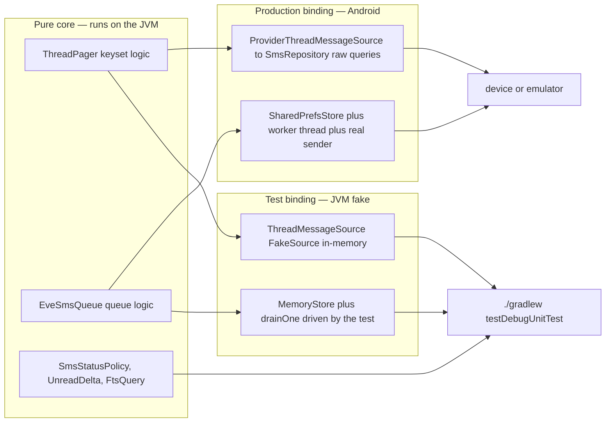
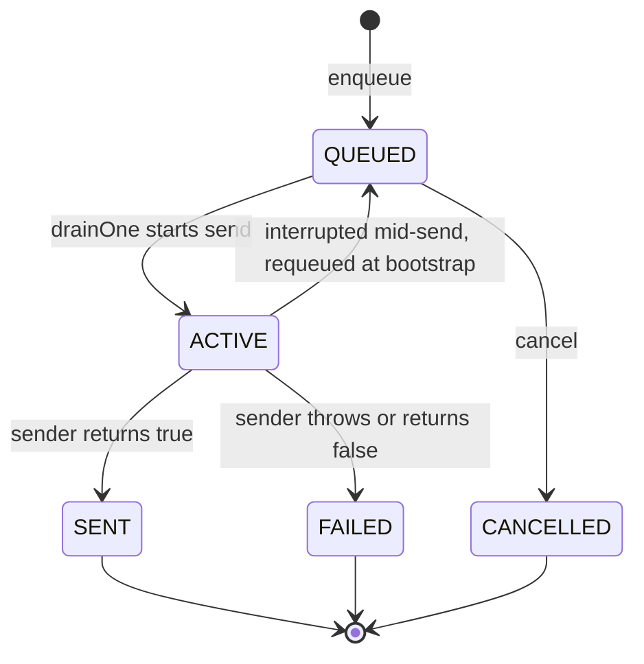

# Testing Strategy

This app is a single-module Android project (`:app`) with one real test layer: a
**headless JUnit 4 unit-test suite** under `app/src/test/`. The whole suite runs on a plain
JVM — no device, no emulator, no Robolectric — and is the primary automated quality gate in
CI. It does this by deliberately isolating the logic that actually has interesting invariants
(keyset paging, DB migrations, delivery-report verdicts, priority/idempotency queueing, unread
bookkeeping, FTS query building) into **pure functions or behind a pluggable seam** that a
device-bound adapter and a test fake can each satisfy. The instrumented suite
(`app/src/androidTest/`) is a single placeholder, so behavior that genuinely needs Android
(MMS receivers, the embedded gateway, the on-device `ContentObserver`) is verified on a
device or emulator, not by these tests.

## Running the suite

```bash
./gradlew testDebugUnitTest      # the full JVM unit-test suite (the CI gate)
./gradlew test                   # shorthand used in some docs; runs unit tests across variants
```

- The suite is **JUnit 4** (`junit = 4.13.2` in the version catalog, wired as
  `testImplementation(libs.junit)` in `app/build.gradle.kts`). There is no Robolectric and no
  Android-instrumentation dependency in the unit-test scope — the only test dependency is
  `junit`, which is the whole reason the suite can run on the bare JVM.
- The suite is executed in CI by **`.github/workflows/build-debug.yml`** ("Build Debug APK"),
  which runs on **push and pull request to `master` or `main`**: it sets up Temurin JDK 17,
  runs `./gradlew assembleDebug`, then `./gradlew testDebugUnitTest`, then uploads
  `app-debug.apk`. This is the **only** workflow that runs unit tests — `release.yml`
  (the `v*`-tag release build) does **not**, so a release is trusted on the same code that
  passed the PR pipeline.
- Release notes track the suite count as a gate (e.g. v2.6.13 records
  `testDebugUnitTest 162/162` green), and the current tree holds **26 test classes** under
  `app/src/test/java/com/autonomousone/messages/` (24 in the root package, plus
  `navigation/NavigationRouteEncodingTest` and `sms/SmsStatusPolicyTest`).

The single Gradle setting that makes all of this possible:

```kotlin
testOptions {
    // Let JVM unit tests call android.util.Log etc. as harmless no-ops.
    unitTests.isReturnDefaultValues = true
}
```

`unitTests.isReturnDefaultValues = true` makes **method-based** Android APIs (`android.util.Log`,
and friends) return default values as no-ops instead of throwing "not mocked" — so classes that
log on every code path still execute on the JVM. **Field-based** SDK constants (e.g. the
`Telephony.Sms.STATUS_*` integers that `SmsStatusPolicyTest` imports) are compile-time constants
inlined at build time and therefore also resolve on the JVM. Together, these let the full JUnit
suite run headlessly with `testDebugUnitTest`.

## The JVM-testability seam

The dominant pattern: a component with an interesting invariant is written as a **pure core**
plus a thin **device adapter**, and the two are joined through a small seam — an internal
interface, a companion factory, a pluggable `Store`, or a set of bare-SQL constants — so the
core can be driven by a fake on the JVM while production binds the real Android path.



*The seam pattern: a pure core is bound to a device adapter in production and to an
in-memory fake in tests, so the same invariants are checked headlessly.*

The four seams named in this repo are:

1. **`ThreadPager.forTesting` source interface.** `ThreadPager`'s primary constructor is
   `private`; a companion factory `forTesting(source, threadId, phone)` (the "PART AZ" seam)
   is the only way to build one outside the public `Context` constructor. Its single
   dependency is the internal `ThreadMessageSource` interface (`querySms` / `queryMms` taking
   `selection`, `selectionArgs`, `sortOrder`, `limit`). Production binds
   `ProviderThreadMessageSource`, which delegates to `SmsRepository.querySmsRaw` /
   `queryMmsRaw` (raw `ContentResolver` queries); tests bind an in-memory `FakeSource` that
   interprets the real selection strings. Keeping exactly one public constructor is deliberate
   — it avoids overload ambiguity at `ThreadPager(getApplication(), …)` call sites.
2. **`EveSmsQueue` `Store` + `MemoryStore`.** The queue's persistence is the pluggable
   `Store` interface (`load()` / `save(records, idempotency)`). Tests inject `MemoryStore`
   and a fake `sender: (String, String) -> Boolean` via `resetForTest(store, sender)`, then
   drive the queue deterministically by calling `drainOne()` directly (the background worker is
   stopped). Production `start(context, sender)` binds `SharedPrefsStore` and a real worker
   thread.
3. **SQL-level migration tests.** Rather than run a live SQLite DB on the JVM, the migration
   tests read the **KSP-generated schema JSON** (`app/schemas/…/4.json`, `6.json`) and compare
   the hand-written migration SQL constants (`MessagesDatabase.UPGRADE_TO_V4_SQL`,
   `MIGRATION_5_6` / `UPGRADE_TO_V6_SQL`) against it, statement-by-statement, plus drive the
   shape-driven `syncStateRebuildSql` helper across real-world column sets.
4. **`FtsQuery` parsing.** `FtsQuery.build(raw)` is a pure string function (no Android at
   all); its tests pin the exact quoted-MATCH grammar.

## Test inventory → the invariants they protect

The suite is organized around *regressions that once shipped*, each pinned by a dedicated class.
The most load-bearing ones, mapped to the seam that makes them testable, are:

### Conversation paging — `ThreadPagerTest`

Guards the v2.6.7 **bidirectional keyset pager**. The fake source records every selection the
pager issues so the test can assert on the SQL grammar itself. The invariants pinned:

- **Canonical ASC output** — every public method returns oldest→newest (newest last); the
  ViewModel/UI never sees a DESC list.
- **`loadLatest` is a bounded newest window, never a full scan** (≤ `INITIAL_PER_SOURCE` = 12
  per source) and it must **not** arm the newer direction.
- **Older/newer crawls use strictly-ordered keyset predicates, never `OFFSET`** — the test
  asserts no issued selection contains `OFFSET`.
- **Independent SMS/MMS cursors and exhaustion flags** — one merged cursor used to let the
  source with the newer tail skip the other's rows; the two crawls meet in the middle with no
  overlap and no gap.
- **`loadOldest` arms the newer direction and disables the older one**; `loadNewerSince`
  returns strictly newer rows in ASC.
- **Phone-only threads (`threadId == 0`) never query the MMS table** (asserted via a call
  counter), and MMS rows carry negative model ids.

See [Conversation Window and Keyset Pagination](/openwiki/architecture/conversation-paging.md).

### Conversation list mapping — `ConversationListMapperTest`

The pager above returns canonical ASC; a separate **pure** function,
`buildReverseChatItems` (`ui/conversation/ConversationListMapper.kt`, called by
`ConversationScreen`), owns the reverse-layout flip so opening a conversation lands on the
latest row with no scroll command. It is a plain string/list function with no Android
dependency, so it is unit-tested directly (no seam, like `FtsQuery` / `UnreadDelta`). The
invariants pinned:

- **Index 0 is the newest message** — the mapped list runs newest→oldest even though the
  ViewModel's `messages` stay ASC, so the LazyColumn's `reverseLayout` paints the latest row
  at the bottom on first layout.
- **Date separators trail their day group** — because the data order is mirrored, each
  `DateSeparator` is emitted *after* its day's messages (it then paints above them, like a
  section header); a single-day window ends with exactly one `"Today"` separator, and a
  multi-day window interleaves messages and closes each day with its own header
  (`"Today"`, `"Yesterday"`, then locale-formatted).
- **Keys are identity-based, not localized-text-based** — `chatItemKey` uses
  `msg_<id>_<date>_<type>` for messages and `date_<yyyy-DAY_OF_YEAR>` for separators, so a
  negative MMS model id never collides with its positive SMS mirror.
- **Self-SMS duplicate race** — if the provider hands the same row twice (refresh + live
  incoming race), the mapper keeps the freshest copy per model id before building rows,
  because the LazyColumn requires unique keys.

### Room migrations — `MigrationToV4SqlTest`, `MigrationToV6SqlTest`

Room *throws on the device at upgrade time* if a migration drifts from the generated schema.
These tests move that failure forward to every `testDebugUnitTest` run by comparing the
migration SQL to the committed, KSP-generated `app/schemas/…/{4,6}.json`.

- **`MigrationToV4SqlTest`** (v2→v4 and v3→v4): every non-`DROP` statement in
  `UPGRADE_TO_V4_SQL` matches the compacted `4.json` text; the `UPGRADE` list **never drops
  `sync_state`** (a blanket drop once erased sync watermarks on every upgrade — the P0 that
  forced a 360K rescan); and `syncStateRebuildSql` is driven across **real-world DB shapes**:
  exact-v4 shape → no-op, legacy v2 → Room-style rebuild (create `sync_state_v4_new` →
  `INSERT…SELECT` → drop → rename) with legacy-column mapping and `initialWindowReady` pinned
  to 1, a broken 2→3 hybrid → `CASE WHEN newestSyncedDate > 0 … ELSE IFNULL(newestDate, 0)`,
  unknown shape → drop + recreate, missing table → plain v4 create. It also asserts the legacy
  non-managed indexes are dropped and the four FTS content-sync triggers exist.
- **`MigrationToV6SqlTest`** (v5→v6, `conversations.lastMessageType`): the boundary is 5→6;
  the migration is **additive-only** (an `ALTER TABLE … ADD COLUMN` + backfill, no
  `DROP`/`CREATE TABLE`); the added column matches `6.json` (position before `pinned`,
  `INTEGER NOT NULL`, `DEFAULT 1`); and the backfill uses a **deterministic newest-row
  tie-break** (`date DESC, source DESC, providerId DESC`, `LIMIT 1`) with a `WHERE EXISTS`
  guard so message-less threads keep the default.

These schemas are exported by KSP (`room.schemaLocation = "$projectDir/schemas"`) and
committed; see [Data Model](/openwiki/architecture/data-model.md).

### EVE send queue — `EveSmsQueueTest`

The queue implements the EVE *Custom HTTP* provider contract. Its core is tested headlessly via
`MemoryStore` + a fake `sender` + a manually driven `drainOne()`. The status lifecycle is:



*EveSmsQueue record status lifecycle as exercised by `EveSmsQueueTest`.*

The invariants pinned:

- **Priority levels** match the EVE spec — `critical`=1, `expired`=3, `expiring`=6,
  `announcement`=10 — and **higher priority is drained first** (critical → expiring →
  announcement).
- **Idempotency** — re-enqueueing with the same `Idempotency-Key` returns the **original**
  record with `created = false` and does not create a duplicate SMS (a second `drainOne` is a
  no-op; only one message is sent).
- **Status flow** — `QUEUED → SENT` with `terminal`/`successful` true and a positive `sentAt`
  (formatted by `eveIsoTimestamp`); a **failing sender → `FAILED`** with `failedReason =
  "provider_error"`.
- **GMweb/EVE verification fields** round-trip through persistence: success →
  `"confirmed"`, failure → `"manual_review_required"`.
- **Cancel** — a queued message is cancellable and then never sends; a **sent** message is not
  cancellable (`reason = "not_cancellable"`); an unknown id returns `null` for both `status`
  and `cancel`.
- **Capacity** — `pendingByPriority()` and `totalPending()` reflect live pending counts.

### SMS delivery status — `SmsStatusPolicyTest`

`SmsStatusPolicy` is a **pure object, deliberately separated from `SmsStatusReceiver`** so the
delivery-report semantics are unit-testable without Android. The verdict is derived from
**positive callback evidence only**. The invariants pinned:

- **3GPP TP-Status classification** — `0x00..0x1f` → `DELIVERED`, `0x20..0x3f` → `TEMPORARY`,
  `0x40..0x7f` → `FAILED`, and **unknown/vendor values → `UNKNOWN` (never invent a verdict)**.
- **3GPP2** — the documented `2 << 16` "received" status → `DELIVERED`, anything else →
  `UNKNOWN`.
- **Aggregation (`nextStatus`)** — all SENT callbacks received → `STATUS_NONE` (sent/unknown
  floor); partial sent parts → `STATUS_PENDING`; **all delivered parts OK → `STATUS_COMPLETE`**;
  **one permanently failed multipart part fails the whole logical message** (`STATUS_FAILED`);
  a temporary network report → `STATUS_PENDING`; and **full delivery outranks older failure
  evidence** (a delivered-part failure never downgrades an already-sent message).

### Change-router URI parsing — `ChangeRouterExtractIdTest`

The `ContentObserver` fires on the **main looper**; `ChangeRouter` must distinguish URIs that
carry a row id (an O(1) targeted mutation) from generic URIs (a bounded reconcile) — and the
read itself is offloaded to `Dispatchers.IO`, never blocking the caller's thread. The pure
`extractRowIdFromPath` function is pinned as:

- single-row `//sms/<id>` and `//mms/<id>` → the numeric id;
- table-level `//sms` / `//mms`, non-numeric last segment, and null/blank path → `null`;
- **thread URIs are NOT row ids** — `//sms/thread/123` must yield `null` (reading `123` as
  `_ID` would upsert a random unrelated message); the router must fall through to reconcile.

### FTS search — `FtsQueryTest`

`FtsQuery.build` must never let user input break out of the quoted token (operators like `OR`,
`*`, `:` are user text, not FTS syntax). Pinned: every token is double-quoted; multi-word
queries AND the tokens; embedded double quotes are escaped by **doubling**; extra whitespace is
collapsed; and empty/whitespace-only input yields `""` (callers must skip execution).

### Persian digits & SMS segmentation — `SmsCounterAndDigitsTest`

Two pure utilities the app leans on for a Persian/Arabic user base:

- **`DigitNormalizer`** — Persian (`۰۱۲…`) and Arabic-Indic (`٠١٢…`) digits (plus separators
  and dash variants) normalize to plain ASCII digits; mixed input works; `hasNonAsciiDigits`
  detects the case.
- **`SmsSegmentCounter`** — standards-compliant segment counting: GSM-7 is 160 chars single /
  153 per concatenated part, **any non-GSM-7 character (Persian/Arabic/emoji) flips to UCS-2**
  at 70 single / 67 per part, and extended-GSM-7 characters count as **2 units**.

### Unread badge — `UnreadDeltaTest`

The conversation projection's `unreadCount` is maintained by a **signed O(1) delta, never by
recounting the thread** — so a 360K-message thread costs nothing per incoming SMS. `UnreadDelta`
is a pure object pinned across every transition: brand-new unread → `+1`; brand-new read → `0`
(outgoing messages land already-read and must never go to `-1`); re-upsert of an unchanged row
→ `0`; **unread→read flip → `-1` (the badge actually comes down when read — the old rule
returned 0 for this and badges never cleared)**; read→unread provider correction → `+1`. The
test also proves **repeated upserts never accumulate** (1000 re-upserts of one unread row add
exactly `+1`) and that a **full unread lifecycle sums to zero**.

### Other subsystems covered by the same pattern

- **Message identity & mapping** — `MessageKeyTest` pins composite-key non-collision for
  overlapping SMS/MMS provider ids, the `toSms()` **negation of MMS ids** (SMS positive, MMS
  negative), a round-trip through the entity key, and a **100k mixed-identity scale smoke test**;
  `MessageEntityTest` pins the lossless `toSms()` field mapping (unread inverted from read,
  address fallback, status/dateSent, id negation); `MessageEntityMappingTest` pins the stable
  `"sms"`/`"mms"` wire constants and the distinct source namespaces.
- **Live-consistency** — `ThreadMergeTest` pins `mergeTail` (append unseen newer rows sorted,
  **idempotent** re-delivery, keep optimistic synthetic-id rows, refresh status on an unchanged
  id/date, keep self-SMS outgoing/incoming distinct); `ThreadSnippetTest` pins the
  "list and chat disagree" fix (newer outgoing replaces a stale incoming snippet, an own
  outgoing reply clears the badge, an incoming message never marks the thread read, an
  older/equal row never overwrites, `reconcileAll` touches only threads with newer data);
  `SmsObserverTimingTest` pins the **leading-edge dispatch** (first change fires
  synchronously with no debounce delay; a burst collapses to one trailing call — the trailing
  `Handler`/`Looper` path itself is not exercised on the JVM).
- **Routing & policy** — `SameConversationRoutingTest` pins `ContactRepository.sameConversation`
  (formatted vs raw, national vs international suffix, blanks never match, short fragments never
  suffix-match, full short codes compare exactly); `GatewayAccessPolicyTest` pins `canStart`
  (consent required) and `canTransmit` (consent **and** runtime-enabled);
  `OnboardingPolicyTest` pins step ordering and that losing the default SMS role returns the
  user to the role step; `LocalProviderWritesTest` pins the mark-read registry (claimed exactly
  once, non-positive thread ids never noted, entries expire after `WINDOW_MS`, the ring evicts
  the oldest when flooded).
- **Parsers & formatting** — `IphoneReactionParserTest` (verb→emoji mapping, straight/curly
  quotes, media nouns, and the full rejection table); `IncomingShareParserTest` (share-intent
  parsing, `%2B`/literal-plus decoding, `EXTRA_TEXT` precedence); `PersianCalendarTest`
  (Nowruz, month/day boundaries, Persian month names, time tokens);
  `NavigationRouteEncodingTest` (route args percent-encode space as `%20` not `+`, phone `+`
  survives, Persian names round-trip, `&` is escaped so it cannot split args);
  `DiagnosticLogTest` (the phone token is stable and never contains the original number).
- **`ExampleUnitTest`** is a trivial addition placeholder, mirroring the template.

## What the JVM suite does NOT cover — device verification

`app/src/androidTest/` contains exactly one class, `ExampleInstrumentedTest`, which only
asserts the package name — so the instrumented suite is effectively a **placeholder** and
`./gradlew test`/`testDebugUnitTest` provides no on-device coverage. Anything that genuinely
needs the Android runtime is verified on a **device or emulator** instead:

- **MMS receive** — the vendored Fossify `mmslib` stack (`com.android.mms.transaction.PushReceiver`
  + `TransactionService`) is exercised only on a real SIM/device.
- **The embedded gateway server** — `GatewayServer` (hand-rolled `ServerSocket`), `Keystore`
  auth, and `ConnectivityManager` have no JVM unit tests; only the pure `GatewayAccessPolicy`
  truth tables are tested in-repo. Server behavior is observed on-device through the gateway
  screen log flow and the `scripts/test-gateway-api.ps1` live smoke test.
- **Cloud-relay network components** — likewise observed on-device through the gateway log
  flow, not by JVM tests.
- **EveSmsQueue's real persistence + worker** — the queue *core* (ordering, idempotency,
  status, verification fields) is JVM-tested against `MemoryStore`, but the `SharedPrefsStore`
  round-trip and the background worker-thread drain loop run only on the device.
- **`ContentObserver` on the main looper** — `SmsObserverTimingTest` asserts only the
  leading-edge dispatch decision; the actual `Handler`/`Looper`-scheduled trailing dispatch and
  `ChangeRouter.route()`'s `Dispatchers.IO` provider reads run only on the device.

## How to add a test

1. **Put the logic in a pure seam.** If the behavior is a decision/policy/formatting rule,
   make it a pure `object` function (like `UnreadDelta` / `SmsStatusPolicy` / `FtsQuery`). If
   it reads a provider or does I/O, hide that behind a small internal interface (like
   `ThreadMessageSource` / `EveSmsQueue.Store`) and add a `forTesting`/`resetForTest`-style
   factory so a fake can be injected. Keep the Android-specific part in a separate adapter.
2. **Add a JUnit 4 test** under `app/src/test/java/com/autonomousone/messages/`, mirroring the
   existing convention: one class per invariant area, backticked descriptive test names, and
   assertions on the concrete invariants (exact strings, exact SQL, exact status codes) rather
   than happy-path smoke checks. The only test dependency available is `junit` — no Robolectric.
3. **Guard schema/migration changes at the SQL level.** If you bump the Room schema, let KSP
   regenerate `app/schemas/…` (never hand-edit the committed JSON) and extend the corresponding
   `MigrationToV*SqlTest` so the new migration SQL is pinned against the generated schema — that
   is what turns a device-time upgrade crash into a CI failure.
4. **Run the narrowest gate first, then the full suite.** Prefer the narrowest quiet validation
   that proves the changed behavior (e.g.
   `./gradlew :app:testDebugUnitTest --tests "com.autonomousone.messages.<YourTest>"`), and
   preserve complete failure output when a test fails. Gate the change on the full
   `./gradlew testDebugUnitTest` — the same command CI runs — before considering it done.

This "prefer the narrowest quiet validation that proves the changed behavior, and preserve
complete failure output" rule, along with treating source code and tests as authoritative, is
the validation convention stated in [AGENTS.md](/AGENTS.md).

## Related

- [Conversation Window and Keyset Pagination](/openwiki/architecture/conversation-paging.md) — the `ThreadPager` the paging tests drive.
- [Data Model](/openwiki/architecture/data-model.md) — the Room schema and migrations the SQL-level tests guard.
- [Sync Coordinator](/openwiki/architecture/sync-coordinator.md) — the single writer whose `mutate`/`reconcile` the router tests route into.
- [Build, CI, and Release](/openwiki/operations/build-and-release.md) — the `build-debug.yml` workflow that runs `testDebugUnitTest`.
