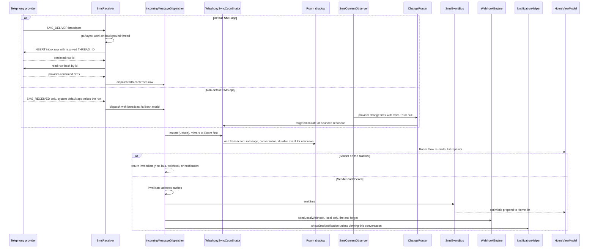

# Workflow: Incoming Message Pipeline

This page follows one inbound message from the moment Android raises a broadcast to the moment the user sees it — on the Home list, in the open conversation, on a webhook endpoint, or as a notification. The pipeline is defined by one invariant and one funnel:

- **Persist before fan-out.** The Telephony provider is the single source of truth. Every consumer (Room shadow, UI, webhook, notification) is fed from *provider-confirmed state* — the row the receiver just wrote, or read back after someone else wrote it. No consumer ever sees optimistic local state as truth.
- **One funnel.** Every inbound path — default-app `SMS_DELIVER`, non-default `SMS_RECEIVED`, and MMS via mmslib — terminates at `IncomingMessageDispatcher.dispatch(context, sms, source)`, which applies a fixed order: Room mirror → blocklist gate → address-cache invalidation → event bus → local webhook → notification. The Room mirror is not merely a UI shadow: for a brand-new row it also commits the durable `MESSAGE_CREATED` cloud event into `gateway_event_outbox` inside the *same* Room transaction (PR-02).

The static anatomy of each component lives on [Incoming SMS/MMS Reception](/openwiki/architecture/incoming-messaging.md) and [Provider-to-Room Sync](/openwiki/architecture/sync-coordinator.md); the durable cloud-event outbox (state machine, `EventUploader`, identity rules) is documented on [Durable Gateway Sync](/openwiki/architecture/durable-gateway-sync.md), and the local webhook's transport details are on [Incoming-SMS Webhooks and Cloud Events](/openwiki/integrations/incoming-webhooks.md); the paged conversation window that renders the appended row is on [Conversation Window and Keyset Pagination](/openwiki/architecture/conversation-paging.md). This page is the trace itself.

## The whole trace

Caption: one received message traced from broadcast to every consumer — the default-app persist/read-back path, the non-default ContentObserver fallback, and the dispatcher's fixed fan-out order with its blocklist branch (early exit after the Room mirror). The Room mirror is a single transaction that also commits the durable `MESSAGE_CREATED` outbox event for brand-new rows (PR-02); the webhook step now fires only the user-configured local leg.

## Step 1 — Broadcast entry: `SmsReceiver`

`SmsReceiver` is declared in the manifest (`app/src/main/AndroidManifest.xml`) exported with `android.permission.BROADCAST_SMS`, with two intent filters of priority 999 — `SMS_RECEIVED` and `SMS_DELIVER`. `onReceive` handles the dedupe that makes the two roles safe:

- **When this app IS the default SMS app**, `SMS_DELIVER` fires (it only goes to the default app) and the receiver skips any `SMS_RECEIVED` for the same PDU — otherwise the same message would be processed twice. The default-app check is `Telephony.Sms.getDefaultSmsPackage(context) == context.packageName`, with exceptions collapsing to `false`.
- **When this app is NOT the default SMS app**, only `SMS_RECEIVED` fires; the system default app writes the inbox row.

Heavy work never runs on the broadcast thread: after `goAsync()`, the receiver spawns a `Thread` that runs `processIntent` and calls `pending.finish()` in a `finally`. This keeps the system from killing the process mid-INSERT — the provider write and read-back are the one piece of work that must complete under the broadcast lifetime.

`processIntent` parses PDUs with `Telephony.Sms.Intents.getMessagesFromIntent`, concatenates multipart (concatenated SMS) parts into one body, and bails out on an empty body or blank sender. The canonical thread id is resolved up front via `IncomingMessageDispatcher.resolveThreadId`, a wrapper over `Telephony.Threads.getOrCreateThreadId` that returns `0L` on failure so callers keep a well-formed model instead of inventing ids.

## Step 2 — Persist, then read back (the SSOT rule)

For `SMS_DELIVER` (default-app path only), the receiver:

1. **INSERTs the row itself** into `Telephony.Sms.Inbox` with `ADDRESS`, `BODY`, `DATE`, `DATE_SENT`, `READ=0`, `SEEN=0`, `TYPE=MESSAGE_TYPE_INBOX`, and the resolved `THREAD_ID` (so the platform Threads table stays consistent, mirroring what the stock SMS app does). The insert is wrapped in `try/catch`; a failure yields `persistedId = -1`.
2. **Reads the freshly persisted row back** from `Telephony.Sms` by id (`readBackFromProvider`), so every downstream consumer sees exactly what the provider holds — the real row id, the provider-normalized `THREAD_ID`, the authoritative `DATE` and `READ` flag.
3. **Falls back to broadcast data** when the row is not visible (non-default role, insert failure, read-back exception): a `Sms` model built from the PDU with `id` set to the persisted insert id when the INSERT succeeded, otherwise the PDU timestamp as a surrogate, `threadId` from `resolveThreadId`, `unread = true`. The fan-out still runs; the fallback degrades id quality, not delivery.

Then a single call — `IncomingMessageDispatcher.dispatch(context, sms)` — ends the receiver's job.

The MMS path reaches the same funnel a different way: mmslib's manifest-declared `PushReceiver` takes `WAP_PUSH_DELIVER`, persists the notification-indication into `Telephony.Mms`, and drives `TransactionService` to download the payload from the carrier MMSC. When the download finishes it broadcasts `MMS_RECEIVED` to the app's `MmsReceiver` (found by `taskAffinity`, so it is not exported and carries no intent filter). `MmsReceiver` reads the persisted `Telephony.Mms` row back plus its `addr` (FROM, type 137 preferred) and `text/plain` part, normalizes dates from seconds to milliseconds, negates the id (the repo-wide convention that MMS ids are negative so mixed UI lists never collide), and calls `dispatch(context, sms, source = MessageEntity.SOURCE_MMS)`. The `source` argument selects the shadow's keyset space and dedupe id; `TelephonySyncCoordinator` maps the negative id back with `abs()` when keying the Room shadow. Blocked MMS senders are additionally screened inside the library via the `isAddressBlocked` override, which is backed by `BlocklistRepository`.

## Step 3 — The single fan-out: `IncomingMessageDispatcher.dispatch`

`dispatch` is the one funnel for all inbound traffic (SMS and MMS alike). Its contract is that `sms.id`/`sms.threadId` **must** come from the provider row that was just written or read back. It runs on a caller-supplied background context and does network/DB work freely. The steps, in this exact order:

<!-- openwiki: broken internal link [#the-room-mirror-mutexert-to-the-o1-fast-path] heading anchor "the-room-mirror-mutexert-to-the-o1-fast-path" does not exist in /openwiki/workflows/incoming-message-pipeline.md. Fix the href or restore the target, then delete this comment. -->
1. **Room shadow mirror — always first.** `TelephonySyncCoordinator.get(context).mutate(MessageMutation.Upsert(source, sms))`. This is the ordering guarantee of the whole pipeline: persistence into the provider precedes every fan-out, and the Room mirror precedes every *other* fan-out. Comment in code: blocking is a notification policy, not a sync policy — the row stays persisted either way. The mutation is also where the durable `MESSAGE_CREATED` cloud event is committed (see [The Room mirror](#the-room-mirror-mutexert-to-the-o1-fast-path)) — for a brand-new row it lands in the *same* Room transaction.
2. **Blocked-sender early exit.** `BlocklistRepository.isBlocked(context, sms.sender)` — the static shortcut exists so broadcast receivers can check without instance state. If blocked, `dispatch` **returns immediately**: no bus event, no local webhook, no notification. Silent handling; the message remains persisted in the provider and the Room shadow. Blocking silences UI/webhook/notification, it does not delete — and because the durable event was already committed in step 1, a *brand-new* blocked message still produces a `MESSAGE_CREATED` outbox row even though the user never sees it locally.
3. **Address-cache invalidation.** `SmsRepository(context).invalidateAddressCaches()` drops the process-wide `AddressCache` (the canonical thread→address map and the per-thread cache used by the conversation-list fast path). A brand-new sender must not render as "Unknown" on the next list refresh — the caches are dropped so names re-resolve against the contact list.
4. **Optimistic UI nudge.** `SmsEventBus.emitSms(sms)` — a fire-and-forget `SharedFlow` (no replay, `extraBufferCapacity = 64` absorbs bursts). It is a nudge, not a data source: the authoritative repaint comes from the committed Room mirror (step 1 above), and the bus makes the first frame instant.
5. **Local webhook.** `WebhookEngine.sendLocalWebhook(context, sms)` — fire-and-forget, consent-gated inside (webhook branch below). This is the user-configured local leg only; the durable cloud event is *not* fired here anymore — it lives in the outbox committed by step 1.
6. **Notification.** `NotificationHelper.showSmsNotification(context, sms)` — **skipped when the user is actively viewing this conversation**: `ContactRepository.sameConversation(sms.sender, SmsEventBus.activeConversationPhone) && SmsEventBus.isAppInForeground`. `activeConversationPhone` is set by `ConversationViewModel` on conversation load and cleared on `onCleared`; `isAppInForeground` is set by `MainActivity.onResume`/`onPause`. `sameConversation` normalizes (strips non-digits, handles `+`) and matches on suffix with a ≥7-digit guard so short fragments never join two conversations. So: viewing the *other* chat → notify; app backgrounded → notify; viewing *this* chat in foreground → suppress.

### The Room mirror: `mutate(Upsert)` to the O(1) fast path

`TelephonySyncCoordinator` is the **single writer into Room**, a per-process singleton with two completely separate channels:

- **`mutations`** — `Channel(MessageMutation, capacity = UNLIMITED)`. Exact, sequential, **never conflated, never dropped**: a bounded channel plus `trySend` would silently lose an event under a burst (100 SMS in one second), leaving that row stale in the shadow until the next reconcile.
- **`reconciles`** — `Channel(ReconcileRequest, capacity = CONFLATED)`. N queued nudges collapse into one bounded repair pass (startup, crash recovery, observer fallback).

For an incoming message, `applyMutation(Upsert)` runs **one Room transaction**: upsert the `MessageEntity` (keyed by `(source, providerId)`), compute the unread delta with `UnreadDelta` (signed O(1) — brand-new unread is +1, re-upsert is 0, unread→read is −1; the thread is never recounted), and upsert the conversation projection with `upsertPreservingFlags` — a *true* upsert, so a brand-new thread is INSERTed right here and Home never depends on a later rebuild. `lastMessageDate` is the max of new and existing, and pin/archived flags are preserved.

**PR-02: the durable cloud event commits here, in the same transaction.** When the upsert is for a brand-new row (`old == null`), the transaction also calls `enqueueCloudEvent { GatewayEventFactory.messageCreated(...) }`, which builds a `MESSAGE_CREATED` outbox row and inserts it into `gateway_event_outbox` with `INSERT OR IGNORE` — *inside* the open `withTransaction` block. The event row and the message row it describes therefore live or die together: a process death before commit loses both, and the provider reconcile re-mirrors the row and re-enqueues the event; a duplicate commit is a no-op against the unique `eventUuid` index. The event's identity is deterministic (`GatewayEventFactory.eventUuidFor(MESSAGE_CREATED, source, providerId, dateMs)`; the payload's `messageId` is a name-UUID of `source:providerId:dateMs`), the `conversationId` is the opaque UUID from `remote_conversation_map` (created on first use), and the payload is an envelope (`cryptoVersion = 0` UTF-8 JSON for now; Phase 7 swaps in AEAD bytes with zero schema change). An enqueue failure is logged and swallowed — it never fails the local mutation.

The durable leg is deliberately *separated* from the dispatch's best-effort legs: the outbox commit needs no consent, token, or network — transmission is the uploader's problem. `EventUploader` (started by `GatewayService` under `ConnectionSupervisor`) is the only cloud transmitter: it claims batches transactionally, POSTs them to `/api/v1/agent/events/batch`, marks ACKs per `eventUuid`, retries on backoff, dead-letters permanent 4xx rejects, and requeues `SENDING` rows after a crash — the full state machine is documented on [Durable Gateway Sync](/openwiki/architecture/durable-gateway-sync.md). While the gateway runtime flag `isEnabled` is off or `gmwebUrl` is blank, the uploader idles and rows simply accumulate `PENDING`.

The committed transaction invalidates the Room `Flow`s. That is the authoritative leg of the UI update: `HomeViewModel.observeRoomConversations` collects `conversationDao().observeAll()` and repaints the list once the read-cutover gate is open (see below). The event-bus prepend from step 4 is what makes the row appear *instantly*; the Room Flow commit is what makes it *correct* — and `HomeViewModel` deliberately does **not** run a provider scan on the bus event, because the exact mutation already reached Room.

**Read-cutover gate.** Room may serve the UI only after both sources have mirrored their initial window: `isShadowReady()` checks `initialWindowReady` for both `SOURCE_SMS` and `SOURCE_MMS` in the sync-state table, and the flag flips only *after* the conversations projection has been rebuilt from the mirrored messages — the UI can never observe "ready" against an empty projection. Until the gate opens, Home falls back to the provider path (or the persisted `ConversationCache`); if the shadow DB cannot be opened at all (failed migration), `HomeViewModel` disables the cutover and degrades to the provider path — the shadow is a read model, the provider remains truth.

**Conversation screen.** `ConversationViewModel` collects the same bus flow: when the incoming sender matches the open conversation (`sameConversation`), it appends the row via `appendLiveMessage` (deduping by id, or by body + ≤5 s time proximity so the bus row collapses with the provider-confirmed one), scrolls to it when the user is at the latest edge, and — because the user is watching — marks the thread read in the provider (`repository.markThreadAsRead`, which updates both `Telephony.Sms.READ` and `Telephony.Mms.READ` and notes the write in `LocalProviderWrites`). That provider write fires the ContentObserver again, closing the loop on the fallback path below.

### The webhook branch: `WebhookEngine` (local leg only)

PR-02 deleted the old fire-and-forget *cloud* leg — the cloud event is now the durable `gateway_event_outbox` row committed in the Room transaction above, transmitted by `EventUploader`. What remains in `WebhookEngine` is the user-configured **local** webhook, best-effort by design and unchanged in behaviour:

`sendLocalWebhook` is gated once, up front, by `GatewayAccessPolicy.canTransmit(prefs.hasGatewayConsent, prefs.isEnabled)` — versioned privacy consent **and** the supervisor-derived runtime `isEnabled` flag; it also no-ops when no `webhookUrl` is configured. Non-HTTPS URLs are rejected and logged (never sent). When open, a JSON POST (`event: "sms_received"`, sender, message, timestamp, threadId) runs fire-and-forget on the engine's IO scope: with a configured secret the body is HMAC-SHA256 signed over `"<timestamp>.<body>"` and sent as `X-Signature` + `X-Timestamp` so receivers can verify authenticity and reject replays; timeouts are 8 s each; failures are logged, never thrown. Nothing downstream of the dispatcher depends on it, and the receiver process is already past `pending.finish()` by then.

### The notification branch: `NotificationHelper`

`showSmsNotification` (only reached when the viewing-suppression check passed):

- Checks `POST_NOTIFICATIONS` on Android 13+ and silently returns if not granted.
- Posts on `messages_notification_channel` (`IMPORTANCE_HIGH`) with **notification id = `sender.hashCode()`** — per-sender dedupe, so a new SMS from the same sender replaces the previous notification.
- Resolves the contact display name (normalized lookup, then raw).
- **Quiet hours**: if inside the configured daily window, the notification still appears but silently — no defaults, `PRIORITY_LOW`.
- **OTP extraction**: if the body contains trigger keywords (otp, code, verification, …) a 4–8 digit code is highlighted in the title (`🔑 OTP: …`) with a dedicated "Copy <code>" action.
- Always carries an inline **Reply** action (`RemoteInput`) and a **Mark as read** action, both targeting `NotificationActionReceiver`.
- Tap intent targets `MainActivity` with `AppLaunchIntent.ACTION_OPEN_CONVERSATION`, per-thread `threadId`/`phone` extras, and a per-thread data URI (`messages://conversation/<threadId>`) so PendingIntents of different threads stay distinct; `VISIBILITY_PRIVATE` hides body and OTP on the lock screen.

## Step 4 — The non-default-app fallback: ContentObserver → `ChangeRouter`

When the app is **not** the default SMS app, the receiver never INSERTs: the system default app writes the inbox row, the receiver's read-back returns nothing, and dispatch goes out from the broadcast fallback model (id = PDU timestamp). The *authoritative* row reaches the Room shadow a different way — through the provider change itself:

1. **`SmsContentObserver`** — attached by both `HomeViewModel` and `ConversationViewModel` via `SmsRepository.registerObserver`, which registers the same observer on **both** `Telephony.Sms.CONTENT_URI` and `Telephony.Mms.CONTENT_URI`. It fires on the **main looper** with leading-edge dispatch: the first change in a burst fires immediately (millisecond-live), and any further change inside `COALESCE_MS = 150 ms` collapses into a single trailing call that passes `null` (unknown change → reconcile). `onChange(selfChange, uri)` deliberately does **not** call `super` — the base class would delegate back into the other override and double-dispatch every change.
2. **`ChangeRouter.route(context, uri)`** — the decision point, never doing provider I/O on the main thread:
   - **URI with an extractable row id** (`content://sms/348201`): the source table is chosen by **authority** (`content://mms/…` → MMS, else SMS — not path substring, which would misroute `content://sms/thread/…` and OEM `mms-sms` URIs). Off the main thread, the router reads *exactly that one row*; a hit becomes `mutate(Upsert)` (the targeted O(1) path), a miss (row deleted externally) becomes `mutate(Delete)`. Extraction is deliberately conservative: `/thread/` paths yield `null` because the trailing number there is a thread id, not a row id — reading it as `_ID` would upsert a random unrelated message.
   - **URI without a row id, or `null`** (table-level change, OEM without row URIs, or the coalesced trailing call): the router consults `LocalProviderWrites.claimRecentMarkRead()` — a 2-second window of the app's own mark-read writes — and downgrades to `reconcile(ForThread(threadId))` when its own bulk mark-read explains the burst; otherwise `reconcile(FullSync)`, the bounded dual-source window sync.

The row-id URI is treated as an **optimization, not a contract**: Android *may* deliver it, but OEM builds frequently do not. The reconcile channel exists precisely so a deployment without row URIs still converges — with the cost of a bounded watermark-based window instead of the whole inbox.

This observer path is what keeps the shadow authoritative for non-default deployments, and it doubles as the general repair path: any provider change the app did not itself dispatch (other apps' writes, status callbacks, external edits) flows through the same router.

## Invariants and failure semantics

- **Persistence precedes fan-out; provider state precedes everything.** No consumer (UI, local webhook, notification, shadow, durable outbox) is ever fed optimistic state as truth; a read-back failure degrades to broadcast data with a logged warning rather than aborting delivery.
- **The Room mirror is unconditional** — it precedes the blocklist gate, so a blocked message exists in the provider *and* the shadow; blocking silences bus/local webhook/notification, it does not delete. Consequence: a *brand-new* blocked message still commits a `MESSAGE_CREATED` outbox row (the durable leg is not blocklist-gated), even though the user never sees it locally.
- **Exactly-once Room writes, and the durable event rides the same commit.** The UNLIMITED mutation channel never conflates or drops; one new message = one transaction = one Flow emission, and that transaction also carries the `MESSAGE_CREATED` outbox row (for a brand-new row only). `eventUuid` uniqueness plus `INSERT OR IGNORE` makes a re-commit a no-op, so the provider reconcile can re-mirror and re-enqueue after a crash without ever duplicating an event. Full scans (`fullRebuildConversations`, the keyset backfill) are confined to the conflated reconcile path and never run on the incoming-message hot path.
- **Durable correctness lives in the queue, not on the wire.** The outbox row commits *before* any network attempt — transmission, retry/backoff, ACK, and dead-lettering are `EventUploader`'s job under `GatewayService`; an outage or a dead gateway only delays delivery, it never loses the event. The local webhook is the one leg that remains best-effort and fire-and-forget.
- **Two identity spaces, one key.** SMS ids are positive provider ids; MMS ids are negated at the `MmsReceiver` boundary and restored with `abs()` in `TelephonySyncCoordinator.providerId`; the composite shadow key is `(source, providerId)` with stable wire values `"sms"`/`"mms"`, and those same `(source, providerId)` values seed the deterministic cloud-event identity (`messageId`, `eventUuid`).
- **The broadcast window is bounded and sufficient.** Only the INSERT + read-back must complete inside `goAsync()`; the Room commit (message + conversation + outbox event), the local webhook, and the notification are handed to background scopes (coordinator loop, engine IO scope, main-thread notification post) and survive `pending.finish()`.
- **The shadow is degradable.** If Room cannot be opened, the read-cutover latch disables Room reads and the app continues on the provider path — a broken shadow must never kill the app.

## Focused tests

The boundary logic that the pipeline depends on has JVM tests that pin it:

- `ChangeRouterExtractIdTest` — URI parsing: `//sms/348201` → `348201`, `//sms` → null, `/thread/123` → null (a thread id is not a row id), non-numeric/blank → null. This is exactly the row-id-vs-reconcile decision of the non-default fallback.
- `SmsObserverTimingTest` — the observer's timing contract: the first change fires synchronously on the leading edge (<50 ms), and a 10-change burst fires only once (the rest coalesces into the trailing call).
- `UnreadDeltaTest` — every state transition of the O(1) unread-delta rule the mutation transaction relies on (new unread +1, re-upsert 0, unread→read −1), so a 360K-message thread pays nothing per incoming SMS and badges actually come down.
- `SameConversationRoutingTest` — the `sameConversation` predicate behind both the viewing-suppression check and the blocklist matching: normalization, country-code suffix matching, and the ≥7-digit guard.
- `GatewayEventFactoryTest` — the identity contract behind the in-transaction `MESSAGE_CREATED` commit: `messageId` is stable per provider row and never body-derived, `eventUuid` differs per event kind, and the payload envelope round-trips while rejecting any `cryptoVersion` other than 0 until Phase 7 lands.

## Related pages

- [Incoming SMS/MMS Reception](/openwiki/architecture/incoming-messaging.md) — static anatomy of the receiver layer, mmslib, dispatcher, and blocklist
- [Provider-to-Room Sync](/openwiki/architecture/sync-coordinator.md) — the dual-channel coordinator, cutover gate, and durable backfill
- [Durable Gateway Sync](/openwiki/architecture/durable-gateway-sync.md) — the `gateway_event_outbox` state machine, `EventUploader` transmitter, and the identity/envelope rules the in-transaction `MESSAGE_CREATED` commit relies on
- [Incoming-SMS Webhooks and Cloud Events](/openwiki/integrations/incoming-webhooks.md) — the user-configured local webhook leg and its signing
- [UI, Navigation, and App Shell](/openwiki/architecture/ui-architecture.md) — the MVVM shell that hosts Home/Conversation ViewModels and the event bus
- [Conversation Window and Keyset Pagination](/openwiki/architecture/conversation-paging.md) — how the conversation screen renders the appended live row
