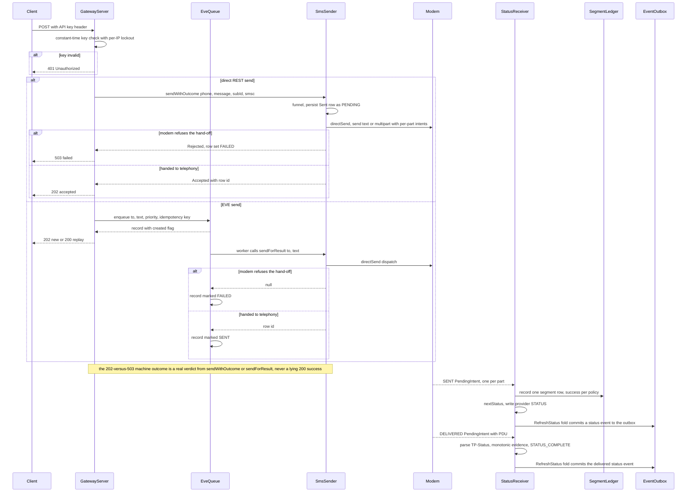
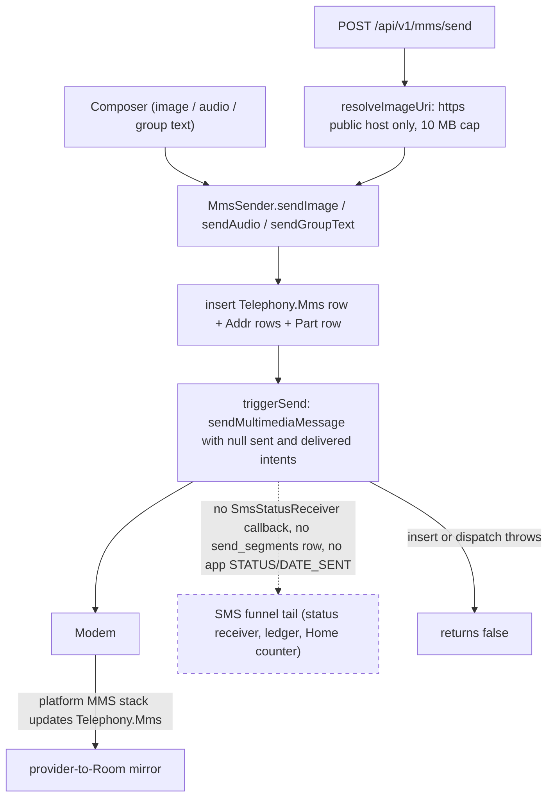

# Workflow: Send Pipeline

This page traces one outgoing send from the moment a person or a machine asks for it to the moment the device knows it was delivered. Seven doors can start an SMS — the chat UI, a notification quick-reply, a long-press schedule in the UI, a REST `POST /api/v1/sms/send` (plus its REST scheduled sibling), the EVE `POST /send` queue (also the funnel for the GMweb legacy pull bridge), and GMweb strategic `SEND_SMS` commands — but all of them converge on one small funnel before they touch the modem: `SmsSender`, whose **`sendWithOutcome` is the single-funnel entry** and whose private `directSend` is the **only place `SmsManager` is ever touched**. It **persists a row into the shared `Telephony.Sms` provider before dispatching**, resolves the user's SIM/SMSC/delivery-report preferences, splits the body into billable segments, and hands each segment to `SmsManager` with its own status `PendingIntent`. Behind that funnel, the **PR-03 durable `remote_commands` queue** (`GatewayOutgoingPipeline`) is the intended steady state: every send source lands there as an idempotent, exactly-once command. Modem results return later through a manifest-declared `SmsStatusReceiver`, which folds those callbacks into provider status via the pure `SmsStatusPolicy` and writes one row per segment into the `send_segments` ledger; the same status fold also commits a `MESSAGE_STATUS_CHANGED` row into the **durable `gateway_event_outbox`**. MMS is a **separate funnel** — `MmsSender` writes the message into `Telephony.Mms` and hands it to `SmsManager.sendMultimediaMessage`, bypassing `SmsSender` and its entire status/ledger tail (see [MMS: the separate funnel](#mms-the-separate-funnel)).

The static anatomy of each component lives on [Outgoing Send Pipeline](/openwiki/architecture/outgoing-messaging.md); the external HTTP contract and error codes live on [Gateway REST API and EVE Provider Contract](/openwiki/integrations/rest-api.md); the durable command/event tables live on [Durable gateway sync](/openwiki/architecture/durable-gateway-sync.md); the Room/`send_segments` schema lives on [Data model](/openwiki/architecture/data-model.md); and the service/supervisor that hosts the server, queue, and pollers live on [Gateway service](/openwiki/architecture/gateway-service.md). This page is the trace.

## One funnel, many doors

The single most important invariant: **every SMS send lands on `SmsSender`**, and the differences between entry points are *which of `SmsSender`'s three public methods they call* and *what they do before and after*. Since the PR-03 refactor those three methods are no longer independent paths: `send(...)` and `sendForResult(...)` both **delegate to `sendWithOutcome`**, which is now the *single-funnel entry point*. Its body is the one place that decides between the legacy direct hand-off and the new durable-queue hand-off (see [PR-03: the durable single funnel](#pr-03-the-durable-single-funnel)), and the private `directSend` below it is the only code that ever touches `SmsManager`. The choice of method still determines two user-visible properties — whether the user's send-rate limiter applies, and whether the caller learns whether the modem accepted the message.

| Entry point | `SmsSender` method | Rate-limited? | Silent (no toast)? | Learns modem outcome? |
|---|---|---|---|---|
| Chat UI — `ConversationViewModel.sendMessage` | `send(phone, text, subIdOverride, null)` | **yes** | no | no (fire-and-forget row id) |
| Notification quick-reply — `NotificationActionReceiver` | `send(phone, replyText)` | **yes** | no | no |
| UI scheduled — `ScheduledSms.SendWorker` | `send(phone, body)` | **yes** | no | no |
| REST `POST /api/v1/sms/send` — `GatewayServer` | `sendWithOutcome(phone, message, subId, smsc)` | no | **yes** | **yes** → 202 / 503 |
| EVE `POST /send` — `EveSmsQueue` worker | `sendForResult(to, text)` | no | **yes** | **yes** → SENT / FAILED |
| GMweb legacy pull — `OutboxPoller` (via `EveSmsQueue`) | `sendForResult(to, text)` | no | **yes** | **yes** |
| GMweb strategic — `SecureCommandPoller` (`executeIngested`) | `sendWithOutcome(phone, body, subId, null, showToast=false)` | no | **yes** | **yes** → COMPLETED / FAILED command state |
| REST scheduled — `GatewayScheduler.SendWorker` | `sendForResult(phone, message)` | no | **yes** | **yes** |

The split is deliberate: interactive paths use `send(...)` (rate-limited, toasts, returns a row id) while machine paths use the v2.6.10 "honest" variants — `sendWithOutcome` (a sealed `Accepted`/`Rejected`) and `sendForResult` (a row id or `null`) — because a machine caller must be able to distinguish "handed to telephony" from "the modem refused". The rate limiter and the toasts live only in `send(...)` and the interactive branches of the funnel, so gateway/EVE/GMweb/gateway-scheduled traffic is never paced by the user's setting or nagged by a toast; those paths are bounded instead by queue capacity (500 pending), schedule caps (200 pending), and — for the strategic command transport — the durable `remote_commands` lifecycle.

## The funnel: `SmsSender`

`SmsSender.send(phone, text, subscriptionIdOverride, smscOverride)` runs a fixed order:

1. **Rate-limit gate** — *only* this method consults it. When `MessagingPreferences.rateLimitEnabled` is on (default OFF), it syncs the in-memory `SendRateLimiter` (`enabled`, `maxMessages` from `rateLimitCount`, `windowMillis` from `rateLimitWindowMin`) and calls `acquireSlot()`, sleeping the returned wait before dispatching. This is why `NotificationActionReceiver` moved its send off the main thread in v2.6.10 — the limiter's `Thread.sleep` would otherwise ANR the broadcast.
2. **`persistToSent`** — inserts the row into `Telephony.Sms.Sent` *before* dispatch with `STATUS_PENDING`, `READ`/`SEEN = 1`, and a `THREAD_ID` resolved from `Telephony.Threads.getOrCreateThreadId`. Resolving the thread id matters: without it the row is an orphan, `Telephony.Threads` keeps its stale snippet/date, and the Home list (built from Threads) and the chat screen (which queries by address) disagree. If the provider insert fails the code falls back to a timestamp as the row id so the send still proceeds.
3. **`SmsEventBus.emitOutgoingSent`** — fires the `OutgoingSent` event with `threadId = 0` (resolved downstream by phone match) so the Home list reorders the thread and an open chat appends the row instantly, even while the chat screen is on top in the single-activity back stack.
4. **`dispatch`** — resolves the effective `SmsManager` (per-call `subscriptionIdOverride`, else the saved `sendSubscriptionId`, applied via `createForSubscriptionId` only on API 31+), computes the effective SMSC, splits the body with `divideMessage`, builds one `PendingIntent` per part for `ACTION_SMS_SENT` (always) and — when delivery reports are on — one per part for `ACTION_SMS_DELIVERED`, then calls `sendMultipartTextMessage` or `sendTextMessage`. It returns `true`/`false` for the hand-off result.

The effective **SMSC** is resolved in exactly this order: per-request `smscOverride` → this SIM's manual override → the global `smscAddress` → `null` (the SMSC programmed on the (U)SIM, Android's documented default). The `PendingIntent`s are built `FLAG_MUTABLE` (so `SmsManager` can fill the delivery `pdu`/`errorCode` extras) and are deliberately **not** one-shot, since a temporary TP-Status may later advance to delivered; a stable `requestCode` derived from `(action, rowId, partIndex)` keeps each part's broadcast distinct.

On a dispatch exception, `dispatch` writes `STATUS_FAILED` to the row, shows a toast only when `showToast` is true (the interactive paths), and returns `false`. **This synchronous exception path is the only place `STATUS_FAILED` is written before any callback exists** — modem callback results never manufacture a `FAILED` (see below).

### The machine outcomes and the 503-vs-200 contract

Before v2.6.10, `send()` returned a row id even when `SmsManager.sendTextMessage` threw, so the gateway answered HTTP 200 "success" for a message that never reached the modem. The fix is the explicit-outcome split:

- `sendWithOutcome(phone, text, subId, smsc)` → `SendOutcome.Accepted(rowId)` when the hand-off succeeds, `SendOutcome.Rejected(rowId, reason)` on refusal. The contract is explicit that **`Accepted` means "handed to telephony", not "delivered"** — SENT/DELIVERED arrive later via the status receiver.
- `sendForResult(phone, text)` → the row id on a successful hand-off, `null` when dispatch failed. This null-returning shape is what lets `EveSmsQueue`'s sender lambda stay a plain `Boolean` (`sendForResult(to, text) != null`).

## PR-03: the durable single funnel

PR-03 establishes the intended steady state for this pipeline: **every send source — the Android composer, notification reply, web/PWA command, scheduled send, and the Gateway/EVE API — lands in one durable `remote_commands` queue and is executed exactly once, and every modem status change is committed into the durable `gateway_event_outbox`.** The queue's contract is that nothing calls `SmsManager` outside the pipeline, and exactly-once comes from a unique `idempotencyKey` (a re-delivered command is a no-op `INSERT OR IGNORE`) plus the guarded command lifecycle `RECEIVED → ACCEPTED → EXECUTING → COMPLETED | FAILED`.

Today, however, the **runtime funnel is still `SmsSender`'s three methods**, and the durable queue is only partially wired:

- `GatewayOutgoingPipeline` is the durable queue object. Its `enqueueSendSms` writes a `SEND_SMS` `RemoteCommandEntity` (a JSON payload of `phone`/`body`/`threadId`/`messageId`, `expiresAt` floored at 24 h so no short timeout can delete a queued command) and resolves `threadId` → opaque conversation id via `remote_conversation_map`. A redelivery with the same `idempotencyKey` returns the existing command id rather than enqueueing twice.
- The rollout is gated by the `@Volatile` flag **`GatewayOutgoingPipeline.ENQUEUE_ALL_SENDS`, which is `false` by default**. `sendWithOutcome` reads the flag: **off** (the shipped path) it takes the legacy `directSend` and never touches the queue; **on** it enqueues durably, claims the command with a single-owner `markCommandAcceptedIfReceived`, runs `directSend` on a detached `Dispatchers.IO` coroutine, and marks the row `COMPLETED`/`FAILED`. The flag is meant to flip to `true` only after green process-death tests, and a later phase removes the flag entirely so `directSend` becomes unreachable outside the pipeline.
- **There is no background drain executor for `remote_commands`.** The only in-process consumer is `SecureCommandPoller.executeIngested` (see below), which drains the specific `SEND_SMS` row the strategic command poller just ingested. Local sends enqueued while the flag is on are executed inline by `sendWithOutcome` itself; nothing independently re-drains queued-but-not-yet-claimed rows after a process death. This is the gap PR-03's rollout notes call out: the durable queue exists and is idempotent, but the general "executor that drains `remote_commands` in order" is not yet a running component.
- The **`MESSAGE_STATUS_CHANGED` half is already live and unconditional** (it does not depend on the flag): when the status receiver's `RefreshStatus` mutation folds a callback into the Room shadow, `TelephonySyncCoordinator` commits a `MESSAGE_STATUS_CHANGED` event into `gateway_event_outbox` *in the same Room transaction* (see [Durable status callbacks](#durable-status-callbacks-and-the-send-segment-ledger)), and `EventUploader` drains that outbox to GMweb. So the *status* side of the intended steady state is already durable end-to-end, while the *command* side awaits the executor.

In short: the steady state is "durable queue with exactly-once execution for commands, durable outbox for status"; the present runtime is "the three `SmsSender` methods as the funnel (direct `SmsManager` hand-off), a durable command queue that is idempotent but not yet continuously drained, and a durable status outbox that is already fully wired."

## Entry point: the chat UI

`ConversationViewModel.sendMessage(threadId, phone, message, subscriptionOverride)` is the interactive door. It normalizes the destination (stripping pasted spaces/dashes), then does an **optimistic UI write before any network/telephony work**: it inserts a temporary `Sms` row (synthetic id = now, `STATUS_PENDING`) into `messages`, records it in `optimisticMessages`, and appends it to `ThreadMessageCache` so the next open paints it instantly. Only then does it launch on `Dispatchers.IO` and branch:

- **Group + `groupMessagingEnabled` on** → one group MMS via `MmsSender.sendGroupText` (not the SMS funnel).
- **Group + toggle off** → one `smsSender.send(recipient, ...)` per recipient.
- **Single recipient** → `smsSender.send(recipient, ..., subscriptionOverride, null)`; the persisted row id is tracked in `persistedSentIds` for later reconciliation against the provider reload.

The `subscriptionOverride` argument is the **in-chat SIM switcher** (`selectedSubId` state on the screen): a per-call SIM override that applies to this one message, falling back to the user's global preference when `null`. Note that the UI always passes `null` for the SMSC override: it is the **REST gateway path** that is the only entry point accepting both `subscription_id` and `smsc` as *request-supplied* per-call overrides (from the JSON body) — the UI supplies at most a subscription override, and never an SMSC one.

Notification quick-reply is the other interactive door: `NotificationActionReceiver` handles `ACTION_REPLY`, reads the `RemoteInput` text, and calls `SmsSender(appContext).send(phone, replyText)` under `goAsync()` on `Dispatchers.IO` — rate-limiting and persistence apply, and it relies on `SmsSender` to persist and emit its own `OutgoingSent` (no duplicate event).

### Long-press schedule (UI)

Long-pressing the send button opens `ScheduleSendDialog` (presets of 1 h / 3 h / tomorrow 9 am, or a custom date-time picker). Confirming calls `ScheduledSms.schedule(context, phone, body, triggerAtMillis)`. That method:

- enqueues a WorkManager `OneTimeWorkRequest` with a unique name `scheduled_sms_<triggerAt>` and `ExistingWorkPolicy.REPLACE`, tagged `scheduled_sms`, with an initial delay until `triggerAt`;
- emits an **optimistic bubble** straight into the bus (`SmsEventBus.emitSms` with `type = 2`, `status = 32` pending, `date = triggerAtMillis` so it sorts at the right position) so the user sees it queued immediately; the draft is cleared because "scheduled is as good as queued".

`ScheduledSms.SendWorker` (which runs when the delay elapses) sends through the normal `SmsSender.send(phone, body)` — so SIM/SMSC preferences, delivery reports, **and the rate limiter all apply** — then calls `SmsEventBus.notifyResume()` to refresh any open Home. On an exception it returns `Result.retry()` while `runAttemptCount < 3`, then `Result.failure()`. Cancellation is by exact trigger time via `ScheduledSms.cancel`.

## Entry point: REST and EVE (the machine doors)

`GatewayServer` is the only inbound HTTP surface. Every request (except `GET /health`) is authenticated against the gateway API key — `X-API-Key` or `Authorization: Bearer` — using a constant-time comparison with a per-client-IP lockout (8 failures in 10 min → 5 min lockout → 429). After auth, the two send doors diverge.

**Direct REST — `POST /api/v1/sms/send`.** The body is `{phone, message, subscription_id?, smsc?}`. The phone is digit-normalized; `smsc`, when present, must match `^\+?[0-9]{5,20}$` and `subscription_id` must be ≥ −1 (both 400 otherwise). It calls `smsSender.sendWithOutcome(phone, message, subscriptionId, smsc)` and maps the outcome:

- `Accepted` → **202** `{"status":"accepted","id":<rowId>, ...}` (echoing the overrides when supplied)
- `Rejected` → **503** `{"status":"failed","error":<reason>, ...}`

This is the **503-vs-200 decision point**: the machine caller's success/failure is decided by `sendWithOutcome`'s explicit outcome, so a modem refusal can no longer masquerade as a 200 "success". (`docs/api/openapi.yaml` still documents this endpoint as 200 — a pre-202/503 drift; the code is authoritative.)

**EVE — `POST /send`.** The body is `{to, text, priority?}` plus an `Idempotency-Key` header. The handler first applies a **capacity guard**: if `EveSmsQueue.totalPending()` (QUEUED + ACTIVE across all priorities) has reached `ANNOUNCEMENT_LIMIT = 500`, it answers **429** `rate_limited` with `Retry-After: 30` *before* parsing. Otherwise it enqueues into `EveSmsQueue`. A repeat idempotency key returns the **original** record with `created = false` and HTTP **200** (no duplicate SMS); a new request is **202** with `requestId`, `jobId`, `statusUrl`, and `queuePosition`. The send does **not** happen synchronously — the queue's single worker thread drains it later through `sendForResult`, and the record becomes `SENT` or `FAILED`. The same queue is also the funnel for the GMweb **legacy** pull bridge (`OutboxPoller` enqueues pulled tasks into it), so a cloud-originated send gets identical persistence, ordering, and failure semantics as a LAN one.

### The two GMweb transports

GMweb reaches the device over **two** outbound-only HTTPS bridges, both hosted by `GatewayService`/`ConnectionSupervisor`, and they use *different* funnels:

- **Legacy pull — `OutboxPoller`** (`GET /gateway/pull` + `POST /gateway/ack`, the phone's gateway API key as `X-API-Key`). It dials out, receives one queued send per request, enqueues it into the **same local `EveSmsQueue`** as `POST /send`, drives it to a terminal status via `drainUntilTerminal` (a bounded poll that also calls `EveSmsQueue.drainOne()` directly so a busy worker can't stall a single record), and **acks the server's ledger with the radio-level result**. It holds a partial wake lock only while a cycle is in flight and pauses (zero HTTP) until the network monitor reports a route. This is the compatibility transport.
- **Strategic command transport — `SecureCommandPoller`** (PR-10, `POST /api/v1/agent/commands/claim` + `POST /api/v1/agent/commands/{id}/status`, per-device `AgentAuth` signatures). This is the correctness-critical path: it **ingests every claimed command durably first** (`ingestCommand`, `INSERT OR IGNORE` by unique `idempotencyKey` → exactly-once), acks `ACCEPTED` only for a fresh row, and for a `SEND_SMS` row hands it to `GatewayOutgoingPipeline.executeIngested`. A re-delivered command is *never* double-executed — the poller just re-reports the durable state (a `COMPLETED` row → honest `COMPLETED` ack, in-flight → the row's own executor reports). `executeIngested` runs the *same guarded lifecycle* the local funnel uses: single-owner `RECEIVED→ACCEPTED`, then `EXECUTING`, then `sendWithOutcome` (silent, no rate limit), then `COMPLETED`/`FAILED`, writing the terminal state to the row before it acks. A corrupt or payload-missing `SEND_SMS` is marked `FAILED` and surfaces an execution error rather than a silent drop.

The two transports are additive, not a replacement: the legacy `OutboxPoller` keeps running while the strategic poller is the long-term command channel, and both converge on the same funnel/queue machinery so a cloud send is indistinguishable from a LAN one at the modem.

*Caption: the REST/EVE send path — HTTP auth, the direct-send and queue-send branches through the single `sendWithOutcome` funnel, the 202/503 machine outcome, and the shared durable callback tail that writes the segment ledger, folds the provider status, and commits `MESSAGE_STATUS_CHANGED` into the durable event outbox.*

## Two scheduling paths (both survive reboot)

There are two independent "send later" systems, and the key distinction is **what makes each durable** and **which `SmsSender` method fires at delivery time**:

| | `ScheduledSms` (UI) | `GatewayScheduler` (REST) |
|---|---|---|
| Triggered by | Long-press send → `ScheduleSendDialog` | `POST /api/v1/sms/schedule` with `sendAt` (epoch ms) or `delaySeconds` |
| Durable job | WorkManager `OneTimeWorkRequest`, unique name `scheduled_sms_<triggerAt>`, `REPLACE`, tag `scheduled_sms` | WorkManager one-time work per `scheduleId`, **plus** a persistent registry |
| Registry | none — WorkManager's own SQLite store only | `SharedPreferences` index (`gateway_schedule_prefs`), the 100 most recent entries, survives reboot |
| Idempotency | none | exact `(phone, message, sendAt)` triple while `scheduled` → existing entry, 200 `created:false` |
| Capacity | unbounded | `MAX_PENDING = 200` → 429 `too_many_pending` |
| Send path at fire time | `SmsSender.send` (SIM/SMSC prefs **and** rate limit apply) | `SmsSender.sendForResult` (silent, **no** rate limit) |
| Cancellation | `cancel(context, triggerAtMillis)` by exact trigger time | `DELETE /api/v1/sms/schedule/{id}` while pending, else 409 |
| Failure policy | `Result.retry()` while `runAttemptCount < 3`, then failure | retry while `< 3`, then entry `failed` with `failedReason: dispatch_failed` |

Both are durable across reboot because the **delivery job lives in WorkManager's persistent store**, which re-fires a pending `OneTimeWorkRequest` after a reboot or process death. The difference is the *record-keeping* layer: `ScheduledSms` keeps nothing of its own (WorkManager's store is the registry), while `GatewayScheduler` keeps a `SharedPreferences` index on top so REST clients can poll each schedule's fate (`scheduled → sent | failed | cancelled`) and so an idempotent replay works. That registry is also why `GatewayScheduler.SendWorker` re-checks the entry's status before sending: an entry cancelled while waiting becomes a no-op success, not a send.

The fire-time `SmsSender` difference is subtle but real: the UI path's `send(...)` honors the user's rate limiter and can toast, whereas the gateway path's `sendForResult(...)` is silent and unthrottled — matching every other machine door.

## MMS: the separate funnel

MMS is **not** a branch of the `SmsSender` funnel — it is a parallel path through `MmsSender`, and it carries none of the SMS funnel's machinery. There are three doors into it: the composer's **image** attachment (`ConversationViewModel.sendImageMessage` → `MmsSender.sendImage`), the composer's **audio** attachment (`sendAudioMessage` → `MmsSender.sendAudio`), and the composer's **group text** branch (multiple recipients with `groupMessagingEnabled` on → `MmsSender.sendGroupText`, which creates one group `Telephony.Threads` thread for all recipients instead of N separate SMS). The REST gateway adds a fourth door: `POST /api/v1/mms/send` (`GatewayServer` → `MmsSender.sendImage`).

Each `MmsSender` method writes the message into the shared `Telephony.Mms` provider — an `Mms` row (`MESSAGE_BOX_OUTBOX`, `MESSAGE_TYPE_SEND_REQ = 0x80`, resolved `THREAD_ID`), one `Addr` row for the FROM token plus one per recipient, and a `Part` row with its content (text written directly; images **downsampled and JPEG-compressed** to fit a ~900 KB carrier cap; audio copied through) — then calls `triggerSend`, which hands the row to the radio via `SmsManager.sendMultimediaMessage(context, mmsUri, null, null, null)` with a `null` MMSC location (the carrier's MMSC settings are used).

The decisive difference is that **`triggerSend` passes `null` for the sent and delivered `PendingIntent`s**. An MMS send therefore:

- produces **no `SmsStatusReceiver` callback** — the manifest-declared receiver is reached only by the explicit intents `SmsSender` builds, and MMS builds none;
- writes **no `send_segments` row** — so an MMS send never counts toward the Home "N SMS today" chip (that counter is SMS-segment-only);
- gets **no app-side `STATUS`/`DATE_SENT`** — delivery confirmation for MMS is the platform's job (the default-SMS-app MMS stack updates the `Telephony.Mms` row, which the provider-to-Room mirror picks up); the app never observes a modem-level MMS verdict;
- applies **none of the SMS funnel's controls** — no rate limiter, no `sendSubscriptionId`/SMSC preference (the group-text and image paths pass `null` to `SmsSender` or never call it), no `SendOutcome`/`sendForResult` outcome plumbing. A failure surfaces only as the `false` returned by `sendImage`/`sendAudio`/`sendGroupText` when the provider insert or dispatch throws.

`POST /api/v1/mms/send` is also a different *shape* of REST door than `/api/v1/sms/send`: it is **synchronous** (no queue, no 202/503 outcome contract — `sendImage`'s boolean maps to **200** `{"status":"success"}` or **500** `{"status":"failed"}`), and its `imageUrl` is hardened against SSRF: only `https://` URLs on **public** hosts are accepted (`resolveImageUri` downloads the image to the app cache, refusing `http://`, `content://` — which the UI paths still pass natively — and any host in a private/loopback/link-local range, including ULA `fc00::/7`), and the download is capped at 10 MB.

*Caption: the MMS funnel — the composer attachments, group text, and the SSRF-guarded REST door all write a `Telephony.Mms` row and dispatch via `sendMultimediaMessage` with null status intents, so the dotted line to the SMS funnel's status/ledger tail never fires.*

## Durable status callbacks and the send-segment ledger

### Why the receiver is manifest-declared

`SmsStatusReceiver` is declared in `AndroidManifest.xml` with `android:exported="false"` and **no intent filter** — it is reached only by the explicit `PendingIntent`s that `SmsSender` built. The manifest lifetime (rather than a runtime-registered receiver) is what makes SENT/DELIVERED results arrive after the screen, or the whole app process, that initiated the send has gone away. In `onReceive` the receiver `goAsync()`, captures `resultCode` before leaving the broadcast thread, then runs `processStatusIntent` on a companion `CoroutineScope(SupervisorJob() + Dispatchers.IO)` with `pendingResult.finish()` in a `finally` — keeping the process alive until the provider write and the ledger write both complete.

### The no-poisoning invariant

The central policy decision: **vendor non-OK SENT codes must never be written to the shared provider as `STATUS_FAILED`.** Affected Samsung/RIL combinations return non-OK codes (e.g. `RESULT_ERROR_GENERIC_FAILURE`) after the SMSC has accepted and delivered the message; writing those into `Telephony.Sms.STATUS` would poison the shared provider and make every SMS app show a false "Not delivered". So a SENT callback, OK or not, only records progress (the part index joins the row's `sentDone` set); the raw modem result is diagnostic data only. A non-OK DELIVERED callback is only a *reporting gap* — the message stays Sent, and delivery can only be established from positive evidence, never downgraded by a missing or failed report.

### Status aggregation

`SmsStatusPolicy` (pure, Android-free) decides the row status from the per-part counts, and the receiver keeps those counts in versioned `SharedPreferences` sets that are **monotonic** (a DELIVERED verdict can never be downgraded by a duplicate/stale report; TEMPORARY may later advance to FAILED or DELIVERED; UNKNOWN leaves prior evidence untouched). `nextStatus` yields:

1. all parts DELIVERED → `STATUS_COMPLETE` (the receiver also stamps `DATE_SENT`);
2. any part permanently FAILED (parsed TP-Status) → `STATUS_FAILED` (one permanently failed multipart part fails the whole logical message);
3. any part in TEMPORARY → `STATUS_PENDING`;
4. some parts delivered but not all → `STATUS_NONE` (the "single tick" sent floor);
5. still collecting SENT callbacks → `STATUS_PENDING`;
6. else (fully sent, delivery reports gapped or disabled) → `STATUS_NONE`.

After writing `STATUS` to the provider, the receiver emits `MessageMutation.RefreshStatus` through `TelephonySyncCoordinator` — a targeted O(1) re-read + upsert of that one message into the Room shadow, replacing the old full-provider-scan path. Since the PR-02 durable-outbox wiring, that same `RefreshStatus` mutation does **one more thing in the same Room transaction**: it builds a `GatewayEventFactory.messageStatusChanged(...)` row and commits it into the durable `gateway_event_outbox` table (`INSERT OR IGNORE`, deduped on the deterministic `eventUuid` derived from kind + provider identity + date). This is the **`MESSAGE_STATUS_CHANGED`** event — the PR-03 "status half" of the durable pipeline, which is live today and does not depend on the `ENQUEUE_ALL_SENDS` flag. The `EventUploader` worker is the only thing that transmits it (claim → POST `/api/v1/agent/events/batch` → per-eventUuid partial ACK, retry, or dead-letter). The same transactional-commit pattern also applies to `MESSAGE_CREATED` (new messages), `MESSAGE_DELETED`, and `THREAD_READ` — every cloud event is committed atomically with the Room row it describes, so a crash between the two can never lose one without the other.

Because the `eventUuid` is deterministic on `(kind, source, providerId, dateMs)`, a provider re-report of the *same* status at the *same* date is a free no-op dedupe — the outbox never double-queues a status transition, which is what makes the "durable status outbox" half of the PR-03 steady state safe against the redelivered/duplicated callbacks the receiver is already built to absorb.

### Multipart segment accounting

On every **SENT** callback (delivered callbacks do not write the ledger), `SmsStatusReceiver` records one `SendSegmentEntity` row per carrier-billable segment in the `send_segments` table. The **success verdict follows the AMBIGUOUS_ACCEPTED policy rather than raw `RESULT_OK`**: `success = ok || resultCode == RESULT_ERROR_GENERIC_FAILURE`. On the affected RIL combinations the radio returns `GENERIC_FAILURE` for submits the SMSC actually accepted, so counting only `RESULT_OK` froze the counter while messages kept sending and showing Sent; explicit radio-level failures (`NO_SERVICE`, `RADIO_OFF`, `NULL_PDU`) are **not** billable and stay `success = false`.

Two accounting properties matter:

- **The counter counts rows, not logical messages.** A 3-part multipart send contributes 3 to the Home "N SMS today" chip — what the carrier bills. The Home counter is fed by `SendSegmentDao.observeSuccessSince(dayStart, dayEnd)`, a live `Flow` over a local-midnight window that `HomeViewModel` re-opens at midnight, driving the `SentTodayChip` in the Home top bar.
- **Redelivered callbacks are idempotent.** The composite primary key `(rowId, partIndex)` with `OnConflictStrategy.REPLACE` means a re-fired callback inserts over the existing row and the count never moves twice.

The ledger is deliberately kept **out of the sync mirror** (it is app-owned telemetry no Telephony table stores, so no reconcile path may touch it), and failed (`success = false`) rows are retained for post-mortems and simply never counted. It is bounded by `pruneBefore`, called with a 90-day horizon from the `TelephonySyncCoordinator` reconcile. A ledger write failure can never break status processing — it is caught, logged, and repaired by the next callback.

## UI and Room updates

The send's effect is three-channel (two of them move the UI; the third is the durable cloud mirror):

- **Instant (event bus).** `SmsSender` emits `OutgoingSent` right after persisting (inside `directSend`, so it fires exactly once no matter which entry point ran the funnel). `HomeViewModel` collects it to lift the thread to the top with the new snippet, and an open `ConversationViewModel` appends the row (`appendLiveMessage`) so a send produced outside the screen (REST, queue, notification reply, GMweb command) still appears live.
- **Durable (provider → Room).** The provider row is the source of truth. `SmsContentObserver` / `TelephonySyncCoordinator` mirror provider changes into the Room shadow; the status receiver's `RefreshStatus` mutation is the targeted update that moves a row from `PENDING` to sent/delivered/failed in the shadow without a full rescan.
- **Durable (Room → cloud).** In the same transaction as the above, the status change is also committed into `gateway_event_outbox` as a `MESSAGE_STATUS_CHANGED` event and drained to GMweb by `EventUploader`, so the remote mirror sees the modem-level status even if the provider/Room path is later rebuilt from scratch.

## Failure and durability semantics

- **Dispatch failure** (modem refuses before any callback) → `dispatch` writes `STATUS_FAILED`, the machine caller sees `Rejected`/`null` (503 / `FAILED` in the queue), the interactive caller sees a toast, and — when the command is tracked durably (flag on, or a GMweb `SEND_SMS`) — the `remote_commands` row is marked `FAILED`.
- **Modem callback, non-OK** → never `STATUS_FAILED`; the row stays on the sent floor (`STATUS_NONE`) and the diagnostic code is logged.
- **Reboot** → WorkManager re-fires both scheduling paths; `GatewayServer` (and with it `EveSmsQueue`) is re-armed by `BootGatewayReceiver` when the user left the gateway enabled, re-checking consent; `EventUploader` runs `recoverSending()` first so outbox rows left `SENDING` by a crash return to `PENDING`.
- **Process death mid-EVE-send** → a record left `ACTIVE` is re-queued to `QUEUED` on boot, so it is retried rather than lost.
- **Process death around a durable command** → a `remote_commands` row is durable in Room, so it survives death; the atomic `RECEIVED→ACCEPTED` claim guarantees only one executor ever runs it, and a lost GMweb ack does not re-execute (the durable row is the truth, `ackIfTerminal` just re-reports it). Note the residual PR-03 gap: without a drain executor, a *locally* queued-but-never-claimed command (flag on) is not independently re-executed after death — the strategic poller re-drives only rows it claims from GMweb.

## Configuration and operations

- **`MessagingPreferences`** (prefs `messaging_prefs`) drives the funnel: `deliveryReportsEnabled` (default ON — off means no DELIVERED `PendingIntent`s, so the row can never leave the sent floor), `sendSubscriptionId` (default UNSET = system default SIM), `smscAddress` / per-SIM manual SMSC (strict user-intent: an unchosen address must not override the SIM's own SMSC), and the rate-limit trio `rateLimitEnabled` (default OFF), `rateLimitCount` (default 10), `rateLimitWindowMin` (default 1).
- **`GatewayOutgoingPipeline.ENQUEUE_ALL_SENDS`** — the PR-03 rollout flag (`@Volatile`, default `false`). Off = the shipped three-method funnel with direct `SmsManager` hand-off; on = `sendWithOutcome` enqueues durably into `remote_commands` before executing. Flipping it on is gated on green process-death tests; it is a temporary compatibility surface, not a permanent setting.
- **Gateway** — the API key, port, and bind are `GatewayPreferences`; `GET /ready` reports readiness as the conjunction of server-listening, default-SMS-role held, and `EveSmsQueue` running.
- **`SendRateLimiter`** is in-memory only (per-app-lifetime window, which is deliberate — operators count short bursts, not historical totals).

## Tests

- `SmsStatusPolicyTest` (`app/src/test/java/com/autonomousone/messages/sms/SmsStatusPolicyTest.kt`) pins the pure status policy as JVM unit tests: 3GPP completed/temporary/permanent TP-Status ranges, unknown values never inventing a verdict, the documented 3GPP2 received status, and the aggregation rules (all sent callbacks → sent floor, partial sent parts stay pending, all delivered → `STATUS_COMPLETE`, one permanently failed multipart part fails the whole message, temporary report → pending, full delivery outranks older failure evidence).
- `EveSmsQueueTest` (`app/src/test/java/com/autonomousone/messages/EveSmsQueueTest.kt`) covers the machine-funnel side with an in-memory `Store`: idempotency (repeat key → same request, no duplicate SMS), priority ordering (critical before expiring before announcement), the `QUEUED → ACTIVE → SENT`/`FAILED` transitions, cancel semantics (queued cancellable, sent not), unknown-id handling, and capacity counts.

## Related pages

- [Outgoing Send Pipeline](/openwiki/architecture/outgoing-messaging.md) — the static component anatomy this workflow walks.
- [Gateway REST API and EVE Provider Contract](/openwiki/integrations/rest-api.md) — the full endpoint table, error codes, and queue reference.
- [Durable Gateway Sync](/openwiki/architecture/durable-gateway-sync.md) — the `remote_commands` command inbox, `gateway_event_outbox`, and `RemoteCommandEntity`/guarded lifecycle this page's PR-03/PR-02 sections draw on.
- [GMweb Pull Bridge](/openwiki/integrations/gmweb-pull.md) — the `OutboxPoller` compatibility transport and the `SecureCommandPoller` strategic command transport in more depth.
- [Data model](/openwiki/architecture/data-model.md) — the `send_segments` entity, the Room shadow, and the `TelephonySyncCoordinator` mutation channels.
- [Gateway service](/openwiki/architecture/gateway-service.md) — the foreground service and `ConnectionSupervisor` that host the server, queue, outbox uploader, and both GMweb pollers.
- [Incoming Message Pipeline](/openwiki/workflows/incoming-message-pipeline.md) — the mirror-image inbound path sharing the same provider/Room state.
